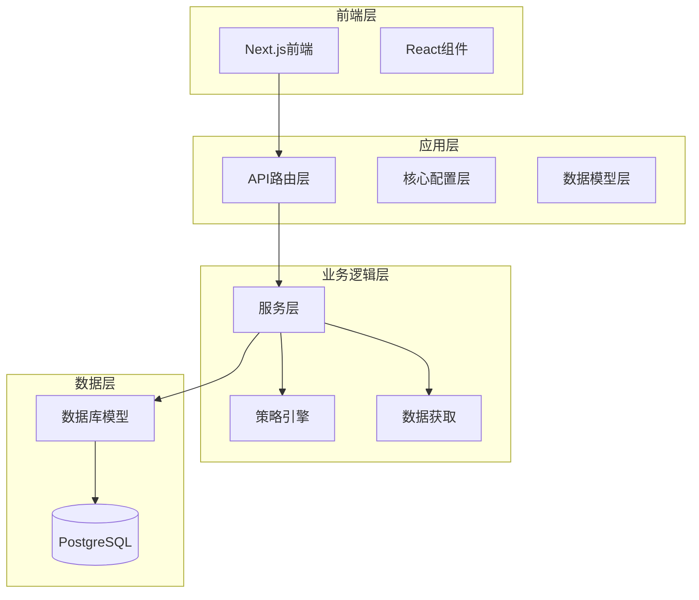
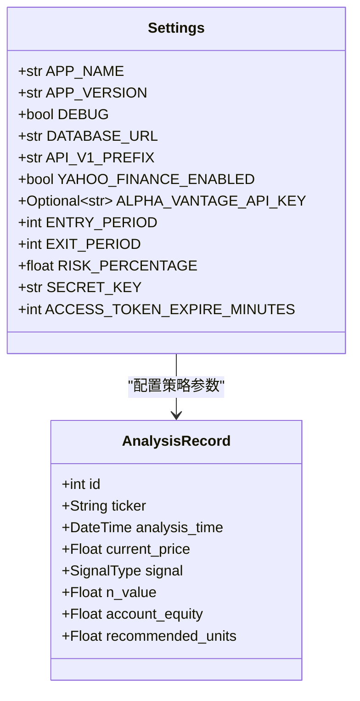
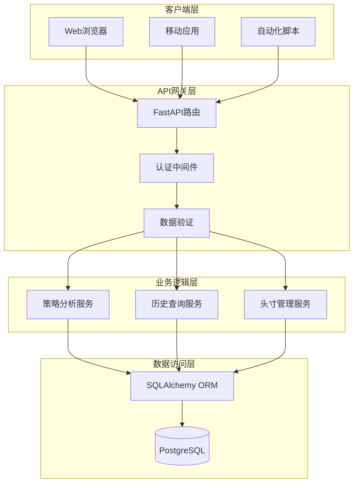
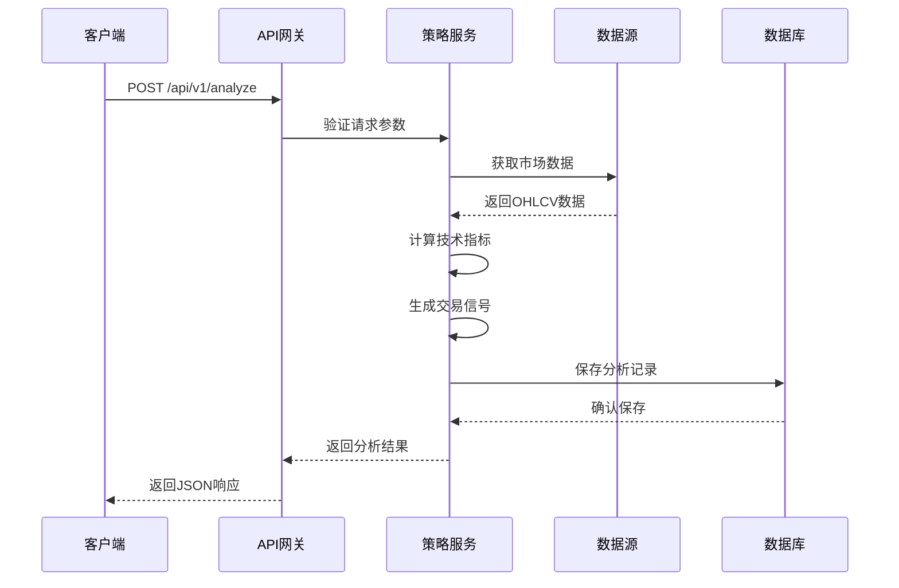
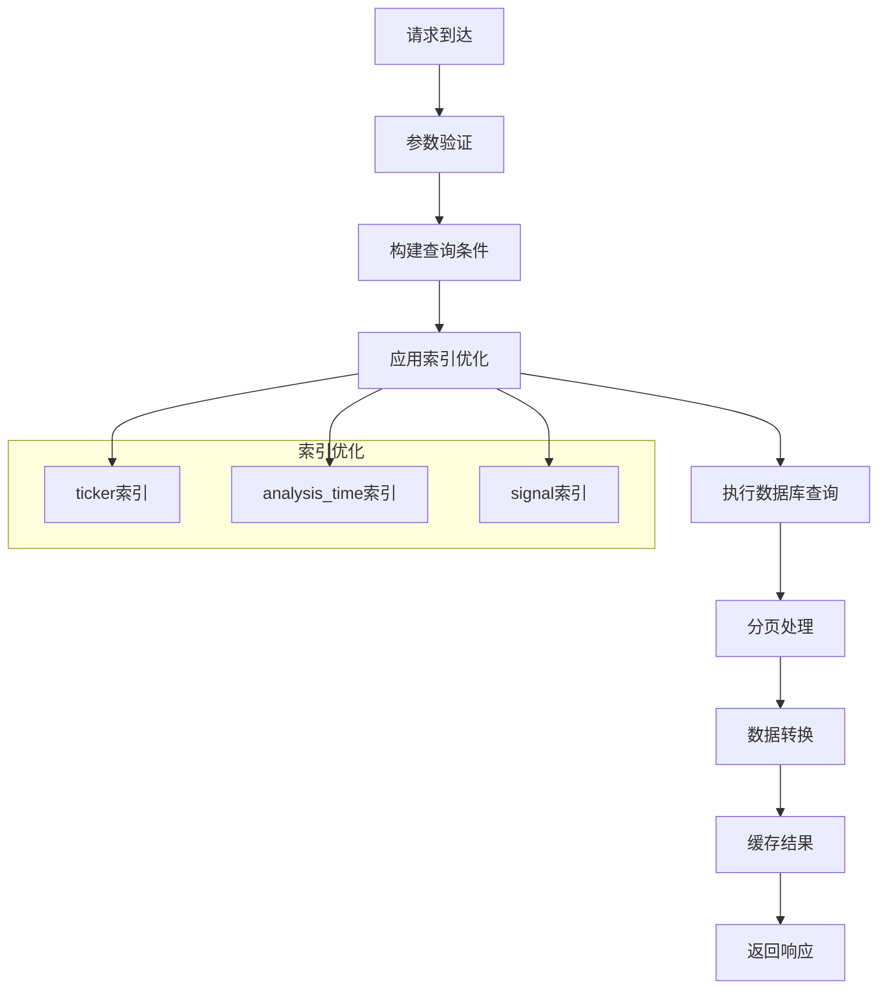
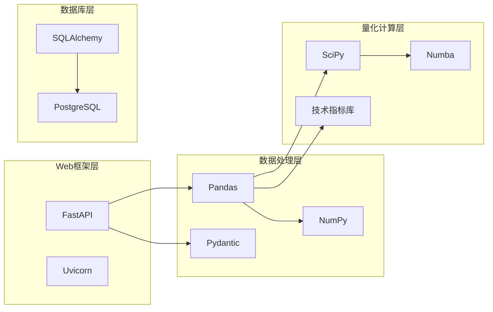
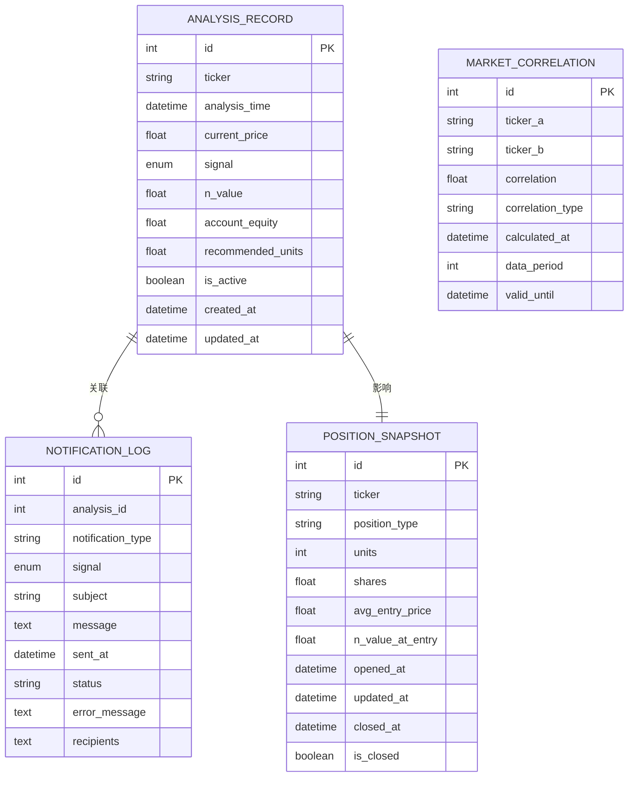
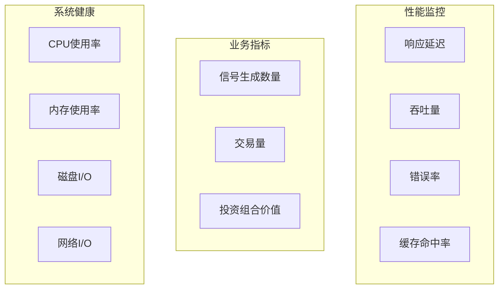

# API接口文档

<cite>
**本文档引用的文件**
- [现代海龟协议：基于Python与微服务架构的自动化量化交易系统产品需求文档(PRD).md](file://现代海龟协议：基于Python与微服务架构的自动化量化交易系统产品需求文档(PRD).md)
- [requirements.txt](file://requirements.txt)
- [app/core/config.py](file://app/core/config.py)
- [app/database/models.py](file://app/database/models.py)
</cite>

## 目录
1. [简介](#简介)
2. [项目结构](#项目结构)
3. [核心组件](#核心组件)
4. [架构概览](#架构概览)
5. [详细组件分析](#详细组件分析)
6. [依赖分析](#依赖分析)
7. [性能考虑](#性能考虑)
8. [故障排除指南](#故障排除指南)
9. [结论](#结论)

## 简介

《现代海龟协议》是一个基于Python与微服务架构的自动化量化交易系统。该系统实现了经典海龟交易法则的数字化转型，通过严格的系统性风险管理框架和波动率导向的资金分配机制，为量化交易员提供了一套完整的自动化交易解决方案。

系统采用FastAPI作为核心Web框架，结合PostgreSQL数据库和先进的量化计算库，实现了从数据获取、策略分析到历史记录管理的完整交易生命周期。本文档详细描述了系统的RESTful API接口规范，重点关注POST /api/v1/analyze（策略分析接口）和GET /api/v1/history（历史记录查询接口）两个核心端点。

## 项目结构

系统采用模块化的微服务架构，核心目录结构如下：



**图表来源**
- [现代海龟协议：基于Python与微服务架构的自动化量化交易系统产品需求文档(PRD).md](file://现代海龟协议：基于Python与微服务架构的自动化量化交易系统产品需求文档(PRD).md#L27-L33)

**章节来源**
- [现代海龟协议：基于Python与微服务架构的自动化量化交易系统产品需求文档(PRD).md](file://现代海龟协议：基于Python与微服务架构的自动化量化交易系统产品需求文档(PRD).md#L27-L33)

## 核心组件

### 技术栈概述

系统采用现代化的Python技术栈，核心依赖包括：

- **Web框架**: FastAPI 0.104.0 - 提供高性能的异步API服务
- **数据库**: SQLAlchemy 2.0.23 + PostgreSQL - 支持复杂的关系型数据存储
- **数据处理**: Pandas 2.1.3 + NumPy 1.26.2 - 金融数据处理核心
- **量化计算**: SciPy 1.11.4 + Numba 0.58.1 - 高性能科学计算
- **数据获取**: yfinance 0.2.32 + httpx 0.25.2 - 多数据源支持

### 配置管理

系统通过集中化的配置管理实现环境隔离和参数控制：



**图表来源**
- [app/core/config.py:11-99](file://app/core/config.py#L11-L99)
- [app/database/models.py:19-68](file://app/database/models.py#L19-L68)

**章节来源**
- [requirements.txt:1-61](file://requirements.txt#L1-L61)
- [app/core/config.py:11-99](file://app/core/config.py#L11-L99)

## 架构概览

系统采用分层架构设计，确保各层职责清晰、耦合度低：



**图表来源**
- [现代海龟协议：基于Python与微服务架构的自动化量化交易系统产品需求文档(PRD).md](file://现代海龟协议：基于Python与微服务架构的自动化量化交易系统产品需求文档(PRD).md#L103-L111)

## 详细组件分析

### 策略分析接口 (POST /api/v1/analyze)

#### 接口概述

策略分析接口是系统的核心功能端点，负责接收资产分析请求并返回详细的交易信号和风险参数。

#### 请求规范

| 属性 | 描述 | 类型 | 必填 | 默认值 |
|------|------|------|------|--------|
| ticker | 资产代码 | string | 是 | - |
| account_equity | 账户净资产 | number | 是 | > 0 |
| data_period | 数据周期 | integer | 否 | 252 |

**请求示例**
```json
{
  "ticker": "AAPL",
  "account_equity": 100000,
  "data_period": 252
}
```

#### 响应规范

| 字段 | 描述 | 类型 | 示例值 |
|------|------|------|--------|
| ticker | 资产代码 | string | "AAPL" |
| signal | 交易信号 | enum | "BUY" |
| current_price | 当前收盘价 | number | 150.25 |
| n_value | N值(ATR) | number | 2.45 |
| recommended_units | 建议交易单位 | number | 4.0 |
| support_resistance | 支撑阻力位 | array | [[145.2, 155.8], ...] |
| analysis_time | 分析时间 | datetime | "2024-01-15T10:30:00Z" |

**响应示例**
```json
{
  "ticker": "AAPL",
  "signal": "BUY",
  "current_price": 150.25,
  "n_value": 2.45,
  "recommended_units": 4.0,
  "support_resistance": [
    [145.2, 155.8],
    [147.5, 158.2]
  ],
  "analysis_time": "2024-01-15T10:30:00Z"
}
```

#### 处理流程



**图表来源**
- [现代海龟协议：基于Python与微服务架构的自动化量化交易系统产品需求文档(PRD).md](file://现代海龟协议：基于Python与微服务架构的自动化量化交易系统产品需求文档(PRD).md#L45-L56)

#### 错误处理

| 错误代码 | 描述 | 处理方式 |
|----------|------|----------|
| 400 | 参数验证失败 | 返回详细错误信息 |
| 404 | 资产代码无效 | 提示资产不存在 |
| 500 | 服务器内部错误 | 记录日志并返回通用错误 |
| 503 | 数据源不可用 | 返回重试建议 |

**章节来源**
- [现代海龟协议：基于Python与微服务架构的自动化量化交易系统产品需求文档(PRD).md](file://现代海龟协议：基于Python与微服务架构的自动化量化交易系统产品需求文档(PRD).md#L107-L111)

### 历史记录查询接口 (GET /api/v1/history)

#### 接口概述

历史记录查询接口提供对系统分析历史的分页查询功能，支持多种筛选条件和排序选项。

#### 查询参数

| 参数名 | 描述 | 类型 | 必填 | 默认值 | 说明 |
|--------|------|------|------|--------|------|
| limit | 每页记录数 | integer | 否 | 50 | 最大100 |
| offset | 偏移量 | integer | 否 | 0 | 分页偏移 |
| ticker | 资产代码 | string | 否 | - | 支持模糊匹配 |
| signal | 交易信号 | enum | 否 | - | BUY/SELL/HOLD |
| start_date | 开始日期 | date | 否 | - | ISO 8601格式 |
| end_date | 结束日期 | date | 否 | - | ISO 8601格式 |
| sort_by | 排序字段 | string | 否 | analysis_time | 支持id,analysis_time,ticker |
| order | 排序方向 | string | 否 | desc | asc/desc |

#### 响应结构

**响应示例**
```json
{
  "total": 1234,
  "page": 1,
  "limit": 50,
  "records": [
    {
      "id": 1,
      "ticker": "AAPL",
      "signal": "BUY",
      "current_price": 150.25,
      "n_value": 2.45,
      "recommended_units": 4.0,
      "analysis_time": "2024-01-15T10:30:00Z"
    }
  ]
}
```

#### 性能优化



**图表来源**
- [app/database/models.py:61-65](file://app/database/models.py#L61-L65)

**章节来源**
- [app/database/models.py:19-68](file://app/database/models.py#L19-L68)

## 依赖分析

### 核心依赖关系

系统的关键依赖关系如下：



**图表来源**
- [requirements.txt:1-61](file://requirements.txt#L1-L61)

### 数据模型关系



**图表来源**
- [app/database/models.py:19-163](file://app/database/models.py#L19-L163)

**章节来源**
- [requirements.txt:1-61](file://requirements.txt#L1-L61)
- [app/database/models.py:1-163](file://app/database/models.py#L1-L163)

## 性能考虑

### 缓存策略

系统采用多层次缓存机制：

1. **数据库查询缓存**: 使用SQLAlchemy的查询缓存功能
2. **API响应缓存**: 对历史查询结果进行短期缓存
3. **计算结果缓存**: 对重复的策略计算结果进行缓存

### 并发处理

- **异步处理**: 所有API端点支持异步处理
- **连接池管理**: 数据库连接池自动管理
- **限流机制**: 防止API滥用和资源耗尽

### 监控指标



## 故障排除指南

### 常见问题

| 问题类型 | 症状 | 解决方案 |
|----------|------|----------|
| 数据获取失败 | HTTP 503错误 | 检查数据源可用性和API密钥 |
| 认证失败 | HTTP 401错误 | 验证令牌有效性和过期时间 |
| 参数验证错误 | HTTP 422错误 | 检查请求参数格式和范围 |
| 数据库连接失败 | 连接超时 | 检查数据库服务状态和连接字符串 |

### 日志记录

系统采用结构化日志记录，关键事件包括：

- API请求和响应
- 数据库操作
- 错误和异常
- 性能指标

**章节来源**
- [app/core/config.py:81-85](file://app/core/config.py#L81-L85)

## 结论

《现代海龟协议》API接口文档详细描述了系统的RESTful接口规范，包括策略分析和历史记录查询两大核心功能。系统采用现代化的微服务架构，结合严格的系统性风险管理框架，为量化交易提供了完整的解决方案。

通过标准化的API接口、完善的数据验证机制和高性能的处理能力，系统能够满足专业量化交易员和金融机构的需求。未来版本将进一步完善认证授权、监控告警和扩展性功能，为更大规模的应用场景做好准备。