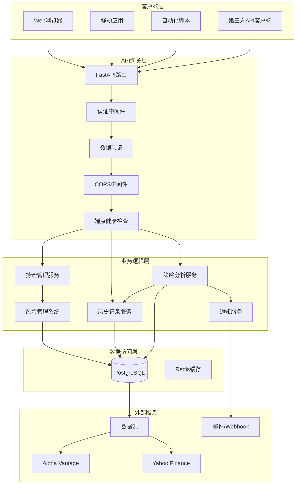
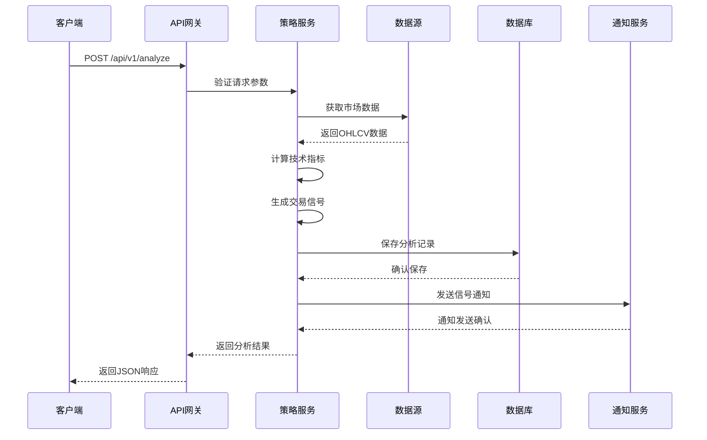
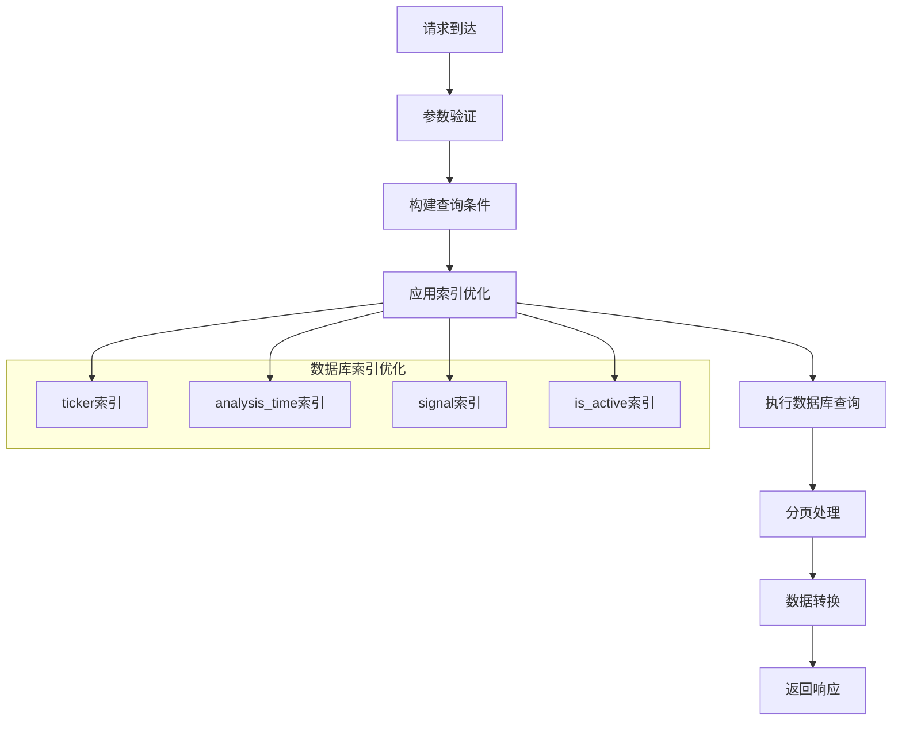
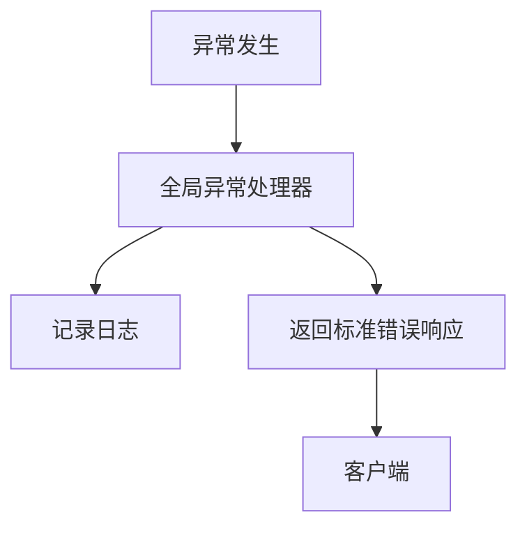
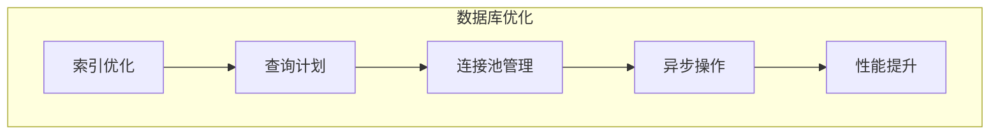
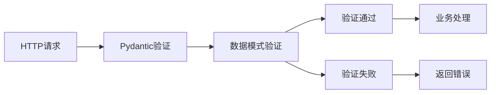
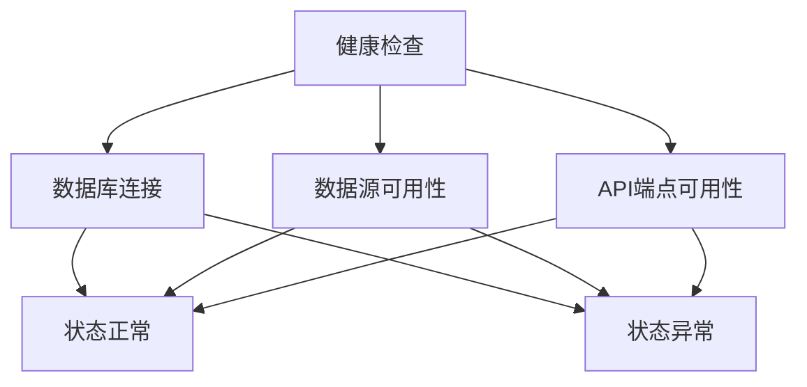

# API接口文档

<cite>
**本文档引用的文件**
- [app/main.py](file://app/main.py)
- [app/api/analyze.py](file://app/api/analyze.py)
- [app/api/history.py](file://app/api/history.py)
- [app/api/positions.py](file://app/api/positions.py)
- [app/schemas/trading.py](file://app/schemas/trading.py)
- [app/services/history.py](file://app/services/history.py)
- [app/services/risk_manager.py](file://app/services/risk_manager.py)
- [app/database/models.py](file://app/database/models.py)
- [app/core/config.py](file://app/core/config.py)
- [requirements.txt](file://requirements.txt)
</cite>

## 更新摘要
**变更内容**
- 新增完整的API接口文档，涵盖分析、历史记录、持仓管理等RESTful端点
- 新增持仓管理API，包括获取持仓、添加持仓、平仓等功能
- 新增系统健康检查和信号统计查询接口
- 新增完整的数据模型和验证规则
- 新增投资组合风险管理和摘要查询功能

## 目录
1. [简介](#简介)
2. [系统架构](#系统架构)
3. [API端点概览](#api端点概览)
4. [核心API接口](#核心api接口)
5. [数据模型规范](#数据模型规范)
6. [错误处理与状态码](#错误处理与状态码)
7. [安全与认证](#安全与认证)
8. [性能优化建议](#性能优化建议)
9. [OpenAPI规范](#openapispec)
10. [客户端实现指南](#客户端实现指南)
11. [部署与监控](#部署与监控)

## 简介

《现代海龟协议》是一个基于Python与微服务架构的自动化量化交易系统。该系统实现了经典海龟交易法则的数字化转型，通过严格的系统性风险管理框架和波动率导向的资金分配机制，为量化交易员提供了一套完整的自动化交易解决方案。

系统采用FastAPI作为核心Web框架，结合PostgreSQL数据库和先进的量化计算库，实现了从数据获取、策略分析到历史记录管理的完整交易生命周期。本文档详细描述了系统的RESTful API接口规范，涵盖策略分析、历史记录查询、持仓管理和风险控制等核心功能。

## 系统架构

系统采用分层架构设计，确保各层职责清晰、耦合度低：



**图表来源**
- [app/main.py:32-89](file://app/main.py#L32-L89)
- [app/core/config.py:11-99](file://app/core/config.py#L11-L99)

## API端点概览

系统提供以下主要API端点：

### 核心分析接口
- **POST /api/v1/analyze** - 策略分析接口
- **GET /api/v1/history** - 历史记录查询接口
- **GET /api/v1/history/statistics** - 信号统计查询接口

### 持仓管理接口
- **GET /api/v1/positions** - 获取当前持仓列表
- **POST /api/v1/positions** - 添加新持仓
- **POST /api/v1/positions/{position_id}/close** - 平仓
- **GET /api/v1/positions/summary** - 获取投资组合摘要

### 系统接口
- **GET /health** - 系统健康检查
- **GET /api/v1/health** - API健康状态

**章节来源**
- [app/main.py:85-89](file://app/main.py#L85-L89)
- [app/api/analyze.py:27](file://app/api/analyze.py#L27)
- [app/api/history.py:20](file://app/api/history.py#L20)
- [app/api/positions.py:16](file://app/api/positions.py#L16)

## 核心API接口

### 策略分析接口 (POST /api/v1/analyze)

#### 接口概述

策略分析接口是系统的核心功能端点，负责接收资产分析请求并返回详细的交易信号和风险参数。

#### 请求规范

| 属性 | 描述 | 类型 | 必填 | 默认值 | 说明 |
|------|------|------|------|--------|------|
| ticker | 资产代码 | string | 是 | - | 支持股票、外汇、期货代码 |
| account_equity | 账户净资产 | number | 是 | > 0 | 美元金额 |
| period | 数据周期 | string | 否 | "1y" | 支持1d,5d,1mo,3mo,6mo,1y,2y,5y,10y,ytd,max |
| dollar_per_point | 每点美元价值 | number | 否 | 1.0 | 股票默认1.0，外汇/期货需配置 |

**请求示例**
```json
{
  "ticker": "AAPL",
  "account_equity": 100000,
  "period": "1y",
  "dollar_per_point": 1.0
}
```

#### 响应规范

| 字段 | 描述 | 类型 | 示例值 |
|------|------|------|--------|
| success | 分析是否成功 | boolean | true |
| ticker | 资产代码 | string | "AAPL" |
| analysis_time | 分析时间 | datetime | "2024-01-15T10:30:00Z" |
| current_price | 当前收盘价 | number | 150.25 |
| previous_close | 前一日收盘价 | number | 148.75 |
| price_change | 价格变动 | number | 1.50 |
| price_change_pct | 价格变动百分比 | number | 1.01 |
| signal | 交易信号 | enum | "BUY" |
| signal_detail | 信号详情 | object | - |
| channel_levels | 通道水平 | object | - |
| volatility | 波动率数据 | object | - |
| recommendation | 持仓建议 | object | - |
| risk_metrics | 风险指标 | object | - |
| price_history | 历史价格数据 | array | - |
| error | 错误信息 | string | null |

**响应示例**
```json
{
  "success": true,
  "ticker": "AAPL",
  "analysis_time": "2024-01-15T10:30:00Z",
  "current_price": 150.25,
  "previous_close": 148.75,
  "price_change": 1.50,
  "price_change_pct": 1.01,
  "signal": "BUY",
  "signal_detail": {
    "signal": "BUY",
    "signal_reason": "价格突破20日最高价，趋势向上",
    "price_action": "突破买入"
  },
  "channel_levels": {
    "high_20_day": 145.20,
    "low_10_day": 142.10
  },
  "volatility": {
    "n_value": 2.45,
    "dollar_volatility": 245.00,
    "true_range_current": 2.30
  },
  "recommendation": {
    "recommended_units": 3.0,
    "position_size": 57.0,
    "current_positions": 0,
    "can_add_position": true
  },
  "risk_metrics": {
    "risk_percentage": 1.0,
    "risk_amount": 1000.00,
    "max_position_value": 100000.00
  },
  "price_history": [
    {
      "date": "2024-01-15T00:00:00Z",
      "open": 148.50,
      "high": 150.25,
      "low": 147.80,
      "close": 150.25,
      "volume": 1000000
    }
  ]
}
```

#### 处理流程



**图表来源**
- [app/api/analyze.py:30-168](file://app/api/analyze.py#L30-L168)

#### 错误处理

| 错误代码 | 描述 | 处理方式 |
|----------|------|----------|
| 400 | 参数验证失败或数据源错误 | 返回详细错误信息 |
| 404 | 资产代码无效 | 提示资产不存在 |
| 500 | 服务器内部错误 | 记录日志并返回通用错误 |
| 503 | 数据源不可用 | 返回重试建议 |

**章节来源**
- [app/api/analyze.py:156-167](file://app/api/analyze.py#L156-L167)

### 历史记录查询接口 (GET /api/v1/history)

#### 接口概述

历史记录查询接口提供对系统分析历史的分页查询功能，支持多种筛选条件和排序选项。

#### 查询参数

| 参数名 | 描述 | 类型 | 必填 | 默认值 | 说明 |
|--------|------|------|------|--------|------|
| ticker | 资产代码 | string | 否 | - | 支持模糊匹配 |
| signal | 交易信号 | enum | 否 | - | BUY/SELL/HOLD |
| start_date | 开始日期 | datetime | 否 | - | ISO 8601格式 |
| end_date | 结束日期 | datetime | 否 | - | ISO 8601格式 |
| limit | 每页记录数 | integer | 否 | 50 | 1-500之间 |
| offset | 偏移量 | integer | 否 | 0 | 分页偏移 |
| sort_by | 排序字段 | string | 否 | analysis_time | 支持id,analysis_time,ticker |
| order | 排序方向 | string | 否 | desc | asc/desc |

#### 响应结构

**响应示例**
```json
{
  "success": true,
  "total": 1234,
  "limit": 50,
  "offset": 0,
  "records": [
    {
      "id": 1,
      "ticker": "AAPL",
      "analysis_time": "2024-01-15T10:30:00Z",
      "current_price": 150.25,
      "signal": "BUY",
      "signal_reason": "价格突破20日最高价",
      "high_20_day": 145.20,
      "low_10_day": 142.10,
      "n_value": 2.45,
      "recommended_units": 3.0,
      "position_size": 57.0,
      "account_equity": 100000.0,
      "is_active": true
    }
  ]
}
```

#### 性能优化



**图表来源**
- [app/database/models.py:61-65](file://app/database/models.py#L61-L65)

**章节来源**
- [app/api/history.py:23-71](file://app/api/history.py#L23-L71)
- [app/database/models.py:19-68](file://app/database/models.py#L19-L68)

### 信号统计查询接口 (GET /api/v1/history/statistics)

#### 接口概述

信号统计查询接口提供指定周期内信号分布的统计信息。

#### 查询参数

| 参数名 | 描述 | 类型 | 必填 | 默认值 | 说明 |
|--------|------|------|------|--------|------|
| ticker | 资产代码 | string | 否 | - | 可选，按资产过滤 |
| days | 统计周期 | integer | 否 | 30 | 1-365之间 |

#### 响应结构

**响应示例**
```json
{
  "success": true,
  "total": 150,
  "signals": {
    "BUY": 80,
    "SELL": 45,
    "HOLD": 25
  },
  "period_days": 30,
  "ticker": "AAPL",
  "start_date": "2024-01-15T10:30:00Z",
  "end_date": "2024-02-15T10:30:00Z"
}
```

**章节来源**
- [app/api/history.py:74-102](file://app/api/history.py#L74-L102)

### 持仓管理接口

#### 获取持仓列表 (GET /api/v1/positions)

##### 查询参数

| 参数名 | 描述 | 类型 | 必填 | 默认值 | 说明 |
|--------|------|------|------|--------|------|
| ticker | 资产代码 | string | 否 | - | 可选过滤条件 |
| include_closed | 包含已平仓 | boolean | 否 | false | 是否包含已平仓持仓 |

##### 响应结构

**响应示例**
```json
[
  {
    "id": 1,
    "ticker": "AAPL",
    "position_type": "LONG",
    "units": 1,
    "shares": 57.0,
    "avg_entry_price": 145.20,
    "n_value_at_entry": 2.45,
    "stop_loss_price": 140.30,
    "opened_at": "2024-01-15T10:30:00Z",
    "is_closed": false,
    "unrealized_pnl": 140.00,
    "current_price": 150.25
  }
]
```

#### 添加新持仓 (POST /api/v1/positions)

##### 请求规范

| 属性 | 描述 | 类型 | 必填 | 默认值 | 说明 |
|------|------|------|------|--------|------|
| ticker | 资产代码 | string | 是 | - | - |
| position_type | 持仓类型 | enum | 是 | - | "LONG" 或 "SHORT" |
| shares | 持仓股数 | number | 是 | > 0 | - |
| entry_price | 入场价格 | number | 是 | > 0 | - |
| n_value | 入场时N值 | number | 是 | > 0 | - |

##### 响应结构

**响应示例**
```json
{
  "success": true,
  "message": "成功添加 AAPL 持仓",
  "position_id": 1,
  "stop_loss": 140.30
}
```

#### 平仓 (POST /api/v1/positions/{position_id}/close)

##### 路径参数

| 参数名 | 描述 | 类型 | 必填 | 说明 |
|--------|------|------|------|------|
| position_id | 持仓ID | integer | 是 | - |

##### 查询参数

| 参数名 | 描述 | 类型 | 必填 | 说明 |
|--------|------|------|------|------|
| exit_price | 出场价格 | number | 是 | - |

##### 响应结构

**响应示例**
```json
{
  "success": true,
  "position_id": 1,
  "exit_price": 150.25,
  "pnl": 140.00
}
```

#### 投资组合摘要 (GET /api/v1/positions/summary)

##### 响应结构

**响应示例**
```json
{
  "total_positions": 5,
  "total_exposure": 8,
  "long_units": 6,
  "short_units": 2,
  "net_exposure": 4,
  "by_ticker": {
    "AAPL": {
      "units": 3,
      "positions": [1, 2]
    },
    "MSFT": {
      "units": 2,
      "positions": [3]
    }
  },
  "limits": {
    "single_market": 4,
    "high_correlation": 6,
    "low_correlation": 10,
    "single_direction": 12
  },
  "utilization": {
    "long": 50.0,
    "short": 16.67
  }
}
```

**章节来源**
- [app/api/positions.py:19-152](file://app/api/positions.py#L19-L152)

## 数据模型规范

### 请求模型

#### AnalyzeRequest (分析请求)

| 字段 | 类型 | 必填 | 默认值 | 说明 |
|------|------|------|--------|------|
| ticker | string | 是 | - | 资产代码，自动转为大写 |
| account_equity | float | 是 | - | 账户净资产，必须>0 |
| period | string | 否 | "1y" | 数据周期 |
| dollar_per_point | float | 否 | 1.0 | 每点美元价值 |

#### PositionAddRequest (添加持仓请求)

| 字段 | 类型 | 必要 | 默认值 | 说明 |
|------|------|------|--------|------|
| ticker | string | 是 | - | 资产代码 |
| position_type | enum | 是 | - | "LONG" 或 "SHORT" |
| shares | float | 是 | - | 持仓股数，必须>0 |
| entry_price | float | 是 | - | 入场价格，必须>0 |
| n_value | float | 是 | - | 入场时N值，必须>0 |

### 响应模型

#### AnalyzeResponse (分析响应)

| 字段 | 类型 | 必填 | 说明 |
|------|------|------|------|
| success | boolean | 是 | 分析是否成功 |
| ticker | string | 是 | 资产代码 |
| analysis_time | datetime | 是 | 分析时间 |
| current_price | float | 是 | 当前收盘价 |
| previous_close | float | 否 | 前一日收盘价 |
| price_change | float | 否 | 价格变动 |
| price_change_pct | float | 否 | 价格变动百分比 |
| signal | enum | 是 | 交易信号 |
| signal_detail | object | 是 | 信号详情对象 |
| channel_levels | object | 是 | 通道水平对象 |
| volatility | object | 是 | 波动率数据对象 |
| recommendation | object | 是 | 持仓建议对象 |
| risk_metrics | object | 是 | 风险指标对象 |
| price_history | array | 是 | 历史价格数据数组 |
| error | string | 否 | 错误信息 |

#### 历史记录模型

| 字段 | 类型 | 必填 | 说明 |
|------|------|------|------|
| id | integer | 是 | 记录ID |
| ticker | string | 是 | 资产代码 |
| analysis_time | datetime | 是 | 分析时间 |
| current_price | float | 是 | 当前价格 |
| signal | enum | 是 | 交易信号 |
| signal_reason | string | 否 | 信号原因 |
| high_20_day | float | 否 | 20日最高价 |
| low_10_day | float | 否 | 10日最低价 |
| n_value | float | 否 | N值 |
| recommended_units | float | 否 | 建议单位数 |
| position_size | float | 否 | 建议持仓大小 |
| account_equity | float | 是 | 账户净资产 |
| is_active | boolean | 是 | 是否活跃信号 |

**章节来源**
- [app/schemas/trading.py:30-262](file://app/schemas/trading.py#L30-L262)

## 错误处理与状态码

### HTTP状态码规范

| 状态码 | 描述 | 使用场景 |
|--------|------|----------|
| 200 | OK | 请求成功，返回正常响应 |
| 201 | Created | 资源创建成功 |
| 400 | Bad Request | 请求参数错误或验证失败 |
| 401 | Unauthorized | 未认证或认证失败 |
| 403 | Forbidden | 权限不足 |
| 404 | Not Found | 资源不存在 |
| 422 | Unprocessable Entity | 数据验证失败 |
| 500 | Internal Server Error | 服务器内部错误 |
| 503 | Service Unavailable | 服务不可用 |

### 错误响应格式

```json
{
  "success": false,
  "error": "错误描述信息",
  "error_code": "错误代码",
  "timestamp": "2024-01-15T10:30:00Z"
}
```

### 全局异常处理

系统提供全局异常处理器，统一处理未捕获的异常：



**图表来源**
- [app/main.py:71-82](file://app/main.py#L71-L82)

**章节来源**
- [app/main.py:71-82](file://app/main.py#L71-L82)

## 安全与认证

### CORS配置

系统启用CORS中间件，允许跨域请求：


**图表来源**
- [app/main.py:62-68](file://app/main.py#L62-L68)

### 安全配置

系统提供基本的安全配置项：

| 配置项 | 类型 | 默认值 | 说明 |
|--------|------|--------|------|
| SECRET_KEY | string | "your-secret-key-change-in-production" | 密钥 |
| ACCESS_TOKEN_EXPIRE_MINUTES | integer | 30 | 访问令牌过期时间(分钟) |
| API_V1_PREFIX | string | "/api/v1" | API版本前缀 |

**章节来源**
- [app/core/config.py:83-84](file://app/core/config.py#L83-L84)

## 性能优化建议

### 缓存策略

系统采用多层次缓存机制：

1. **数据库查询缓存**: 使用SQLAlchemy的查询缓存功能
2. **API响应缓存**: 对历史查询结果进行短期缓存
3. **计算结果缓存**: 对重复的策略计算结果进行缓存

### 数据库优化



**图表来源**
- [app/database/models.py:61-65](file://app/database/models.py#L61-L65)

### 并发处理

- **异步处理**: 所有API端点支持异步处理
- **连接池管理**: 数据库连接池自动管理
- **限流机制**: 防止API滥用和资源耗尽

**章节来源**
- [app/database/models.py:61-65](file://app/database/models.py#L61-L65)

## OpenAPI规范

### API文档生成

系统自动生成OpenAPI规范和交互式文档：

- **Swagger UI**: `/docs`
- **ReDoc**: `/redoc`
- **OpenAPI JSON**: `/openapi.json`

### API版本管理

系统使用版本化的API前缀：
- **当前版本**: `/api/v1`

### 数据验证

所有API请求都经过严格的Pydantic验证：



**图表来源**
- [app/schemas/trading.py:30-72](file://app/schemas/trading.py#L30-L72)

**章节来源**
- [app/main.py:33-59](file://app/main.py#L33-L59)

## 客户端实现指南

### 基础HTTP客户端

```javascript
// JavaScript示例
const API_BASE_URL = 'http://localhost:8000/api/v1';

// 策略分析
async function analyzeAsset(ticker, accountEquity) {
  const response = await fetch(`${API_BASE_URL}/analyze`, {
    method: 'POST',
    headers: {
      'Content-Type': 'application/json',
    },
    body: JSON.stringify({
      ticker,
      account_equity: accountEquity,
      period: '1y'
    })
  });
  
  return response.json();
}

// 获取历史记录
async function getHistory(params) {
  const queryString = new URLSearchParams(params).toString();
  const response = await fetch(`${API_BASE_URL}/history?${queryString}`);
  return response.json();
}
```

### 错误处理最佳实践

```javascript
// 错误处理示例
async function robustApiCall(url, options) {
  try {
    const response = await fetch(url, options);
    
    if (!response.ok) {
      throw new Error(`HTTP error! status: ${response.status}`);
    }
    
    const data = await response.json();
    
    if (!data.success) {
      throw new Error(data.error || 'API returned error');
    }
    
    return data;
  } catch (error) {
    console.error('API调用失败:', error);
    throw error;
  }
}
```

### 重试机制

```javascript
// 重试机制示例
async function retryApiCall(fn, maxRetries = 3, delay = 1000) {
  for (let i = 0; i < maxRetries; i++) {
    try {
      return await fn();
    } catch (error) {
      if (i === maxRetries - 1) throw error;
      
      // 指数退避
      await new Promise(resolve => setTimeout(resolve, delay * Math.pow(2, i)));
    }
  }
}
```

## 部署与监控

### 系统健康检查



**图表来源**
- [app/main.py:91-99](file://app/main.py#L91-L99)

### 监控指标

系统提供以下监控指标：

- **API响应延迟**: 分布式统计
- **吞吐量**: 每秒请求数
- **错误率**: HTTP 5xx错误比例
- **数据库连接**: 连接池使用情况
- **缓存命中率**: 查询缓存效率

### 部署建议

1. **生产环境配置**: 设置适当的CORS策略和安全配置
2. **数据库优化**: 配置合适的连接池大小和超时设置
3. **监控告警**: 设置关键指标的告警阈值
4. **日志管理**: 配置结构化日志输出和轮转

**章节来源**
- [app/main.py:91-99](file://app/main.py#L91-L99)
- [app/core/config.py:11-99](file://app/core/config.py#L11-L99)