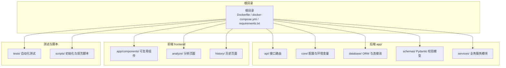
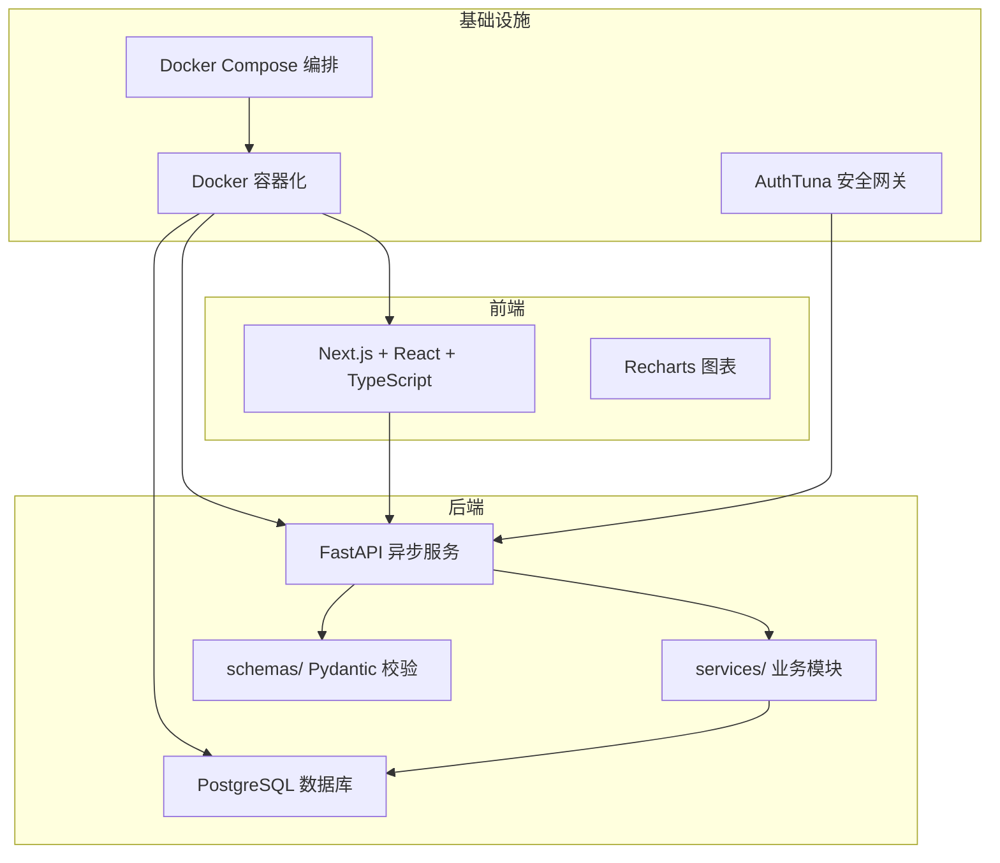
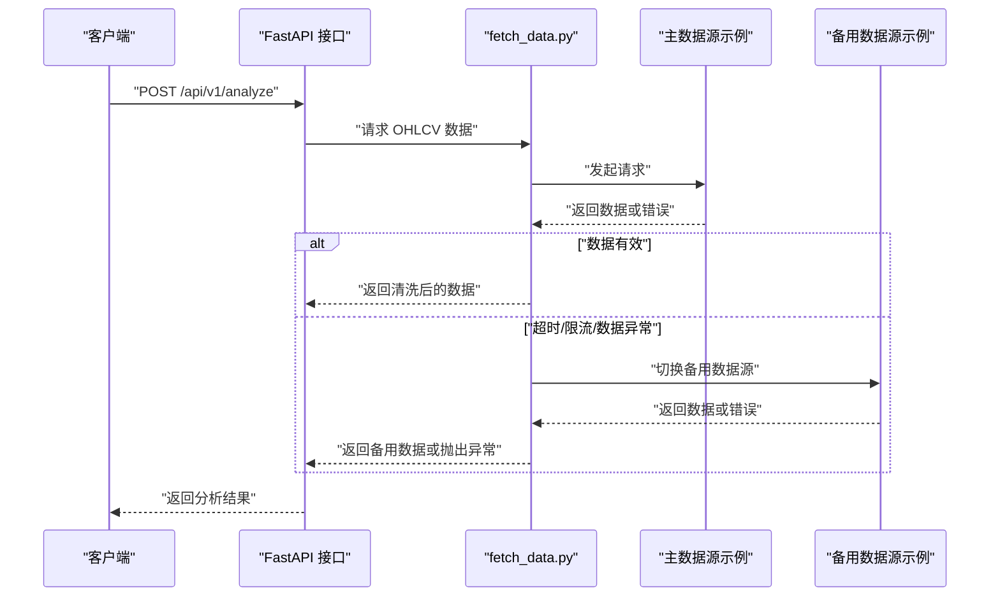
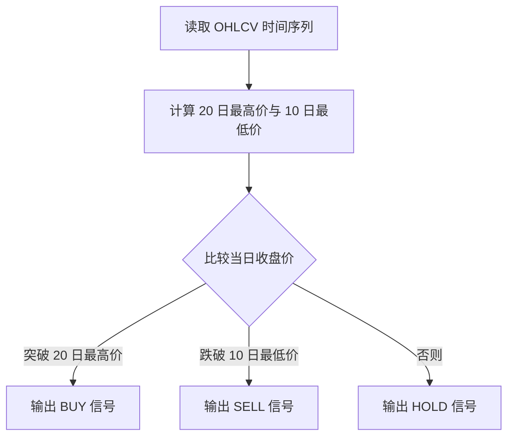
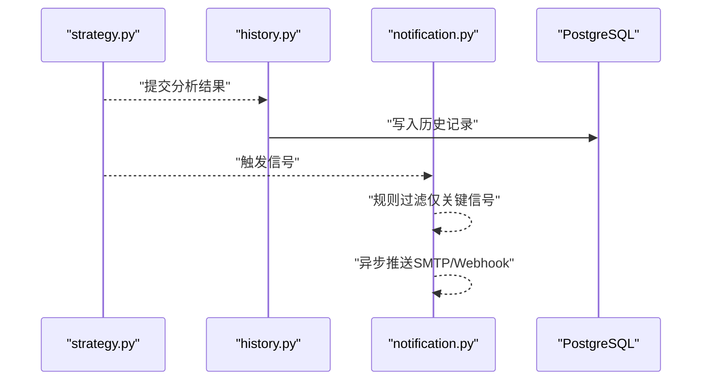
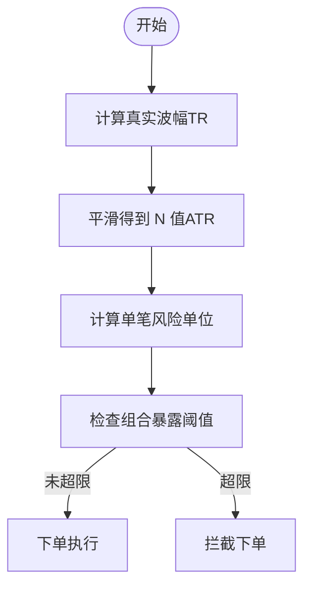
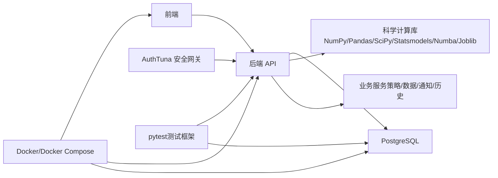

# 开发指南

<cite>
**本文引用的文件**
- [现代海龟协议：基于Python与微服务架构的自动化量化交易系统产品需求文档(PRD).md](file://现代海龟协议：基于Python与微服务架构的自动化量化交易系统产品需求文档(PRD).md)
- [scripts/test_analyze.py](file://scripts/test_analyze.py)
- [scripts/quick_test.py](file://scripts/quick_test.py)
- [scripts/init_db.py](file://scripts/init_db.py)
- [scripts/cleanup_db.py](file://scripts/cleanup_db.py)
- [tests/conftest.py](file://tests/conftest.py)
- [tests/test_api.py](file://tests/test_api.py)
- [tests/test_strategy.py](file://tests/test_strategy.py)
- [app/services/strategy.py](file://app/services/strategy.py)
- [app/database/models.py](file://app/database/models.py)
- [app/api/analyze.py](file://app/api/analyze.py)
- [app/core/config.py](file://app/core/config.py)
- [app/main.py](file://app/main.py)
- [requirements.txt](file://requirements.txt)
</cite>

## 更新摘要
**变更内容**
- 新增测试框架使用指南章节，包含pytest配置、标记系统和测试策略
- 新增数据库脚本操作章节，涵盖初始化、清理和维护工具
- 新增快速验证工具章节，提供策略引擎和API的快速测试方法
- 新增开发工作流程章节，整合完整的开发、测试和部署流程

## 目录
1. [引言](#引言)
2. [项目结构](#项目结构)
3. [核心组件](#核心组件)
4. [架构总览](#架构总览)
5. [详细组件分析](#详细组件分析)
6. [测试框架使用](#测试框架使用)
7. [数据库脚本操作](#数据库脚本操作)
8. [快速验证工具](#快速验证工具)
9. [开发工作流程](#开发工作流程)
10. [依赖分析](#依赖分析)
11. [性能考量](#性能考量)
12. [故障排查指南](#故障排查指南)
13. [结论](#结论)
14. [附录](#附录)

## 引言
本开发指南面向《现代海龟协议》项目的研发与维护团队，目标是提供一套可落地的工程实践手册，涵盖项目结构、代码规范、开发流程、测试策略、扩展方法（新策略、新数据源、第三方服务、通知方式）、质量保障（单元测试、集成测试、性能测试）、贡献与版本管理、发布流程，以及常见问题与调试技巧。本指南严格依据项目PRD文档中的系统架构、模块职责与接口规范进行组织，确保读者能够快速理解并高效交付高质量的量化交易系统。

## 项目结构
根据PRD文档，系统采用前后端分离与领域驱动设计，工程目录拓扑如下：
- 根目录包含容器化与部署清单（Dockerfile、docker-compose.yml）、依赖清单（requirements.txt）等基础设施文件。
- 后端应用位于 app/ 目录，按功能域划分：
  - api/：RESTful 接口路由定义
  - core/：环境变量与全局配置
  - database/：数据库会话、连接池与 SQLAlchemy ORM 模型
  - schemas/：Pydantic 数据校验模型
  - services/：核心业务逻辑（策略、数据摄取、历史追踪、通知）
- 前端应用位于 frontend/ 目录，包含组件与页面：
  - app/components/：可复用组件（如 Navbar、StockChart）
  - 分析与历史页面：analyze/、history/
- 测试与脚本：
  - tests/：API 端点测试与策略回测断言套件
  - scripts/：数据库初始化与模拟数据填充脚本



**章节来源**
- [现代海龟协议：基于Python与微服务架构的自动化量化交易系统产品需求文档(PRD).md:27-34](file://现代海龟协议：基于Python与微服务架构的自动化量化交易系统产品需求文档(PRD).md#L27-L34)

## 核心组件
本节梳理后端核心服务模块及其职责边界，便于后续扩展与维护。

- 容灾型市场数据摄取模块（fetch_data.py）
  - 职责：多源数据仲裁、自动故障转移、数据完整性校验、异常降级与保护
  - 关键流程：主数据源（如雅虎财经）→ 备用数据源（如 Alpha Vantage）→ 受控异常与错误提示
- 策略运算与信号生成模块（strategy.py）
  - 职责：基于滚动窗口与突破规则生成 BUY/SELL/HOLD 信号
  - 关键流程：计算20日最高价与10日最低价 → 条件分支判别 → 输出确定性信号
- 历史追踪与通知模块（history.py、notification.py）
  - 职责：持久化分析日志、基于信号过滤的通知推送
  - 关键流程：ORM 写入历史记录 → 异步触发通知（SMTP/Webhook）


**章节来源**
- [现代海龟协议：基于Python与微服务架构的自动化量化交易系统产品需求文档(PRD).md:39-61](file://现代海龟协议：基于Python与微服务架构的自动化量化交易系统产品需求文档(PRD).md#L39-L61)

## 架构总览
系统采用云原生微服务架构，后端以 FastAPI + 异步 I/O 为核心，前端以 Next.js + React + TypeScript 构建，数据库采用 PostgreSQL，容器化编排与安全隔离贯穿全生命周期。



**章节来源**
- [现代海龟协议：基于Python与微服务架构的自动化量化交易系统产品需求文档(PRD).md:11-126](file://现代海龟协议：基于Python与微服务架构的自动化量化交易系统产品需求文档(PRD).md#L11-L126)

## 详细组件分析

### 组件A：容灾型市场数据摄取模块（fetch_data.py）
- 设计要点
  - 多源仲裁与自动故障转移，避免单点故障
  - 受控异常与降级保护，确保脏数据不进入计算链路
  - 结构化数据校验，前置过滤无效数据
- 扩展建议
  - 新增数据源：在现有仲裁逻辑中增加新源的接入与降级策略
  - 限流与重试：结合指数退避与速率限制，增强稳定性
  - 日志与可观测性：完善失败原因与重试次数的观测指标



**章节来源**
- [现代海龟协议：基于Python与微服务架构的自动化量化交易系统产品需求文档(PRD).md:39-44](file://现代海龟协议：基于Python与微服务架构的自动化量化交易系统产品需求文档(PRD).md#L39-L44)

### 组件B：策略运算与信号生成模块（strategy.py）
- 设计要点
  - 基于滚动窗口的突破规则，输出确定性信号
  - 严格区分趋势突破与震荡整理，避免噪音交易
- 扩展建议
  - 参数化：将窗口长度、阈值等规则参数化，便于回测与优化
  - 多因子融合：在现有信号基础上叠加动量、均值回归等因子
  - 并行化：利用 Numba/Joblib 加速长周期回测



**章节来源**
- [现代海龟协议：基于Python与微服务架构的自动化量化交易系统产品需求文档(PRD).md:45-56](file://现代海龟协议：基于Python与微服务架构的自动化量化交易系统产品需求文档(PRD).md#L45-L56)

### 组件C：历史追踪与通知模块（history.py、notification.py）
- 设计要点
  - ORM 持久化分析日志，支持分页查询与审计追溯
  - 通知规则过滤，仅在关键信号触发异步推送
- 扩展建议
  - 通知渠道：新增 Webhook、企业微信、钉钉等
  - 信号分级：按风险等级或账户规模设置不同通知阈值
  - 去重与幂等：确保同一信号不会重复推送



**章节来源**
- [现代海龟协议：基于Python与微服务架构的自动化量化交易系统产品需求文档(PRD).md:57-61](file://现代海龟协议：基于Python与微服务架构的自动化量化交易系统产品需求文档(PRD).md#L57-L61)

### 组件D：波动率与资金分配（核心风控）
- 设计要点
  - 使用真实波幅（TR）与指数平滑计算 N 值（ATR）
  - 单笔风险单位 = 账户净资产×1% / (N值×每点美元价值)
  - 投资组合多层级暴露阀值，防止系统性风险
- 扩展建议
  - 动态滑点与手续费：在回测框架中集成滑点与佣金模型
  - 多资产风险平价：跨市场统一风险预算
  - 压力测试：极端行情下的组合暴露与再平衡策略



**章节来源**
- [现代海龟协议：基于Python与微服务架构的自动化量化交易系统产品需求文档(PRD).md:67-102](file://现代海龟协议：基于Python与微服务架构的自动化量化交易系统产品需求文档(PRD).md#L67-L102)

## 测试框架使用

### pytest配置与标记系统
项目使用pytest作为主要测试框架，通过conftest.py配置测试环境和标记系统。

**测试标记系统**
- `@pytest.mark.slow`: 标记慢速测试，可通过 `-m "not slow"` 选择性跳过
- `@pytest.mark.integration`: 标记集成测试，支持独立运行

**测试配置fixture**
- `test_config`: 提供测试配置，包含默认股票代码、账户资金和风险百分比

**章节来源**
- [tests/conftest.py:1-26](file://tests/conftest.py#L1-L26)

### API端点测试套件
API测试覆盖健康检查、分析端点、历史记录和持仓管理等核心功能。

**测试类别**
- `TestHealthEndpoint`: 健康检查端点测试，验证系统状态
- `TestAnalyzeEndpoint`: 分析端点测试，包括参数验证和错误处理
- `TestHistoryEndpoint`: 历史记录测试，验证分页和过滤功能
- `TestPositionsEndpoint`: 持仓管理测试，验证投资组合摘要

**章节来源**
- [tests/test_api.py:1-88](file://tests/test_api.py#L1-L88)

### 策略回测断言套件
策略测试专注于海龟协议的核心逻辑验证。

**测试范围**
- `TestTurtleStrategy`: 海龟策略单元测试，包括真实波幅计算、指标计算、信号生成和通道水平测试
- `TestPositionCalculation`: 头寸计算测试，验证风险管理和单位规模计算
- `TestVolatilityPercentile`: 波动率百分位测试，评估波动率相对水平

**章节来源**
- [tests/test_strategy.py:1-136](file://tests/test_strategy.py#L1-L136)

### 测试最佳实践
- 使用Mock替换外部数据源，确保测试可重复性
- 通过参数化测试覆盖边界条件和异常情况
- 利用pytest的fixture机制管理测试数据和配置
- 实施分层测试策略：单元测试、集成测试和端到端测试

**章节来源**
- [tests/test_strategy.py:14-31](file://tests/test_strategy.py#L14-L31)
- [tests/test_api.py:12-22](file://tests/test_api.py#L12-L22)

## 数据库脚本操作

### 数据库初始化脚本
init_db.py提供完整的数据库表结构创建和管理功能。

**核心功能**
- `init_database()`: 创建所有数据库表结构
- `drop_tables()`: 删除所有表（谨慎使用，需用户确认）
- 支持命令行参数：`--drop` 用于删除所有表

**表结构创建**
脚本自动创建以下核心表：
- `analysis_records`: 策略分析记录表
- `position_snapshots`: 持仓快照表  
- `market_correlations`: 市场关联度表
- `notification_logs`: 通知日志表

**章节来源**
- [scripts/init_db.py:17-33](file://scripts/init_db.py#L17-L33)

### 数据库清理脚本
cleanup_db.py提供定期清理过期数据的功能，支持自定义保留天数。

**清理策略**
- 删除超过指定天数的非活跃分析记录
- 清理已平仓的持仓记录
- 删除已发送的通知记录
- 清理过期的市场关联度数据

**使用方法**
```bash
python scripts/cleanup_db.py 90  # 保留最近90天数据
python scripts/cleanup_db.py 30  # 保留最近30天数据
```

**章节来源**
- [scripts/cleanup_db.py:17-78](file://scripts/cleanup_db.py#L17-L78)

### 数据库模型定义
数据库模型采用SQLAlchemy ORM，定义了完整的数据结构和关系。

**核心模型**
- `AnalysisRecord`: 存储每次策略分析的结果和参数
- `PositionSnapshot`: 记录投资组合的当前持仓状态
- `MarketCorrelation`: 存储资产间的相关性分析
- `NotificationLog`: 记录所有发送的通知详情

**索引优化**
- 为常用查询字段建立索引，提升查询性能
- 支持复合索引优化复杂查询

**章节来源**
- [app/database/models.py:19-68](file://app/database/models.py#L19-L68)

## 快速验证工具

### 策略引擎测试脚本
quick_test.py提供快速验证策略引擎功能的工具。

**测试流程**
1. 生成模拟OHLCV数据（60个交易日）
2. 创建TurtleStrategy实例并计算技术指标
3. 生成交易信号并获取详细信息
4. 测试头寸计算功能

**输出信息**
- 策略引擎测试结果状态
- 生成的交易信号类型
- 当前价格和N值
- 20日高点和10日低点
- 头寸计算结果（建议单位、风险金额、最大持仓市值）

**章节来源**
- [scripts/quick_test.py:27-49](file://scripts/quick_test.py#L27-L49)

### 完整分析流程测试
test_analyze.py提供完整的分析流程测试，模拟真实API调用。

**测试特点**
- 生成100个交易日的模拟数据
- 执行完整的策略分析流程
- 验证所有分析结果字段
- 输出详细的分析报告

**验证内容**
- 信号类型和原因
- 价格和技术指标
- 波动率参数
- 头寸规模计算
- 风险指标

**章节来源**
- [scripts/test_analyze.py:32-55](file://scripts/test_analyze.py#L32-L55)

### API端点快速测试
通过直接调用策略分析函数，可以快速验证核心功能。

**使用场景**
- 开发阶段快速验证
- 回归测试的基础
- 性能基准测试

**章节来源**
- [scripts/test_analyze.py:12-16](file://scripts/test_analyze.py#L12-L16)

## 开发工作流程

### 开发环境搭建
1. **安装依赖**
```bash
pip install -r requirements.txt
```

2. **数据库初始化**
```bash
python scripts/init_db.py
```

3. **启动应用**
```bash
uvicorn app.main:app --reload
```

### 开发流程步骤
1. **需求分析**：基于PRD文档明确功能需求
2. **设计实现**：编写代码和必要的测试用例
3. **单元测试**：运行pytest验证核心逻辑
4. **集成测试**：测试API端点和数据库交互
5. **代码审查**：团队评审和改进
6. **部署验证**：在测试环境中验证

### 测试执行策略
- **快速测试**：使用quick_test.py验证核心功能
- **单元测试**：pytest -m "not slow" 跳过慢速测试
- **集成测试**：pytest tests/test_api.py
- **完整测试**：pytest tests/test_strategy.py

### 开发工具配置
- **IDE设置**：配置Python解释器和虚拟环境
- **格式化**：使用Black和Flake8保持代码风格一致
- **类型检查**：mypy验证类型注解
- **Git钩子**：pre-commit钩子自动运行测试

### 持续集成流程
1. **代码提交**：开发者提交代码到功能分支
2. **自动测试**：CI系统运行pytest和代码质量检查
3. **代码审查**：团队成员评审代码
4. **合并主干**：通过审查后合并到主分支
5. **发布部署**：自动化部署到测试和生产环境

**章节来源**
- [app/main.py:17-30](file://app/main.py#L17-L30)
- [requirements.txt:51-54](file://requirements.txt#L51-L54)

## 依赖分析
- 技术栈与库
  - 后端：FastAPI、Pydantic、NumPy、Pandas、SciPy、Statsmodels、Numba、Joblib、SQLAlchemy、PostgreSQL
  - 前端：Next.js、React、TypeScript、Tailwind CSS、Recharts
  - 基础设施：Docker、Docker Compose、AuthTuna（安全网关）
  - 测试框架：pytest、pytest-asyncio、pytest-cov、httpx
- 依赖关系
  - 前端通过 REST API 与后端交互
  - 后端通过 SQLAlchemy 与数据库交互
  - 容器化与编排确保服务解耦与可扩展



**章节来源**
- [现代海龟协议：基于Python与微服务架构的自动化量化交易系统产品需求文档(PRD).md:15-26](file://现代海龟协议：基于Python与微服务架构的自动化量化交易系统产品需求文档(PRD).md#L15-L26)
- [requirements.txt:1-61](file://requirements.txt#L1-L61)

## 性能考量
- 异步与并发
  - 使用 FastAPI 的异步特性与事件循环，提升 I/O 密集型场景吞吐
  - 利用 Joblib 实现 CPU 密集型计算的并行化
- 数据处理
  - Pandas/Polars 优化时间序列计算与内存使用
  - Numba JIT 提升循环密集型指标计算速度
- 存储与查询
  - PostgreSQL 索引与分页查询优化历史数据检索
  - 事务与连接池管理降低数据库压力
- 容器化与弹性
  - Docker Compose 编排多服务，隔离网络与资源
  - 安全网关与密钥管理降低运行风险

## 故障排查指南
- 数据源问题
  - 症状：请求超时、返回 429、数据缺失
  - 处理：启用备用数据源、增加重试与退避、记录失败原因
- 信号异常
  - 症状：频繁 HOLD 或误触发
  - 处理：检查参数化窗口与阈值、确认数据清洗逻辑
- 通知未达
  - 症状：关键信号未推送
  - 处理：检查通知规则过滤、SMTP/Webhook 配置与异步队列
- 性能瓶颈
  - 症状：回测耗时过长、API 响应慢
  - 处理：启用并行计算、优化查询索引、升级硬件或容器资源

**章节来源**
- [现代海龟协议：基于Python与微服务架构的自动化量化交易系统产品需求文档(PRD).md:39-44](file://现代海龟协议：基于Python与微服务架构的自动化量化交易系统产品需求文档(PRD).md#L39-L44)
- [现代海龟协议：基于Python与微服务架构的自动化量化交易系统产品需求文档(PRD).md:57-61](file://现代海龟协议：基于Python与微服务架构的自动化量化交易系统产品需求文档(PRD).md#L57-L61)

## 结论
《现代海龟协议》以稳健的风险管理体系与模块化的微服务架构为基础，提供了从数据摄取、策略计算、历史追踪到通知推送的完整闭环。通过本开发指南，团队可以高效扩展新策略、接入新数据源、集成第三方服务与通知方式，并建立完善的测试与发布流程，确保系统在复杂市场环境下保持高可用与高鲁棒性。

## 附录

### A. 代码规范与最佳实践
- 后端
  - 使用 Pydantic 校验请求/响应，确保类型安全
  - 异步 I/O 与事件循环优先，避免阻塞
  - 业务逻辑与数据访问分离，提高可测试性
- 前端
  - TypeScript 类型约束，减少运行时错误
  - 组件化与可复用性优先，统一样式（Tailwind）
  - Recharts 渲染性能优化，避免大数据量重绘
- 数据库
  - ORM 映射与事务管理，确保一致性
  - 索引与分页查询，提升历史数据检索效率

**章节来源**
- [现代海龟协议：基于Python与微服务架构的自动化量化交易系统产品需求文档(PRD).md:107-112](file://现代海龟协议：基于Python与微服务架构的自动化量化交易系统产品需求文档(PRD).md#L107-L112)

### B. 开发流程与测试策略
- 单元测试
  - 针对策略模块的关键函数与数据清洗逻辑编写断言
  - 使用 Mock 替换外部数据源，保证测试可重复
- 集成测试
  - 端到端验证 API 路由、数据流与数据库写入
  - 使用测试数据库快照，确保环境一致性
- 性能测试
  - 回测框架集成：将策略模块注入 QSTrader/PyAlgoTrade
  - 压力测试：模拟高频 Tick 数据与并发请求

**章节来源**
- [现代海龟协议：基于Python与微服务架构的自动化量化交易系统产品需求文档(PRD).md:113-118](file://现代海龟协议：基于Python与微服务架构的自动化量化交易系统产品需求文档(PRD).md#L113-L118)

### C. 版本管理与发布流程
- 版本管理
  - 使用语义化版本（SemVer），变更类型明确标注
  - 分支策略：主干稳定、功能分支开发、热修复分支
- 发布流程
  - 本地构建与测试（Docker 镜像）
  - CI/CD 流水线：自动化测试、安全扫描、镜像推送
  - 生产部署：Docker Compose 编排，灰度发布与回滚预案

**章节来源**
- [现代海龟协议：基于Python与微服务架构的自动化量化交易系统产品需求文档(PRD).md:119-126](file://现代海龟协议：基于Python与微服务架构的自动化量化交易系统产品需求文档(PRD).md#L119-L126)

### D. 常见扩展场景
- 新策略
  - 在 strategy.py 中新增策略类或函数，保持与现有接口一致
  - 参数化与回测框架集成，便于优化与验证
- 新数据源
  - 在 fetch_data.py 中新增数据源接入与降级策略
  - 统一数据结构与异常处理
- 第三方服务
  - 通过 API 网关与安全网关接入，确保认证与审计
  - 配置化管理密钥与超时参数
- 自定义通知
  - 在 notification.py 中新增通知渠道与规则过滤
  - 支持异步队列与幂等推送

**章节来源**
- [现代海龟协议：基于Python与微服务架构的自动化量化交易系统产品需求文档(PRD).md:39-61](file://现代海龟协议：基于Python与微服务架构的自动化量化交易系统产品需求文档(PRD).md#L39-L61)
- [现代海龟协议：基于Python与微服务架构的自动化量化交易系统产品需求文档(PRD).md:119-126](file://现代海龟协议：基于Python与微服务架构的自动化量化交易系统产品需求文档(PRD).md#L119-L126)

### E. 开发工具与脚本使用
- **数据库管理**
  - `python scripts/init_db.py`: 初始化数据库表结构
  - `python scripts/init_db.py --drop`: 删除所有表
  - `python scripts/cleanup_db.py [days]`: 清理过期数据

- **快速验证**
  - `python scripts/quick_test.py`: 快速测试策略引擎
  - `python scripts/test_analyze.py`: 完整分析流程测试

- **测试执行**
  - `pytest`: 运行所有测试
  - `pytest -m "not slow"`: 跳过慢速测试
  - `pytest tests/test_api.py`: 运行API测试
  - `pytest tests/test_strategy.py`: 运行策略测试

**章节来源**
- [scripts/init_db.py:47-51](file://scripts/init_db.py#L47-L51)
- [scripts/cleanup_db.py:81-83](file://scripts/cleanup_db.py#L81-L83)
- [scripts/quick_test.py:60-62](file://scripts/quick_test.py#L60-L62)
- [scripts/test_analyze.py:60-62](file://scripts/test_analyze.py#L60-L62)