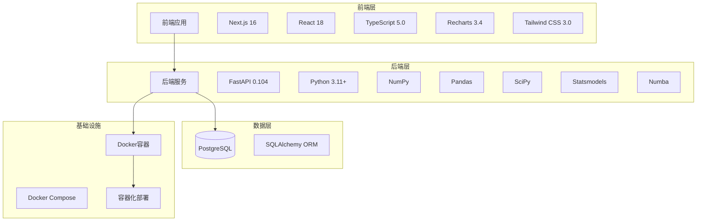
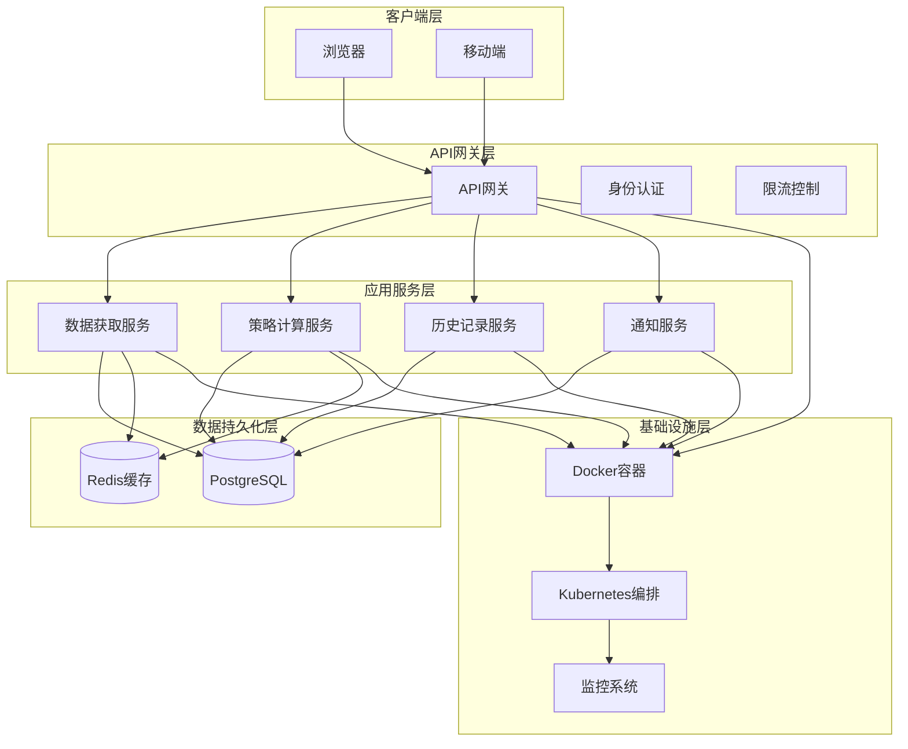
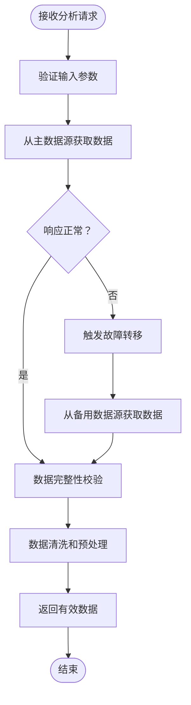
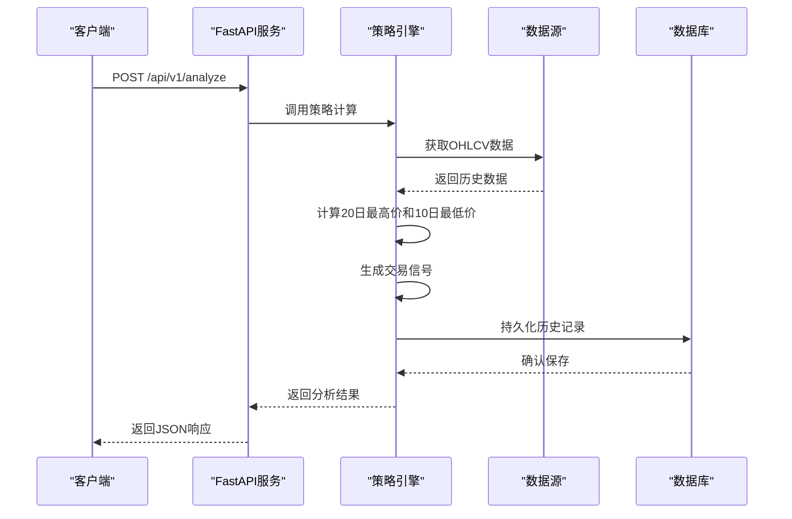
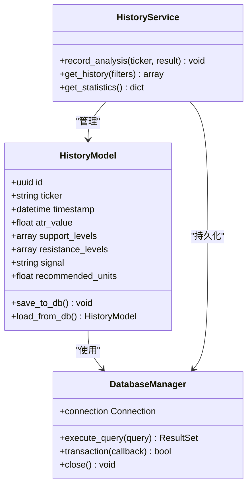
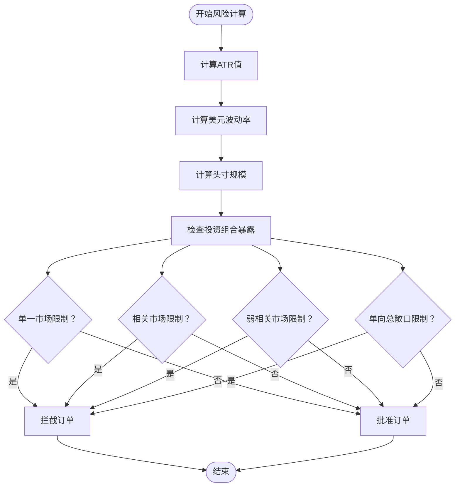
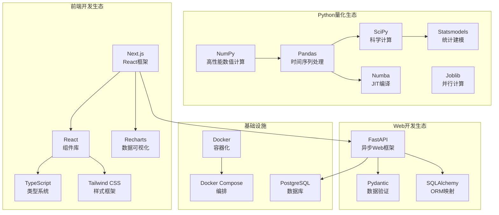

# 技术栈与架构

<cite>
**本文档引用的文件**
- [现代海龟协议：基于Python与微服务架构的自动化量化交易系统产品需求文档(PRD).md](file://现代海龟协议：基于Python与微服务架构的自动化量化交易系统产品需求文档(PRD).md)
</cite>

## 目录
1. [引言](#引言)
2. [项目结构](#项目结构)
3. [核心组件](#核心组件)
4. [架构概览](#架构概览)
5. [详细组件分析](#详细组件分析)
6. [依赖分析](#依赖分析)
7. [性能考虑](#性能考虑)
8. [故障排查指南](#故障排查指南)
9. [结论](#结论)
10. [附录](#附录)

## 引言

《现代海龟协议》是一个基于Python与微服务架构的自动化量化交易系统，旨在将经典的海龟交易法则移植到现代的微服务计算生态中。该系统通过结合高性能的Python异步后端服务与具备极速响应能力的Next.js现代前端界面，实现对全市场多资产历史数据的深度回溯处理、交易信号的实时生成可视化，以及基于波动率的系统性风险控制与头寸规模计算。

该项目的核心目标是为量化研究员与系统架构师提供一份详尽的工程实施蓝图，指导开发一套基于"现代海龟协议"的全栈自动化交易系统，该系统摒弃了主观判断驱动的交易模式，转而构建一个完全由数据驱动、以事件为触发机制的客观计算环境。

## 项目结构

根据PRD文档描述，系统采用清晰的前后端分离与领域驱动设计原则，将整体系统划分为三个主要层次：

**图表来源**
- [现代海龟协议：基于Python与微服务架构的自动化量化交易系统产品需求文档(PRD).md: 第27-34节](file://现代海龟协议：基于Python与微服务架构的自动化量化交易系统产品需求文档(PRD).md#L27-L34)

**章节来源**
- [现代海龟协议：基于Python与微服务架构的自动化量化交易系统产品需求文档(PRD).md: 第11-34节](file://现代海龟协议：基于Python与微服务架构的自动化量化交易系统产品需求文档(PRD).md#L11-L34)

## 核心组件

### 后端技术栈

后端是整个自动交易框架的计算大脑，承载着最为繁重的策略执行与数据清洗任务。技术栈选型体现了对计算效率与网络I/O吞吐量的最大化追求。

**高性能量化后端生态系统**：
- **运行环境**：Python 3.11+，提供最新的语言特性和性能优化
- **Web框架**：FastAPI 0.104，基于异步非阻塞事件循环机制，适合处理大量外部API请求
- **数据处理**：NumPy + Pandas，金融数据预处理的核心基石
- **科学计算**：SciPy + Statsmodels，复杂的信号处理与统计学假设检验
- **性能优化**：Numba JIT编译，加速长周期历史回测
- **并行计算**：Joblib，多核CPU架构下的并发分析能力

### 前端技术栈

前端架构旨在为量化交易员与风险控制官提供极具交互性与洞察力的分析仪表盘。

**响应式现代前端数据可视化层**：
- **框架**：Next.js 16 + React 18，提供高效的服务器端渲染与首屏加载速度
- **类型安全**：TypeScript 5.0，确保与后端API通信时的类型安全性
- **样式**：Tailwind CSS 3.0，效用优先的CSS框架，构建响应式界面
- **可视化**：Recharts 3.4，高效渲染包含数千个数据节点的动态图表

### 数据库设计

系统采用PostgreSQL + SQLAlchemy ORM的组合，确保数据强一致性和类型安全。

**核心设计原则**：
- 关系型数据库保证数据完整性和事务一致性
- SQLAlchemy ORM提供类型安全的对象关系映射
- 支持复杂的查询操作和数据分析需求

**章节来源**
- [现代海龟协议：基于Python与微服务架构的自动化量化交易系统产品需求文档(PRD).md: 第15-26节](file://现代海龟协议：基于Python与微服务架构的自动化量化交易系统产品需求文档(PRD).md#L15-L26)

## 架构概览

系统采用微服务架构设计原则，实现了前后端分离的现代化架构模式：

**图表来源**
- [现代海龟协议：基于Python与微服务架构的自动化量化交易系统产品需求文档(PRD).md: 第103-126节](file://现代海龟协议：基于Python与微服务架构的自动化量化交易系统产品需求文档(PRD).md#L103-L126)

### 微服务架构设计原则

1. **单一职责原则**：每个服务专注于特定的业务功能
2. **独立部署**：服务可以独立开发、测试和部署
3. **容错设计**：具备自动故障转移和降级机制
4. **可观测性**：完整的监控和日志记录体系

### 前后端分离模式

系统采用严格的前后端分离架构，通过RESTful API进行通信：

- **前端**：Next.js应用，负责用户界面和交互
- **后端**：FastAPI服务，负责业务逻辑和数据处理
- **通信协议**：JSON REST API，支持OpenAPI规范

**章节来源**
- [现代海龟协议：基于Python与微服务架构的自动化量化交易系统产品需求文档(PRD).md: 第103-126节](file://现代海龟协议：基于Python与微服务架构的自动化量化交易系统产品需求文档(PRD).md#L103-L126)

## 详细组件分析

### 容灾型市场数据摄取模块

该模块是系统的核心基础设施，负责从多个数据源获取高质量的市场数据：

**图表来源**
- [现代海龟协议：基于Python与微服务架构的自动化量化交易系统产品需求文档(PRD).md: 第39-44节](file://现代海龟协议：基于Python与微服务架构的自动化量化交易系统产品需求文档(PRD).md#L39-L44)

**核心特性**：
- 多源数据仲裁机制
- 自动故障转移（Failover）
- 数据完整性校验
- 受控异常处理

### 策略运算与信号生成模块

系统的核心计算引擎，实现现代海龟协议的数学推演：

**图表来源**
- [现代海龟协议：基于Python与微服务架构的自动化量化交易系统产品需求文档(PRD).md: 第45-61节](file://现代海龟协议：基于Python与微服务架构的自动化量化交易系统产品需求文档(PRD).md#L45-L61)

**信号生成逻辑**：
1. **突破买入信号（BUY）**：收盘价突破20日最高价
2. **跌破卖出信号（SELL）**：收盘价跌破10日最低价  
3. **观望等待信号（HOLD）**：价格在通道内震荡

### 持久化历史追踪模块

负责策略运算状态的历史化管理和审计追溯：

**图表来源**
- [现代海龟协议：基于Python与微服务架构的自动化量化交易系统产品需求文档(PRD).md: 第57-61节](file://现代海龟协议：基于Python与微服务架构的自动化量化交易系统产品需求文档(PRD).md#L57-L61)

### 风险管理系统

基于波动率的现代海龟量化风险建模与资金分配：

**图表来源**
- [现代海龟协议：基于Python与微服务架构的自动化量化交易系统产品需求文档(PRD).md: 第63-102节](file://现代海龟协议：基于Python与微服务架构的自动化量化交易系统产品需求文档(PRD).md#L63-L102)

**风险控制机制**：
1. **单一市场容量熔断**：最多4个风险单位
2. **高度关联市场熔断**：最多6个风险单位
3. **弱关联市场熔断**：最多10个风险单位
4. **单向总敞口熔断**：最多12个风险单位

**章节来源**
- [现代海龟协议：基于Python与微服务架构的自动化量化交易系统产品需求文档(PRD).md: 第35-102节](file://现代海龟协议：基于Python与微服务架构的自动化量化交易系统产品需求文档(PRD).md#L35-L102)

## 依赖分析

系统的技术栈选择体现了对性能、可维护性和扩展性的综合考量：

**图表来源**
- [现代海龟协议：基于Python与微服务架构的自动化量化交易系统产品需求文档(PRD).md: 第15-26节](file://现代海龟协议：基于Python与微服务架构的自动化量化交易系统产品需求文档(PRD).md#L15-L26)

**技术选型优势**：

1. **Python 3.11+**：提供最新的语言特性和性能优化
2. **FastAPI 0.104**：异步非阻塞，类型安全，自动生成API文档
3. **NumPy + Pandas**：金融数据处理的事实标准
4. **Next.js 16 + React 18**：现代前端开发的最佳实践
5. **PostgreSQL + SQLAlchemy**：企业级数据库的可靠选择

**章节来源**
- [现代海龟协议：基于Python与微服务架构的自动化量化交易系统产品需求文档(PRD).md: 第15-26节](file://现代海龟协议：基于Python与微服务架构的自动化量化交易系统产品需求文档(PRD).md#L15-L26)

## 性能考虑

系统在设计时充分考虑了性能优化和可扩展性：

### 计算性能优化

- **JIT编译**：Numba将热点代码编译为机器码
- **并行计算**：Joblib利用多核CPU进行并发分析
- **内存优化**：Pandas的高效数据结构处理
- **缓存策略**：Redis缓存常用数据和计算结果

### 网络性能优化

- **异步I/O**：FastAPI的异步非阻塞特性
- **连接池**：数据库连接池管理
- **负载均衡**：微服务间的负载分担
- **CDN加速**：静态资源的CDN分发

### 存储性能优化

- **索引优化**：PostgreSQL的索引策略
- **分区表**：大数据量的历史数据分区
- **压缩存储**：数据压缩减少存储空间
- **读写分离**：主从数据库架构

## 故障排查指南

### 常见问题诊断

1. **数据获取失败**
   - 检查网络连接和API限流
   - 验证备用数据源的可用性
   - 查看错误日志和重试机制

2. **计算性能问题**
   - 监控CPU和内存使用率
   - 分析慢查询和瓶颈代码
   - 调整并行计算参数

3. **数据库连接问题**
   - 检查连接池配置
   - 验证数据库服务状态
   - 监控慢查询日志

4. **前端显示异常**
   - 检查API响应格式
   - 验证TypeScript类型定义
   - 查看浏览器控制台错误

### 监控和日志

- **应用监控**：Prometheus + Grafana
- **日志管理**：ELK Stack
- **性能监控**：APM工具
- **告警系统**：基于阈值的告警

**章节来源**
- [现代海龟协议：基于Python与微服务架构的自动化量化交易系统产品需求文档(PRD).md: 第119-126节](file://现代海龟协议：基于Python与微服务架构的自动化量化交易系统产品需求文档(PRD).md#L119-L126)

## 结论

《现代海龟协议》项目通过精心设计的技术栈选择和架构模式，成功地将经典的海龟交易法则与现代的微服务计算生态相结合。该系统不仅具备了高性能的量化计算能力，还提供了现代化的用户界面和完整的风险管理机制。

### 主要优势

1. **技术先进性**：采用最新的Python 3.11+和Next.js 16技术栈
2. **架构合理性**：微服务架构确保了系统的可扩展性和可维护性
3. **性能优越性**：异步计算和JIT编译提供了出色的性能表现
4. **风险控制完善**：基于波动率的动态资金分配机制
5. **部署灵活**：容器化部署支持多种环境

### 发展前景

该系统为量化交易领域提供了一个完整的解决方案模板，具备向更高复杂度的交易系统演进的基础。通过集成专业的回测框架和安全防护机制，该平台有望发展成为成熟的机构级交易基础设施。

## 附录

### 开发者学习路径

#### 后端开发学习路径
1. **Python基础**：Python 3.11语法和特性
2. **异步编程**：async/await和异步I/O
3. **FastAPI框架**：RESTful API开发
4. **数据处理**：NumPy + Pandas + SciPy
5. **数据库**：SQLAlchemy ORM
6. **容器化**：Docker + Kubernetes

#### 前端开发学习路径
1. **JavaScript/TypeScript**：现代前端开发语言
2. **React生态**：Next.js + React 18
3. **UI框架**：Tailwind CSS + Recharts
4. **状态管理**：Context API + Redux
5. **测试**：Jest + React Testing Library

#### DevOps学习路径
1. **Docker**：容器化技术
2. **CI/CD**：自动化部署流水线
3. **监控**：系统监控和日志管理
4. **安全**：身份认证和授权
5. **云平台**：AWS/Azure/GCP

### 最佳实践指导

1. **代码质量**：严格的代码审查和单元测试
2. **性能优化**：定期性能分析和优化
3. **安全防护**：最小权限原则和安全审计
4. **文档维护**：完整的API文档和技术文档
5. **团队协作**：标准化的开发流程和规范