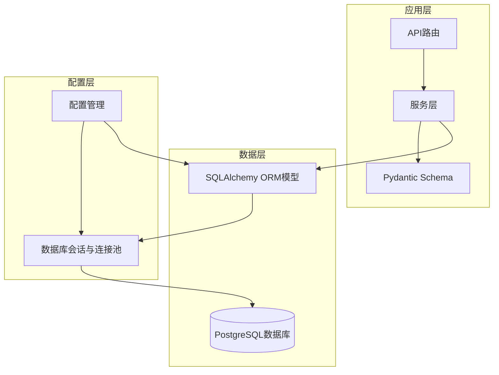
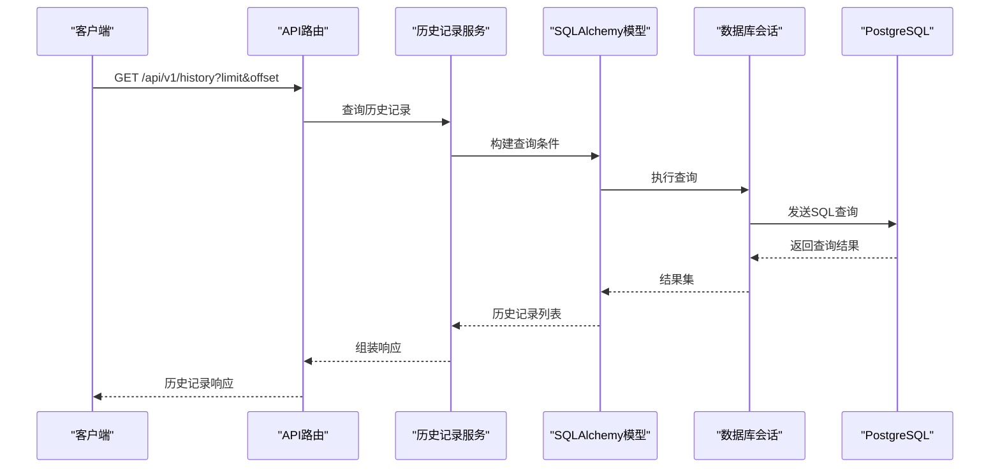
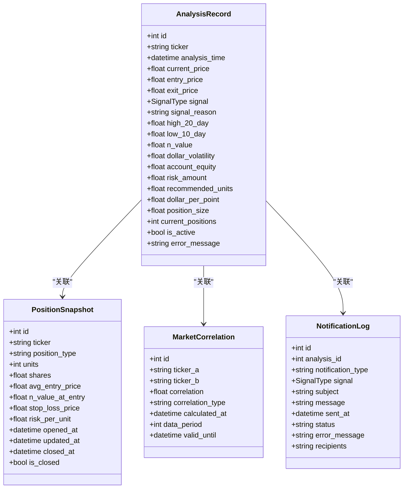
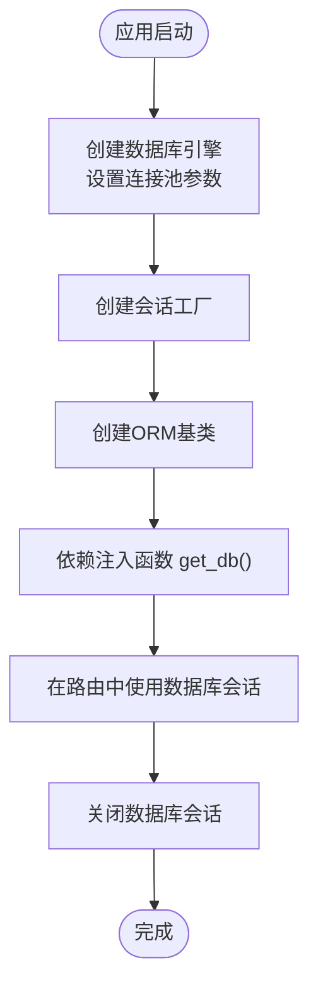
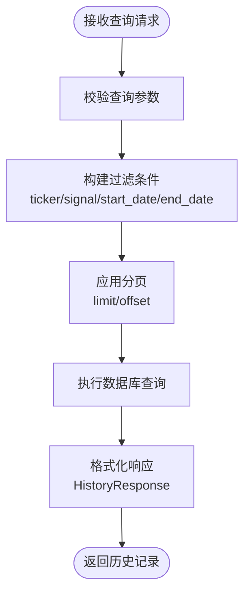
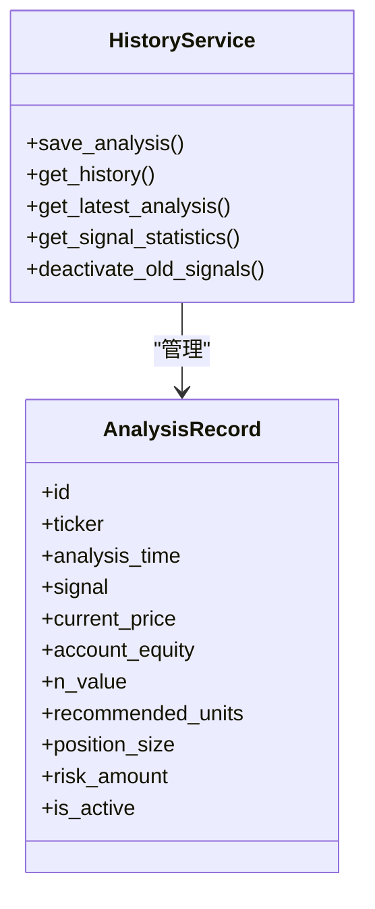
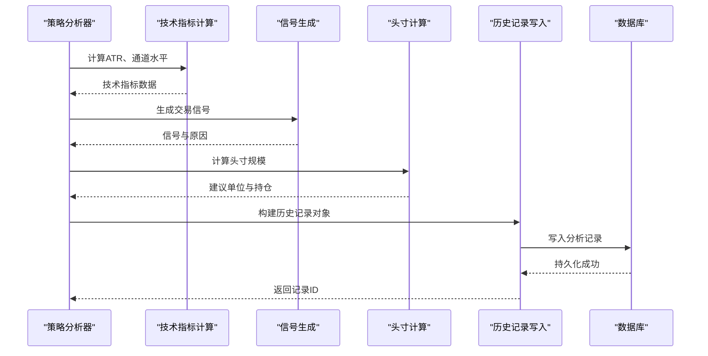
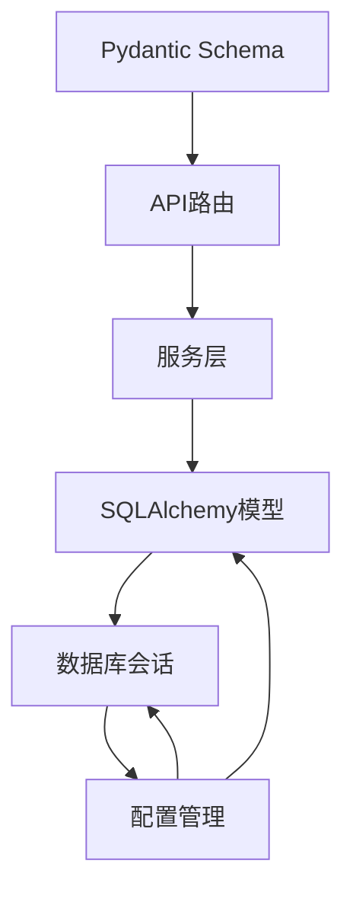

# 历史记录模块

<cite>
**本文档引用的文件**
- [app/database/models.py](file://app/database/models.py)
- [app/database/session.py](file://app/database/session.py)
- [app/schemas/trading.py](file://app/schemas/trading.py)
- [app/services/history.py](file://app/services/history.py)
- [app/api/history.py](file://app/api/history.py)
- [app/services/strategy.py](file://app/services/strategy.py)
- [app/api/analyze.py](file://app/api/analyze.py)
- [app/core/config.py](file://app/core/config.py)
- [app/main.py](file://app/main.py)
- [现代海龟协议：基于Python与微服务架构的自动化量化交易系统产品需求文档(PRD).md](file://现代海龟协议：基于Python与微服务架构的自动化量化交易系统产品需求文档(PRD).md)
</cite>

## 更新摘要
**变更内容**
- 新增历史记录统计分析功能，支持按周期统计信号分布
- 完善历史记录查询API，增强过滤条件和分页机制
- 优化分析记录存储流程，改进参数处理和错误处理
- 新增停用旧信号功能，支持信号状态管理
- 增强数据库索引策略，提升查询性能
- **新增risk_amount字段**：在AnalysisRecord模型中新增risk_amount字段，用于存储风险暴露数据，提供更完整的风险分析历史数据

## 目录
1. [简介](#简介)
2. [项目结构](#项目结构)
3. [核心组件](#核心组件)
4. [架构概览](#架构概览)
5. [详细组件分析](#详细组件分析)
6. [依赖分析](#依赖分析)
7. [性能考虑](#性能考虑)
8. [故障排除指南](#故障排除指南)
9. [结论](#结论)
10. [附录](#附录)

## 简介
本文件为《现代海龟协议》历史记录模块的技术文档，专注于SQLAlchemy ORM模型设计、策略执行日志的持久化流程、PostgreSQL数据库索引优化策略、查询性能调优、数据备份恢复机制，以及历史记录查询API的实现细节。文档旨在帮助开发者和运维工程师理解历史记录数据表结构、字段定义与关系映射，掌握历史数据分析功能的实现原理与前端展示的数据格式规范。

**更新** 新增了统计分析功能，支持按周期统计信号分布，增强了历史记录的分析能力。**新增risk_amount字段**，用于存储风险暴露数据，提供更完整的风险分析历史数据。

## 项目结构
历史记录模块位于后端应用的数据库层与服务层之间，通过SQLAlchemy ORM模型定义数据表结构，通过Pydantic Schema定义API查询参数与响应格式，最终将策略执行日志持久化到PostgreSQL数据库。

**图表来源**
- [app/database/models.py:19-68](file://app/database/models.py#L19-L68)
- [app/database/session.py:12-46](file://app/database/session.py#L12-L46)
- [app/schemas/trading.py:74-82](file://app/schemas/trading.py#L74-L82)
- [app/core/config.py:24](file://app/core/config.py#L24)

**章节来源**
- [app/database/models.py:1-163](file://app/database/models.py#L1-L163)
- [app/database/session.py:1-47](file://app/database/session.py#L1-L47)
- [app/schemas/trading.py:1-262](file://app/schemas/trading.py#L1-L262)
- [app/core/config.py:1-99](file://app/core/config.py#L1-L99)

## 核心组件
历史记录模块的核心组件包括：
- SQLAlchemy ORM模型：定义历史记录表结构、字段类型与索引
- 数据库会话与连接池：管理数据库连接与事务
- Pydantic Schema：定义历史记录查询参数与响应格式
- 配置管理：提供数据库URL与连接池参数
- 历史记录服务：提供分析记录保存、查询、统计等功能

**更新** 新增了统计分析服务，支持按周期统计信号分布和历史数据分析。**新增risk_amount字段**，用于存储风险暴露数据，提供更完整的风险分析历史数据。

关键要点：
- 历史记录表包含分析时间戳、资产代码、当前价格、通道阻力与支撑位、波动率指标、交易信号等核心字段
- **新增risk_amount字段**：存储1%风险金额（账户净资产×风险百分比），用于风险分析和历史追踪
- 通过索引优化提高查询性能，支持按资产代码、信号类型、分析时间等维度检索
- API查询支持分页参数（limit、offset），便于批量数据检索
- 新增统计分析功能，支持信号分布统计和周期分析

**章节来源**
- [app/database/models.py:19-68](file://app/database/models.py#L19-L68)
- [app/database/session.py:12-46](file://app/database/session.py#L12-L46)
- [app/schemas/trading.py:74-82](file://app/schemas/trading.py#L74-L82)
- [app/services/history.py:14-195](file://app/services/history.py#L14-L195)

## 架构概览
历史记录模块的架构围绕"数据模型-会话管理-API查询-数据库存储"展开，确保策略执行日志的可靠持久化与高效查询。

**图表来源**
- [app/schemas/trading.py:74-82](file://app/schemas/trading.py#L74-L82)
- [app/database/models.py:19-68](file://app/database/models.py#L19-L68)
- [app/database/session.py:32-41](file://app/database/session.py#L32-L41)

## 详细组件分析

### 数据库模型设计
历史记录模块的核心数据模型为`AnalysisRecord`，用于存储每次策略分析的历史数据。模型字段涵盖分析时间戳、资产代码、价格数据、通道参数、波动率参数、头寸计算、元数据等。

**图表来源**
- [app/database/models.py:19-162](file://app/database/models.py#L19-L162)

字段定义与数据类型：
- 分析时间戳：`analysis_time`（DateTime，带时区）
- 资产代码：`ticker`（String，长度20，带索引）
- 价格数据：`current_price`、`entry_price`、`exit_price`（Float）
- 交易信号：`signal`（Enum，枚举BUY/SELL/HOLD）
- 通道参数：`high_20_day`、`low_10_day`（Float）
- 波动率参数：`n_value`、`dollar_volatility`（Float）
- **新增风险字段**：`risk_amount`（Float，存储1%风险金额）
- 头寸计算：`account_equity`、`recommended_units`、`dollar_per_point`、`position_size`（Float）
- 持仓信息：`current_positions`（Integer）
- 元数据：`is_active`（Boolean）、`error_message`（Text）

索引优化策略：
- 复合索引：`(ticker, analysis_time)`
- 单列索引：`signal`、`analysis_time`
- 目标：加速按资产代码与时间范围的查询，以及按信号类型的过滤

**章节来源**
- [app/database/models.py:19-68](file://app/database/models.py#L19-L68)

### 数据库会话与连接池
数据库会话与连接池通过`session.py`统一管理，提供：
- 异步非阻塞的数据库连接
- 连接池参数：预检查、大小、溢出连接数、连接回收时间
- 依赖注入函数`get_db()`，用于FastAPI路由中获取数据库会话
- 初始化函数`init_db()`，创建所有表

**图表来源**
- [app/database/session.py:12-46](file://app/database/session.py#L12-L46)

**章节来源**
- [app/database/session.py:12-46](file://app/database/session.py#L12-L46)

### 历史记录查询API
历史记录查询API通过Pydantic Schema定义查询参数，支持：
- 资产代码过滤：`ticker`
- 信号类型过滤：`signal`
- 时间范围过滤：`start_date`、`end_date`
- 分页参数：`limit`（默认50，范围1-500）、`offset`（默认0）

**更新** 新增了统计分析API，支持按周期统计信号分布。

**图表来源**
- [app/schemas/trading.py:74-82](file://app/schemas/trading.py#L74-L82)
- [app/schemas/trading.py:211-218](file://app/schemas/trading.py#L211-L218)

最佳实践：
- 合理设置`limit`，避免一次性返回过多数据
- 使用`offset`实现分页加载，减少内存压力
- 在高频查询场景下，优先使用复合索引`(ticker, analysis_time)`

**章节来源**
- [app/schemas/trading.py:74-82](file://app/schemas/trading.py#L74-L82)
- [app/schemas/trading.py:211-218](file://app/schemas/trading.py#L211-L218)

### 历史记录服务
历史记录服务提供了完整的分析记录管理功能，包括保存、查询、统计和状态管理。

**更新** 新增了统计分析和信号状态管理功能。**新增risk_amount参数支持**，确保风险暴露数据正确保存到数据库。

**图表来源**
- [app/services/history.py:14-195](file://app/services/history.py#L14-L195)

主要功能：
- `save_analysis()`: 保存分析记录，处理各种参数和错误信息，**包含risk_amount字段支持**
- `get_history()`: 获取历史记录，支持多条件过滤和分页
- `get_latest_analysis()`: 获取最新分析记录
- `get_signal_statistics()`: 获取信号统计信息，支持周期分析
- `deactivate_old_signals()`: 停用旧信号，管理信号状态

**章节来源**
- [app/services/history.py:14-195](file://app/services/history.py#L14-L195)

### 策略执行日志持久化流程
策略执行日志的持久化流程涉及数据获取、指标计算、信号生成、头寸计算与历史记录写入。

**图表来源**
- [app/services/strategy.py:44-161](file://app/services/strategy.py#L44-L161)
- [app/services/strategy.py:275-319](file://app/services/strategy.py#L275-L319)
- [app/database/models.py:19-68](file://app/database/models.py#L19-L68)

**章节来源**
- [app/services/strategy.py:44-161](file://app/services/strategy.py#L44-L161)
- [app/services/strategy.py:275-319](file://app/services/strategy.py#L275-L319)

### PostgreSQL数据库索引优化策略
为提升历史记录查询性能，建议采用以下索引策略：
- 复合索引 `(ticker, analysis_time)`：支持按资产代码与时间范围的高效查询
- 单列索引 `signal`：加速按信号类型的过滤
- 单列索引 `analysis_time`：支持按时间排序与范围查询
- 唯一索引 `market_correlations` 的 `(ticker_a, ticker_b)`：确保相关性数据的唯一性

查询性能调优：
- 使用EXPLAIN ANALYZE分析慢查询
- 合理使用LIMIT与OFFSET实现分页
- 在高频查询场景下，避免SELECT *，只选择必要字段
- 定期更新统计信息，确保查询计划最优

**章节来源**
- [app/database/models.py:61-65](file://app/database/models.py#L61-L65)
- [app/database/models.py:128-130](file://app/database/models.py#L128-L130)

### 数据备份恢复机制
建议采用以下备份与恢复策略：
- 定期全量备份：每周进行一次全量备份
- 增量备份：每天进行增量备份，保留最近7天的增量日志
- 备份验证：定期验证备份文件的完整性与可恢复性
- 恢复演练：每季度进行一次恢复演练，确保备份策略有效
- 监控告警：设置数据库备份状态监控与告警机制

## 依赖分析
历史记录模块的依赖关系清晰，各组件职责明确，耦合度低，便于维护与扩展。

**图表来源**
- [app/database/models.py:8](file://app/database/models.py#L8)
- [app/database/session.py:9](file://app/database/session.py#L9)
- [app/core/config.py:98](file://app/core/config.py#L98)

**章节来源**
- [app/database/models.py:1-163](file://app/database/models.py#L1-L163)
- [app/database/session.py:1-47](file://app/database/session.py#L1-L47)
- [app/core/config.py:1-99](file://app/core/config.py#L1-L99)

## 性能考虑
- 连接池优化：根据并发请求量调整`pool_size`与`max_overflow`，避免连接争用
- 查询优化：使用合适的索引，避免全表扫描；合理使用LIMIT与OFFSET
- 缓存策略：对热点查询结果进行缓存，减少数据库压力
- 监控与告警：设置数据库性能指标监控，及时发现性能瓶颈

**更新** 新增统计分析的性能优化建议，包括周期性统计的缓存策略。**新增risk_amount字段的性能考虑**：该字段用于风险分析追踪，建议在查询时根据需要选择性包含，避免不必要的数据传输。

## 故障排除指南
常见问题与解决方案：
- 连接池耗尽：检查`pool_size`与`max_overflow`配置，增加连接池容量
- 查询缓慢：分析慢查询日志，添加或优化索引
- 数据不一致：检查事务提交与回滚逻辑，确保数据一致性
- 配置错误：验证数据库URL与连接参数，确保配置正确
- 统计分析异常：检查时间范围参数，确保统计周期合理
- **risk_amount字段异常**：检查风险计算逻辑，确保risk_amount正确计算并存储

**章节来源**
- [app/database/session.py:12-19](file://app/database/session.py#L12-L19)
- [app/core/config.py:24](file://app/core/config.py#L24)

## 结论
历史记录模块通过清晰的SQLAlchemy ORM模型设计、高效的数据库索引策略与完善的API查询机制，实现了策略执行日志的可靠持久化与高效查询。配合合理的性能优化与备份恢复策略，能够满足大规模历史数据分析与审计追溯的需求。

**更新** 新增的统计分析功能进一步增强了历史记录模块的能力，支持更深入的数据洞察和业务分析。**新增的risk_amount字段**为风险分析提供了完整的历史数据支持，使用户能够追踪和分析风险暴露的变化趋势。

## 附录
- 历史数据分析功能的实现原理：基于技术指标计算与信号生成，结合波动率参数与头寸计算，形成完整的分析报告
- 前端展示的数据格式规范：历史记录响应包含基础字段、技术指标、风险指标与图表数据，便于前端组件渲染
- 统计分析功能：支持按周期统计信号分布，提供信号类型占比和趋势分析
- 信号状态管理：支持停用旧信号，确保历史记录的准确性和时效性
- **风险分析功能**：通过risk_amount字段追踪1%风险金额的历史变化，支持风险暴露分析和趋势监控

**章节来源**
- [app/services/strategy.py:205-273](file://app/services/strategy.py#L205-L273)
- [app/schemas/trading.py:191-209](file://app/schemas/trading.py#L191-L209)
- [app/services/history.py:149-181](file://app/services/history.py#L149-L181)
- [app/services/strategy.py:313-374](file://app/services/strategy.py#L313-L374)