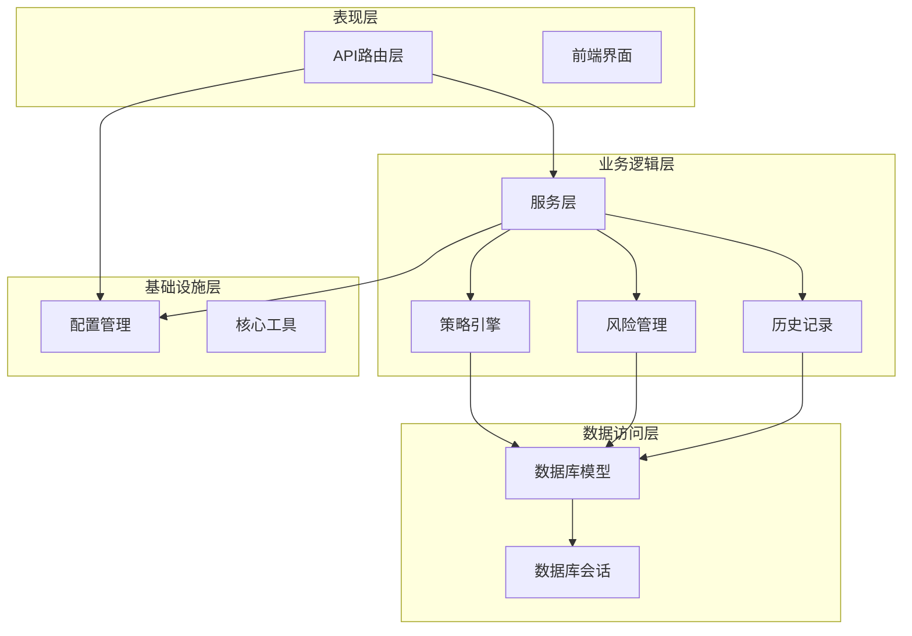
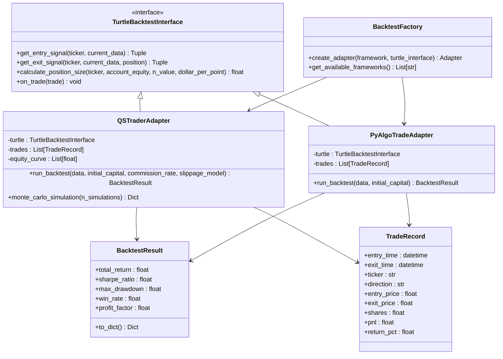
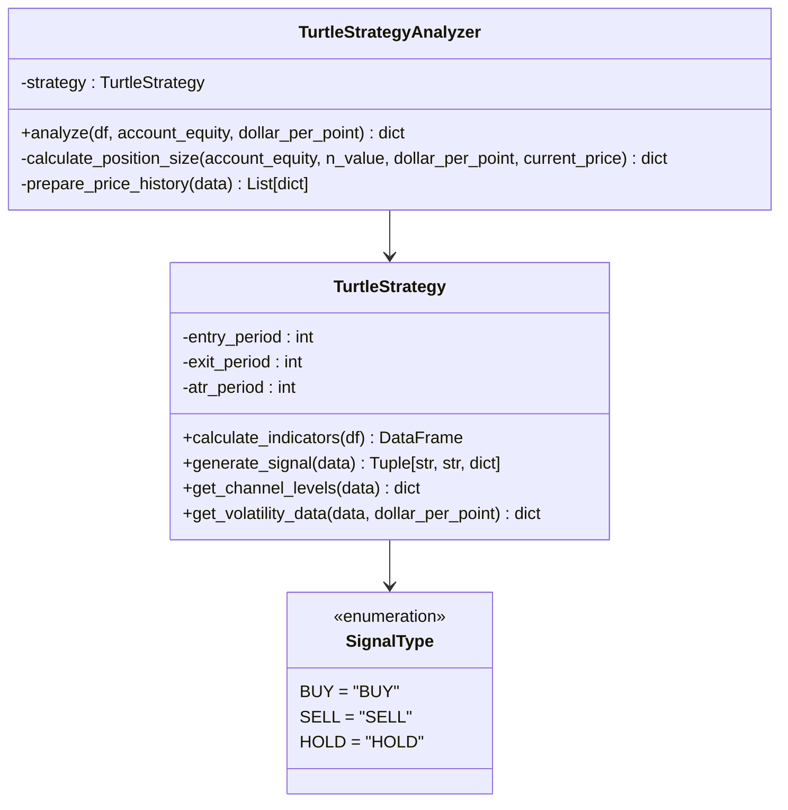
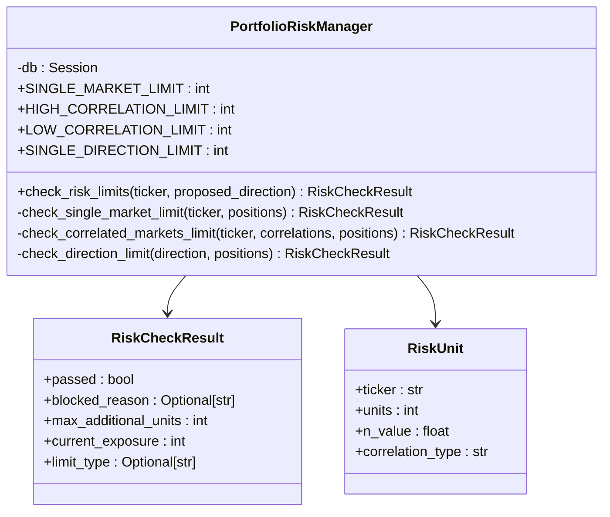
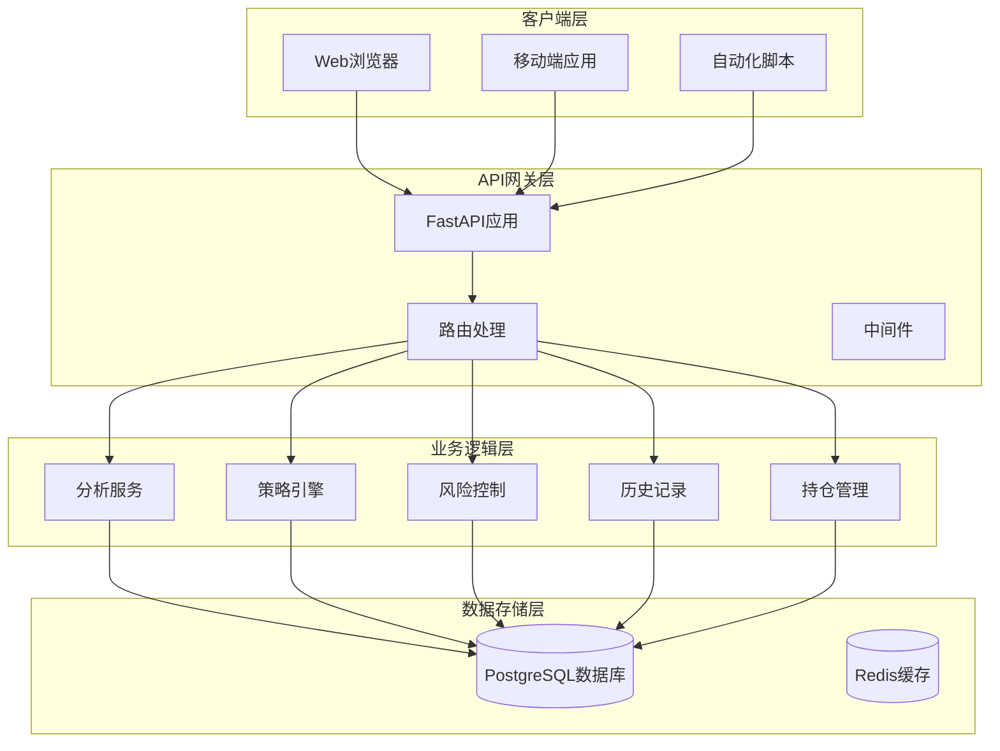
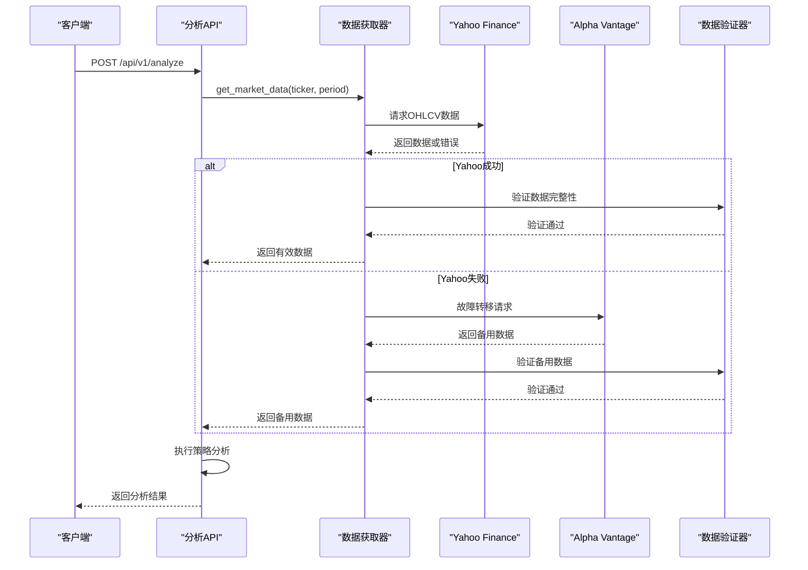
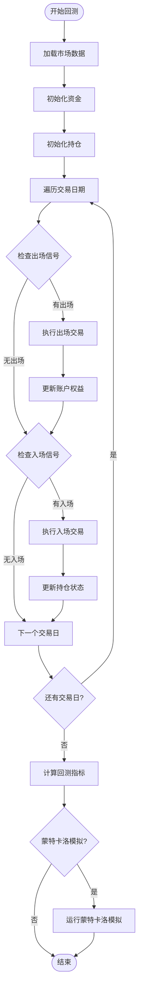
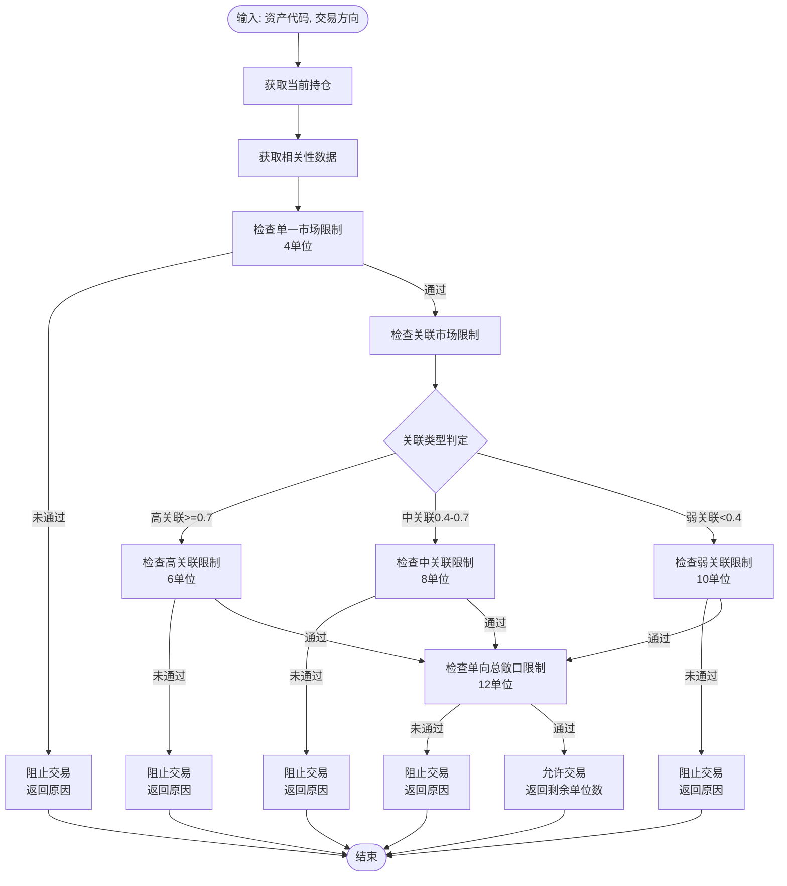
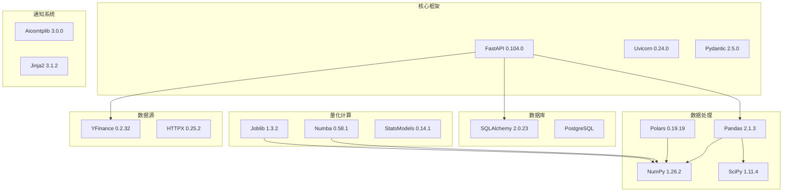

# 回测框架

<cite>
**本文档引用的文件**
- [app/main.py](file://app/main.py)
- [app/services/backtest.py](file://app/services/backtest.py)
- [app/core/config.py](file://app/core/config.py)
- [app/schemas/trading.py](file://app/schemas/trading.py)
- [app/database/models.py](file://app/database/models.py)
- [app/api/analyze.py](file://app/api/analyze.py)
- [app/services/strategy.py](file://app/services/strategy.py)
- [app/services/risk_manager.py](file://app/services/risk_manager.py)
- [app/database/session.py](file://app/database/session.py)
- [app/services/fetch_data.py](file://app/services/fetch_data.py)
- [app/api/history.py](file://app/api/history.py)
- [app/services/history.py](file://app/services/history.py)
- [app/api/positions.py](file://app/api/positions.py)
- [requirements.txt](file://requirements.txt)
- [scripts/init_db.py](file://scripts/init_db.py)
</cite>

## 目录
1. [简介](#简介)
2. [项目结构](#项目结构)
3. [核心组件](#核心组件)
4. [架构概览](#架构概览)
5. [详细组件分析](#详细组件分析)
6. [依赖分析](#依赖分析)
7. [性能考虑](#性能考虑)
8. [故障排除指南](#故障排除指南)
9. [结论](#结论)

## 简介

现代海龟协议量化交易系统是一个基于Python和微服务架构的自动化量化交易系统。该系统实现了经典的海龟交易法则，提供完整的策略分析、头寸计算、历史追踪和信号通知功能。

系统的核心特色包括：
- 基于波动率的趋势跟踪信号生成
- 动态风险管理的头寸规模计算
- 完整的交易决策历史记录
- 实时信号通知推送
- 松耦合兼容多种专业回测框架

## 项目结构

该项目采用清晰的分层架构设计，主要分为以下几个层次：

**图表来源**
- [app/main.py:1-205](file://app/main.py#L1-L205)
- [app/services/backtest.py:1-487](file://app/services/backtest.py#L1-L487)
- [app/core/config.py:1-99](file://app/core/config.py#L1-L99)

**章节来源**
- [app/main.py:1-205](file://app/main.py#L1-L205)
- [requirements.txt:1-61](file://requirements.txt#L1-L61)

## 核心组件

### 回测框架接口

系统提供了灵活的回测框架适配器，支持与多个专业回测平台的松耦合集成：

**图表来源**
- [app/services/backtest.py:84-487](file://app/services/backtest.py#L84-L487)

### 策略分析引擎

系统的核心策略分析引擎实现了经典的海龟交易法则：

**图表来源**
- [app/services/strategy.py:20-408](file://app/services/strategy.py#L20-L408)

### 风险管理系统

系统实现了多层级的风险控制机制：

**图表来源**
- [app/services/risk_manager.py:33-328](file://app/services/risk_manager.py#L33-L328)

**章节来源**
- [app/services/backtest.py:1-487](file://app/services/backtest.py#L1-L487)
- [app/services/strategy.py:1-408](file://app/services/strategy.py#L1-L408)
- [app/services/risk_manager.py:1-328](file://app/services/risk_manager.py#L1-L328)

## 架构概览

系统采用RESTful API架构，结合FastAPI框架实现高性能的异步处理：

**图表来源**
- [app/main.py:40-118](file://app/main.py#L40-L118)
- [app/database/session.py:11-47](file://app/database/session.py#L11-L47)

**章节来源**
- [app/main.py:1-205](file://app/main.py#L1-L205)
- [app/database/session.py:1-47](file://app/database/session.py#L1-L47)

## 详细组件分析

### 数据获取与处理

系统实现了多源数据获取和容灾机制：

**图表来源**
- [app/services/fetch_data.py:44-233](file://app/services/fetch_data.py#L44-L233)
- [app/api/analyze.py:31-191](file://app/api/analyze.py#L31-L191)

### 回测执行流程

系统提供了完整的回测执行流程，支持多种回测框架：

**图表来源**
- [app/services/backtest.py:161-350](file://app/services/backtest.py#L161-L350)

### 风险控制机制

系统实现了四重熔断机制来控制投资组合风险：

**图表来源**
- [app/services/risk_manager.py:59-259](file://app/services/risk_manager.py#L59-L259)

**章节来源**
- [app/services/fetch_data.py:1-233](file://app/services/fetch_data.py#L1-L233)
- [app/services/backtest.py:1-487](file://app/services/backtest.py#L1-L487)
- [app/services/risk_manager.py:1-328](file://app/services/risk_manager.py#L1-L328)

## 依赖分析

系统使用了现代化的Python技术栈，主要依赖包括：

**图表来源**
- [requirements.txt:1-61](file://requirements.txt#L1-L61)

**章节来源**
- [requirements.txt:1-61](file://requirements.txt#L1-L61)

## 性能考虑

### 并发处理优化

系统采用了多种并发处理技术来提升性能：

1. **异步I/O处理**: 使用async/await模式处理数据获取和API调用
2. **连接池管理**: 数据库连接池配置优化，支持高并发访问
3. **JIT编译加速**: Numba库加速长周期历史回测计算
4. **并行计算**: Joblib库支持多核CPU并行分析

### 内存管理

1. **数据分块处理**: 对大数据集进行分块处理，避免内存溢出
2. **索引优化**: 数据库表建立合适的索引以提升查询性能
3. **缓存策略**: 使用Redis缓存热点数据，减少重复计算

### 网络优化

1. **超时控制**: 设置合理的请求超时时间，避免长时间阻塞
2. **故障转移**: 多数据源容灾机制，确保数据获取可靠性
3. **重试机制**: 智能重试策略，提高系统稳定性

## 故障排除指南

### 常见问题及解决方案

#### 数据获取失败

**问题症状**: API返回数据源错误

**可能原因**:
1. 网络连接不稳定
2. 数据源API限制
3. 资产代码无效

**解决步骤**:
1. 检查网络连接状态
2. 验证资产代码格式
3. 查看API限流情况
4. 检查备用数据源配置

#### 回测结果异常

**问题症状**: 回测结果显示异常的收益或风险指标

**可能原因**:
1. 数据质量问题
2. 参数设置错误
3. 滑点和手续费计算问题

**解决步骤**:
1. 验证输入数据的完整性
2. 检查回测参数配置
3. 确认滑点模型设置
4. 对比不同回测框架结果

#### 风险控制触发

**问题症状**: 交易被风控系统阻止

**可能原因**:
1. 超过单一市场限制
2. 关联市场风险过高
3. 单向总敞口超限

**解决步骤**:
1. 检查当前持仓状态
2. 分析相关性矩阵
3. 调整风险参数设置
4. 平仓部分头寸降低风险

**章节来源**
- [app/services/fetch_data.py:16-24](file://app/services/fetch_data.py#L16-L24)
- [app/services/backtest.py:156-160](file://app/services/backtest.py#L156-L160)
- [app/services/risk_manager.py:132-140](file://app/services/risk_manager.py#L132-L140)

## 结论

现代海龟协议量化交易系统是一个功能完整、架构清晰的自动化交易系统。系统的主要优势包括：

1. **模块化设计**: 清晰的分层架构便于维护和扩展
2. **多框架兼容**: 支持与多种专业回测框架集成
3. **全面的风险控制**: 四重熔断机制确保投资组合安全
4. **高性能实现**: 采用多种优化技术提升系统性能
5. **容灾能力**: 多数据源备份确保系统稳定性

该系统为量化交易提供了坚实的技术基础，可以根据具体需求进一步扩展功能和优化性能。