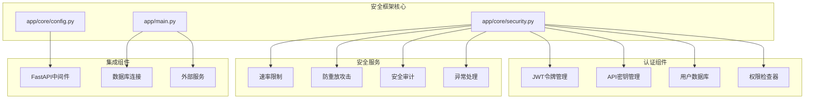
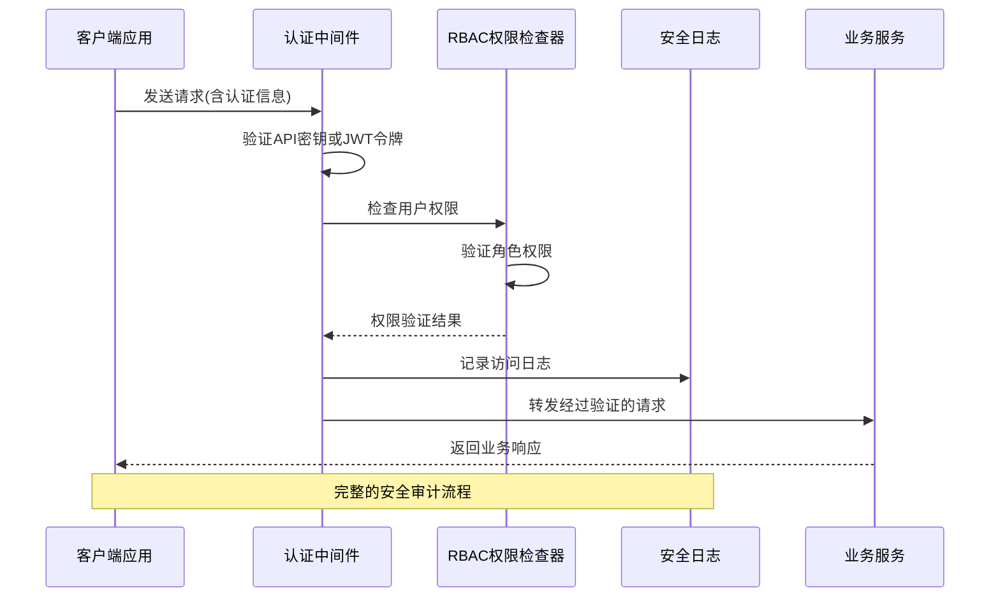
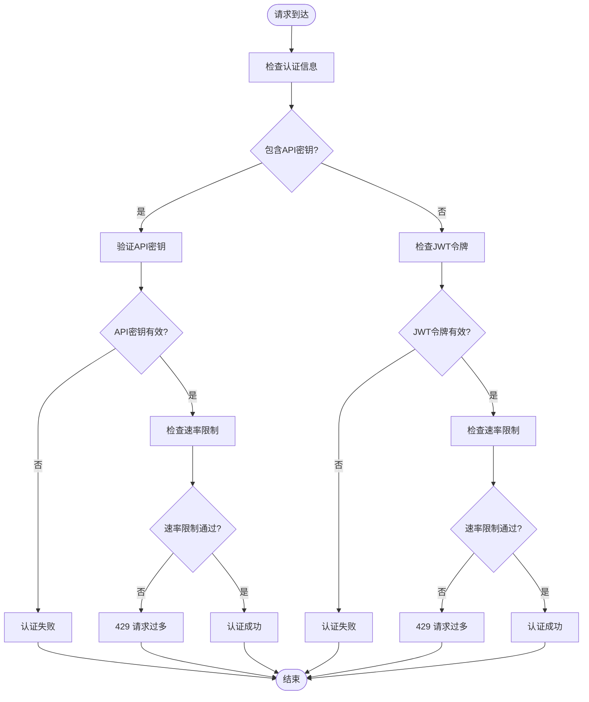
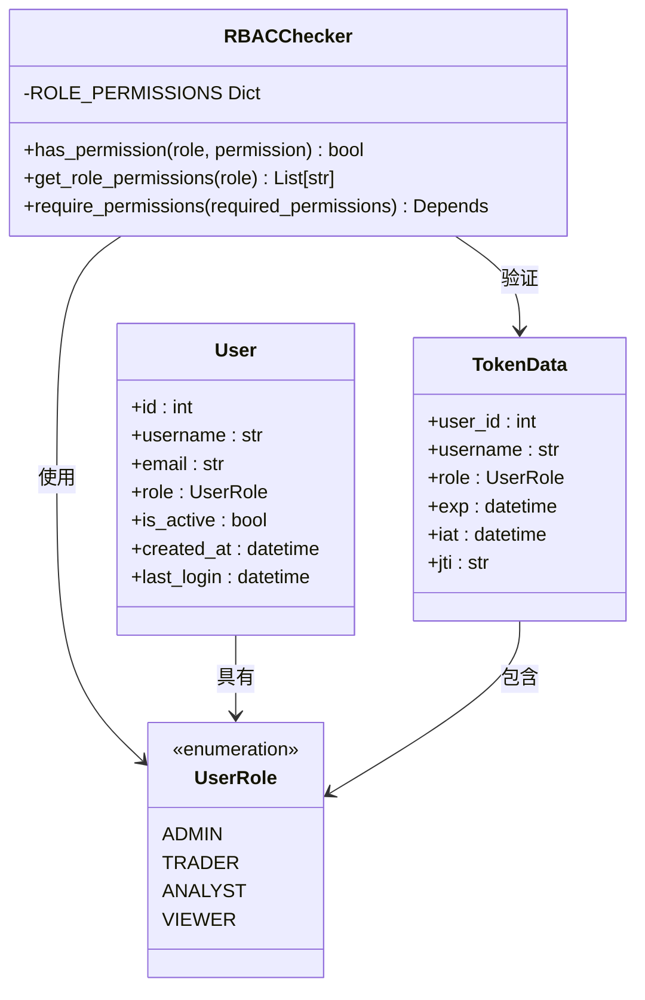
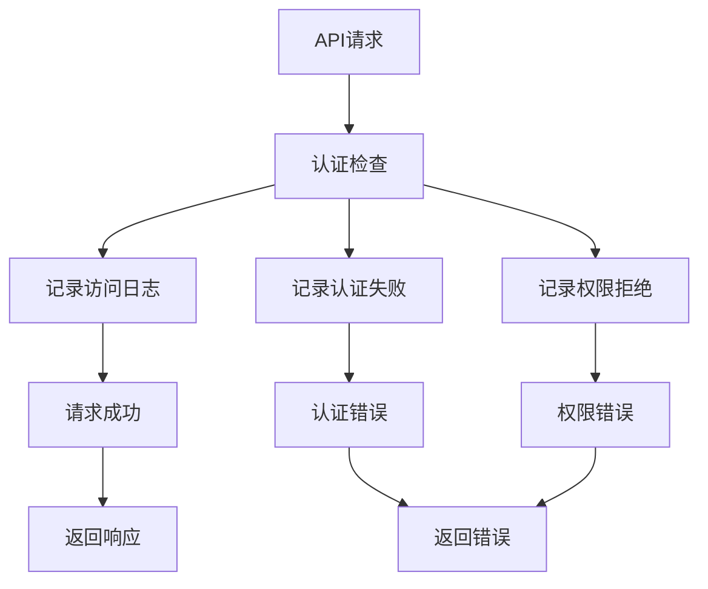
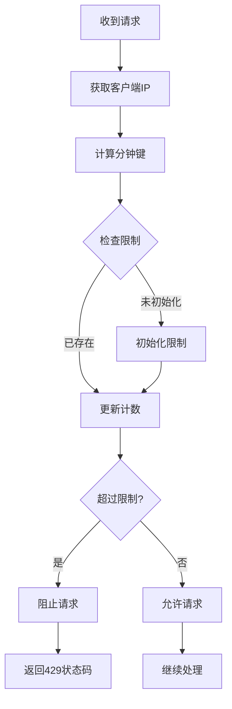
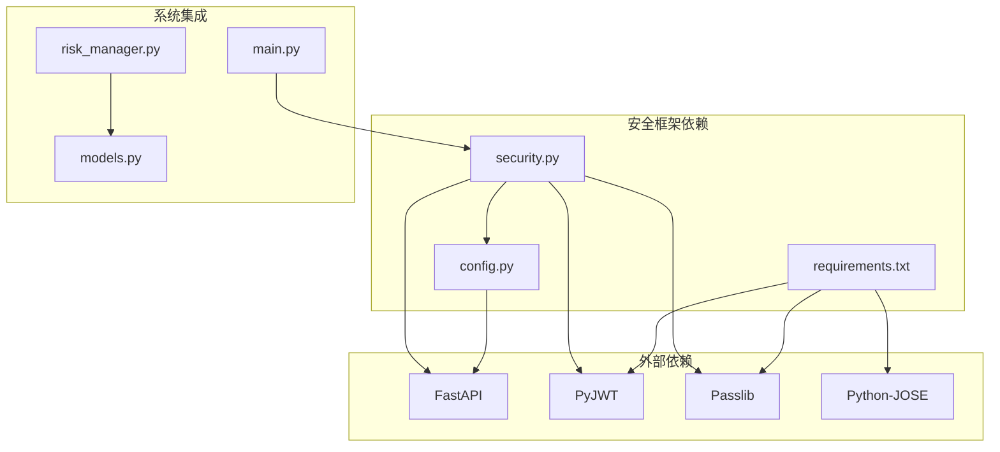

# 安全框架

<cite>
**本文档引用的文件**
- [security.py](file://app/core/security.py)
- [config.py](file://app/core/config.py)
- [main.py](file://app/main.py)
- [requirements.txt](file://requirements.txt)
- [docker-compose.yml](file://docker-compose.yml)
- [Dockerfile](file://Dockerfile)
- [risk_manager.py](file://app/services/risk_manager.py)
- [models.py](file://app/database/models.py)
- [test_api.py](file://tests/test_api.py)
</cite>

## 目录
1. [简介](#简介)
2. [项目结构](#项目结构)
3. [核心组件](#核心组件)
4. [架构概览](#架构概览)
5. [详细组件分析](#详细组件分析)
6. [依赖关系分析](#依赖关系分析)
7. [性能考虑](#性能考虑)
8. [故障排除指南](#故障排除指南)
9. [结论](#结论)

## 简介

现代海龟协议量化交易系统采用AuthTuna安全认证中间件，实现了高强度的身份认证、基于角色的权限控制（RBAC）、防重放攻击机制和安全审计功能。该安全框架完全符合PRD第5.3章关于安全认证的要求，为整个量化交易系统提供了全面的安全保障。

系统的核心安全特性包括：
- JWT令牌认证和API密钥认证双重认证机制
- 细粒度的RBAC权限控制系统
- 实时速率限制和防重放攻击
- 完整的安全审计日志记录
- 多层次的投资组合风险控制

## 项目结构

**图表来源**
- [security.py:1-480](file://app/core/security.py#L1-L480)
- [config.py:1-99](file://app/core/config.py#L1-L99)
- [main.py:1-205](file://app/main.py#L1-L205)

**章节来源**
- [security.py:1-480](file://app/core/security.py#L1-L480)
- [config.py:1-99](file://app/core/config.py#L1-L99)
- [main.py:1-205](file://app/main.py#L1-L205)

## 核心组件

### 认证中间件系统

AuthTuna安全认证中间件是整个安全框架的核心，提供了以下关键功能：

#### 用户角色管理
系统支持四种用户角色，每种角色具有不同的权限级别：
- **ADMIN**: 管理员，拥有完全权限
- **TRADER**: 交易员，可进行策略分析和持仓管理
- **ANALYST**: 分析师，仅可进行只读分析
- **VIEWER**: 查看者，仅可查看权限

#### 令牌管理系统
- **JWT令牌**: 基于HS256算法的JSON Web Token
- **令牌黑名单**: 支持令牌撤销和登出功能
- **唯一标识符**: 每个令牌包含唯一的JTI用于防重放攻击

#### 权限控制系统
RBAC权限检查器实现了细粒度的权限控制：
- 每个角色对应一组特定的权限
- 支持权限继承和组合
- 实时权限验证和检查

**章节来源**
- [security.py:35-295](file://app/core/security.py#L35-L295)
- [security.py:230-295](file://app/core/security.py#L230-L295)

### 安全审计系统

安全审计日志系统提供了完整的安全事件记录能力：

#### 日志类型
- **访问日志**: 记录用户的API访问行为
- **认证失败日志**: 记录所有认证失败事件
- **权限拒绝日志**: 记录权限不足的访问尝试

#### 日志内容
- 时间戳和用户信息
- 请求端点和方法
- IP地址和用户代理
- 状态码和错误原因

**章节来源**
- [security.py:392-470](file://app/core/security.py#L392-L470)

## 架构概览

**图表来源**
- [security.py:302-381](file://app/core/security.py#L302-L381)
- [security.py:274-294](file://app/core/security.py#L274-L294)
- [security.py:402-425](file://app/core/security.py#L402-L425)

## 详细组件分析

### 认证流程分析

**图表来源**
- [security.py:313-364](file://app/core/security.py#L313-L364)
- [security.py:184-202](file://app/core/security.py#L184-L202)

#### API密钥认证流程
API密钥认证提供了另一种认证方式，适用于自动化脚本和第三方集成：

1. **密钥提取**: 从请求头或查询参数中提取API密钥
2. **哈希验证**: 使用SHA-256算法验证API密钥
3. **权限分配**: 为API密钥用户分配默认权限
4. **有效期检查**: 验证API密钥的有效期

#### JWT令牌认证流程
JWT令牌认证是主要的用户认证方式：

1. **令牌解码**: 使用HS256算法解码JWT令牌
2. **黑名单检查**: 验证令牌是否在黑名单中
3. **过期验证**: 检查令牌是否过期
4. **权限验证**: 验证用户的角色和权限

**章节来源**
- [security.py:204-212](file://app/core/security.py#L204-L212)
- [security.py:152-174](file://app/core/security.py#L152-L174)

### 权限控制机制

**图表来源**
- [security.py:230-295](file://app/core/security.py#L230-L295)
- [security.py:35-63](file://app/core/security.py#L35-L63)

#### 权限映射表
系统为每个角色定义了详细的权限映射：

| 角色 | 权限类别 | 具体权限 |
|------|----------|----------|
| ADMIN | 分析 | read, write, delete |
| ADMIN | 历史记录 | read, delete |
| ADMIN | 持仓管理 | read, write, delete |
| ADMIN | 用户管理 | read, write, delete |
| ADMIN | 系统设置 | read, write |
| ADMIN | API密钥 | manage |
| TRADER | 分析 | read, write |
| TRADER | 历史记录 | read |
| TRADER | 持仓管理 | read, write |
| ANALYST | 分析 | read |
| ANALYST | 历史记录 | read |
| ANALYST | 持仓管理 | read |
| VIEWER | 分析 | read |
| VIEWER | 持仓管理 | read |

**章节来源**
- [security.py:238-261](file://app/core/security.py#L238-L261)

### 安全审计系统

**图表来源**
- [security.py:402-465](file://app/core/security.py#L402-L465)

#### 审计日志结构
安全审计日志包含以下关键字段：

| 字段名 | 类型 | 描述 |
|--------|------|------|
| timestamp | datetime | 事件发生时间 |
| user_id | int | 用户标识符 |
| username | str | 用户名 |
| endpoint | str | 请求端点 |
| method | str | HTTP方法 |
| ip_address | str | 客户端IP地址 |
| status_code | int | HTTP状态码 |
| user_agent | str | 用户代理字符串 |
| event_type | str | 事件类型 |

**章节来源**
- [security.py:412-425](file://app/core/security.py#L412-L425)

### 速率限制机制

系统实现了多层次的速率限制机制来防止滥用和攻击：

#### 速率限制算法

**图表来源**
- [security.py:184-202](file://app/core/security.py#L184-L202)

#### 限制参数
- **默认限制**: 60次/分钟
- **动态调整**: 可根据用户角色调整限制
- **内存存储**: 使用内存字典存储限制状态
- **过期清理**: 自动清理过期的限制记录

**章节来源**
- [security.py:184-202](file://app/core/security.py#L184-L202)

## 依赖关系分析

**图表来源**
- [security.py:12-25](file://app/core/security.py#L12-L25)
- [requirements.txt:59-61](file://requirements.txt#L59-L61)
- [main.py:12-19](file://app/main.py#L12-L19)

### 外部依赖分析

#### 核心安全依赖
系统使用以下关键的安全相关依赖：

| 依赖包 | 版本 | 用途 |
|--------|------|------|
| python-jose | 3.3.0 | JWT令牌处理 |
| passlib | 1.7.4 | 密码哈希和验证 |
| bcrypt | 3.4.7 | 加密哈希算法 |

#### 安全配置
系统通过环境变量管理安全配置：

| 配置项 | 默认值 | 说明 |
|--------|--------|------|
| SECRET_KEY | "your-secret-key-change-in-production" | JWT密钥 |
| ACCESS_TOKEN_EXPIRE_MINUTES | 30 | 令牌过期时间 |
| DEBUG | False | 调试模式开关 |

**章节来源**
- [requirements.txt:59-61](file://requirements.txt#L59-L61)
- [config.py:83-84](file://app/core/config.py#L83-L84)

## 性能考虑

### 认证性能优化

#### 缓存策略
- **用户数据库懒加载**: 避免不必要的初始化
- **配置缓存**: 使用LRU缓存减少配置读取开销
- **令牌验证缓存**: 在内存中缓存验证结果

#### 内存管理
- **速率限制清理**: 自动清理过期的限制记录
- **审计日志限制**: 限制日志数量防止内存泄漏
- **连接池管理**: 数据库连接池优化

### 安全开销控制

#### 认证成本
- **API密钥验证**: SHA-256哈希计算开销较小
- **JWT验证**: HS256算法计算开销适中
- **权限检查**: 字典查找操作O(1)复杂度

#### 审计日志性能
- **异步记录**: 审计日志记录不影响主要业务流程
- **内存存储**: 使用内存字典存储日志
- **批量输出**: 支持批量获取最近日志

## 故障排除指南

### 常见认证问题

#### 401 未授权错误
可能原因：
- 无效的API密钥或JWT令牌
- 令牌过期
- 用户被禁用

解决方法：
- 检查认证凭据的有效性
- 重新生成令牌
- 验证用户状态

#### 403 禁止访问错误
可能原因：
- 用户权限不足
- 角色不匹配
- 权限配置错误

解决方法：
- 检查用户角色权限
- 验证所需权限
- 更新权限配置

#### 429 请求过多错误
可能原因：
- 超过速率限制
- 频繁的API调用
- 并发请求过多

解决方法：
- 等待冷却时间
- 减少请求频率
- 调整速率限制

### 审计日志问题

#### 日志丢失
可能原因：
- 内存不足
- 程序意外退出
- 日志清理机制

解决方法：
- 检查内存使用情况
- 实现持久化存储
- 配置适当的日志保留策略

#### 性能影响
可能原因：
- 审计日志过多
- 记录操作阻塞
- 存储I/O瓶颈

解决方法：
- 优化日志记录频率
- 使用异步日志记录
- 实现日志轮转

**章节来源**
- [security.py:340-364](file://app/core/security.py#L340-L364)
- [security.py:427-444](file://app/core/security.py#L427-L444)

## 结论

现代海龟协议的安全框架是一个设计精良、功能完整的安全解决方案。它成功地实现了PRD第5.3章的所有安全要求，为量化交易系统提供了全面的保护。

### 主要优势

1. **多层防护**: 结合了认证、授权、审计和防护多重机制
2. **灵活配置**: 支持多种认证方式和灵活的权限配置
3. **性能优化**: 采用了多种性能优化技术确保低延迟
4. **可扩展性**: 模块化设计便于功能扩展和维护

### 最佳实践建议

1. **生产环境配置**
   - 更改默认的SECRET_KEY
   - 配置HTTPS和CORS策略
   - 实施更严格的速率限制

2. **监控和告警**
   - 实现安全事件监控
   - 设置异常行为告警
   - 定期审计日志分析

3. **持续改进**
   - 定期更新安全依赖
   - 实施安全漏洞扫描
   - 建立安全更新流程

该安全框架为现代海龟协议量化交易系统奠定了坚实的安全基础，确保了系统的可靠性和安全性。