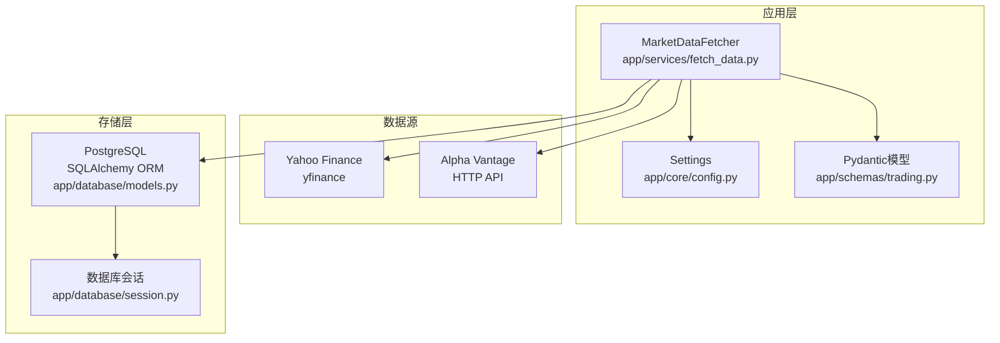
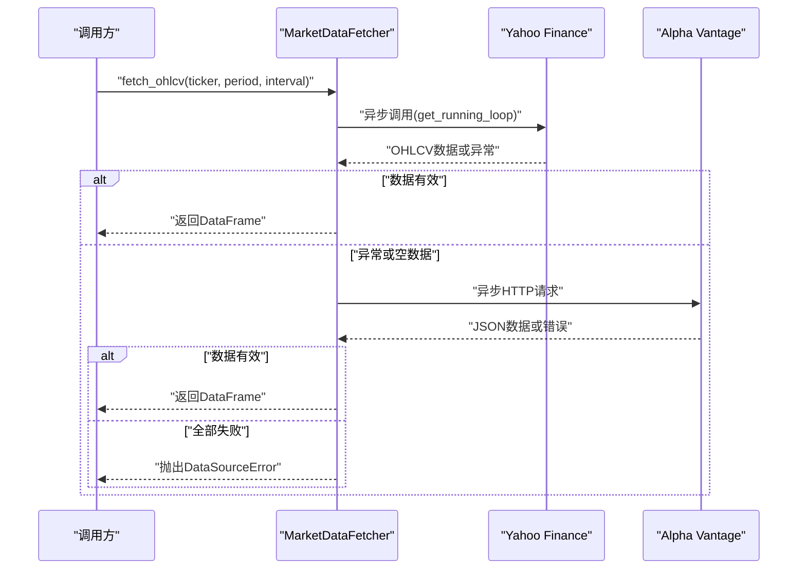
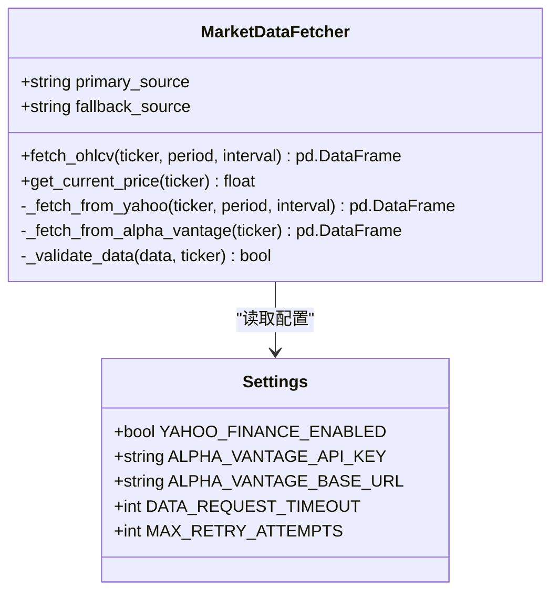
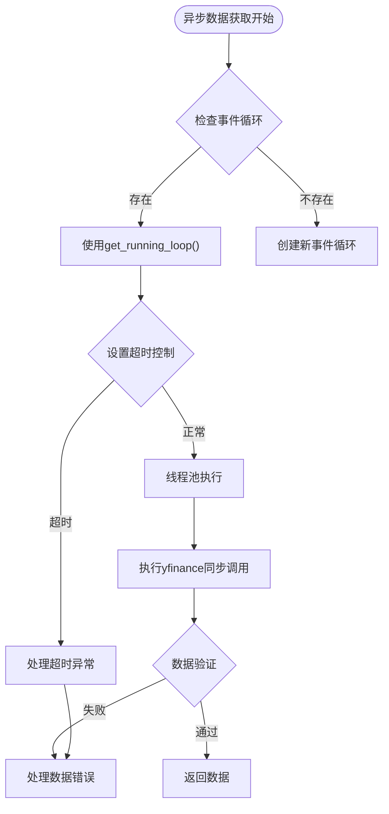
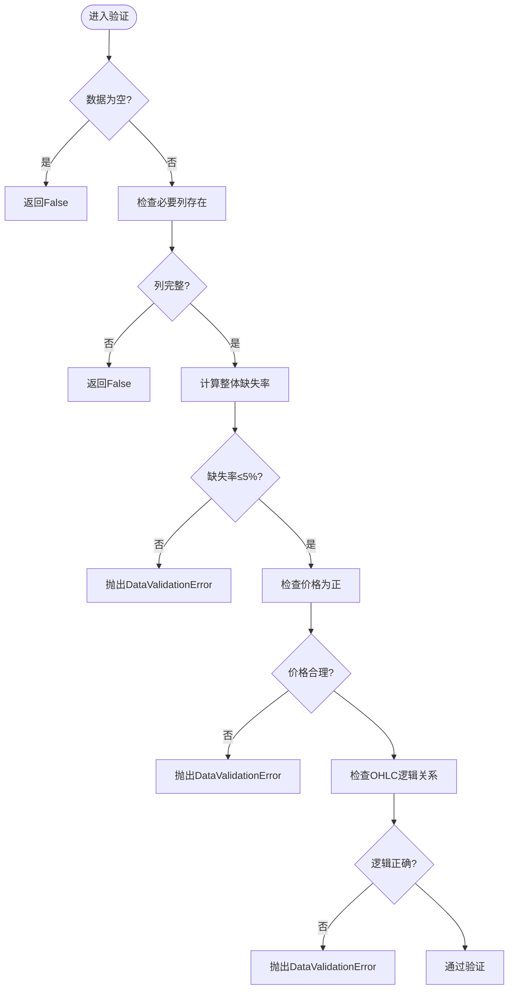
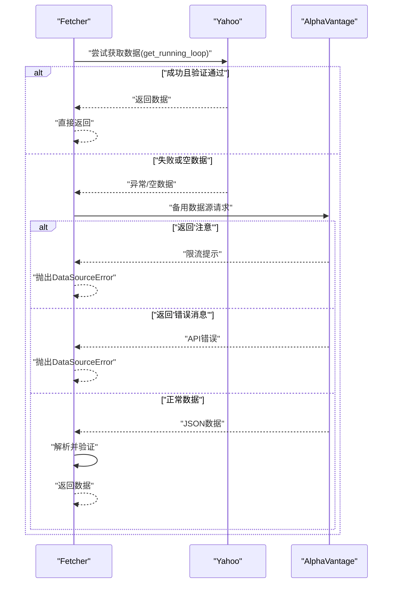
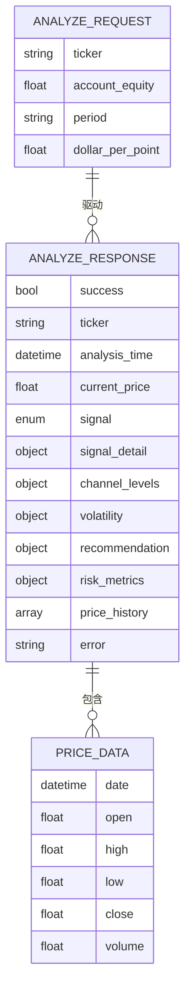
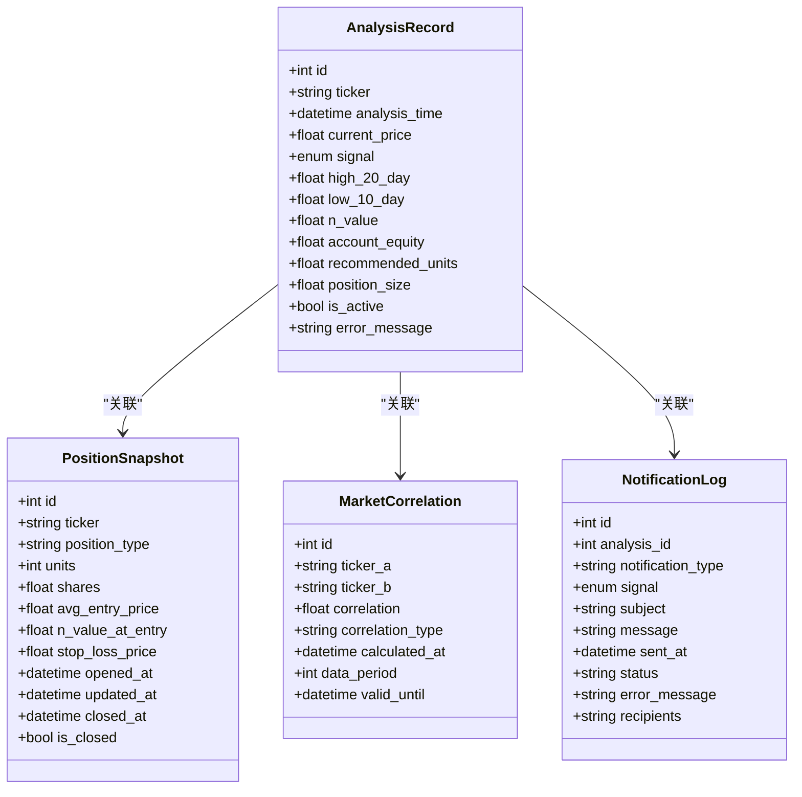
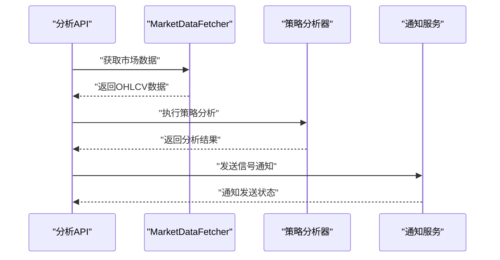
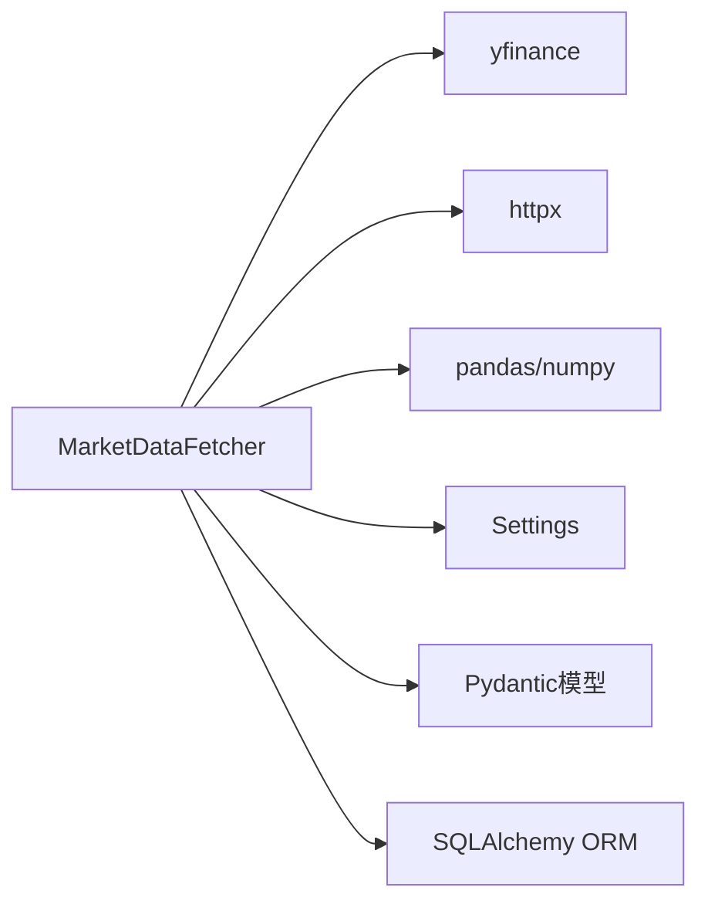

# 数据获取模块

<cite>
**本文引用的文件**
- [fetch_data.py](file://app/services/fetch_data.py)
- [config.py](file://app/core/config.py)
- [trading.py](file://app/schemas/trading.py)
- [models.py](file://app/database/models.py)
- [session.py](file://app/database/session.py)
- [analyze.py](file://app/api/analyze.py)
- [history.py](file://app/api/history.py)
- [strategy.py](file://app/services/strategy.py)
- [history.py](file://app/services/history.py)
- [notification.py](file://app/services/notification.py)
- [main.py](file://app/main.py)
</cite>

## 更新摘要
**变更内容**
- 更新了异步循环处理改进部分，重点介绍get_running_loop()的使用和线程池保护机制
- 新增了超时机制的详细说明，包括asyncio.wait_for()的使用和DATA_REQUEST_TIMEOUT配置
- 补充了线程池保护措施，防止高并发场景下的资源耗尽
- 更新了性能考虑章节，反映现代化异步处理的优势

## 目录
1. [简介](#简介)
2. [项目结构](#项目结构)
3. [核心组件](#核心组件)
4. [架构总览](#架构总览)
5. [详细组件分析](#详细组件分析)
6. [依赖分析](#依赖分析)
7. [性能考虑](#性能考虑)
8. [故障排查指南](#故障排查指南)
9. [结论](#结论)
10. [附录](#附录)

## 简介
本文件为《现代海龟协议》数据获取模块的技术文档，聚焦于多数据源容灾架构与数据清洗验证流程。系统采用"雅虎财经为主数据源、Alpha Vantage为备用数据源"的双源设计，并在以下场景实现自动故障转移与降级：
- 主数据源网络超时或返回空数据
- 备用数据源API限流（429状态码）或返回"注意"提示
- 数据包完整性校验失败（缺失值、异常断层空洞、OHLC逻辑关系异常）

同时，文档阐述了数据清洗与验证流程（基于列完整性、缺失率阈值、价格合理性与OHLC逻辑关系），并给出与策略计算模块的数据接口规范与数据格式标准化说明。

**更新** 新增实时数据同步功能，支持当前价格获取和信号通知系统的集成。系统现已采用现代化的异步处理架构，使用get_running_loop()替代已废弃的get_event_loop()，并实现了完善的超时控制和线程池保护机制。

## 项目结构
数据获取模块位于 app/services/fetch_data.py，核心配置位于 app/core/config.py，数据模型与Pydantic校验位于 app/schemas/trading.py，数据库ORM模型位于 app/database/models.py，数据库会话管理位于 app/database/session.py。

**图示来源**
- [fetch_data.py:26-233](file://app/services/fetch_data.py#L26-L233)
- [config.py:11-99](file://app/core/config.py#L11-L99)
- [trading.py:1-262](file://app/schemas/trading.py#L1-L262)
- [models.py:1-163](file://app/database/models.py#L1-L163)
- [session.py:1-47](file://app/database/session.py#L1-L47)

**章节来源**
- [fetch_data.py:1-233](file://app/services/fetch_data.py#L1-L233)
- [config.py:1-99](file://app/core/config.py#L1-L99)

## 核心组件
- MarketDataFetcher：多源容灾数据抓取器，负责主备数据源的调用、故障转移与数据验证。
- Settings：全局配置对象，包含数据源开关、API密钥、请求超时、重试次数等。
- Pydantic模型：统一的输入输出数据结构，确保接口一致性与数据完整性。
- SQLAlchemy模型：策略分析结果、持仓快照与市场关联度等数据持久化结构。

**章节来源**
- [fetch_data.py:26-233](file://app/services/fetch_data.py#L26-L233)
- [config.py:11-99](file://app/core/config.py#L11-L99)
- [trading.py:1-262](file://app/schemas/trading.py#L1-L262)
- [models.py:1-163](file://app/database/models.py#L1-L163)

## 架构总览
数据获取模块采用现代化的异步非阻塞请求架构，主数据源为雅虎财经（yfinance），备用数据源为Alpha Vantage（HTTP）。系统现已实现完善的异步循环处理改进，使用get_running_loop()替代已废弃的get_event_loop()，并通过asyncio.wait_for()实现超时控制，防止高并发场景下的线程池耗尽。当主数据源异常或数据验证失败时，自动切换到备用数据源；若两者均失败，则抛出数据源错误异常。

**图示来源**
- [fetch_data.py:44-84](file://app/services/fetch_data.py#L44-L84)
- [fetch_data.py:86-173](file://app/services/fetch_data.py#L86-L173)

## 详细组件分析

### MarketDataFetcher 类
职责与特性：
- 支持主数据源（雅虎财经）与备用数据源（Alpha Vantage）的自动故障转移
- **现代化异步处理**：使用get_running_loop()替代已废弃的get_event_loop()，确保与当前Python版本兼容
- **完善超时控制**：通过asyncio.wait_for()实现精确的超时管理，防止长时间阻塞
- **线程池保护**：在高并发场景下避免线程池耗尽，提升系统稳定性
- 异步非阻塞请求（备用数据源）
- 同步调用封装（主数据源通过线程池执行）
- 数据完整性校验（列存在性、缺失率、价格合理性、OHLC逻辑关系）
- 实时数据同步：提供当前价格获取功能

关键方法与行为：
- fetch_ohlcv：主流程入口，先尝试主数据源，再尝试备用数据源，最后抛出异常
- _fetch_from_yahoo：使用yfinance同步获取历史数据，**新增get_running_loop()使用和超时控制**，空数据时抛出异常
- _fetch_from_alpha_vantage：异步HTTP请求，解析JSON为DataFrame，按日期排序并截取近一年数据
- _validate_data：严格的数据完整性校验，超过阈值的缺失率或不合理价格将触发验证异常
- get_current_price：获取当前价格的便捷方法，支持主备数据源回退

**更新** 新增现代化异步处理改进，包括get_running_loop()的使用、超时控制和线程池保护机制。

**图示来源**
- [fetch_data.py:26-233](file://app/services/fetch_data.py#L26-L233)
- [config.py:34-44](file://app/core/config.py#L34-L44)

**章节来源**
- [fetch_data.py:26-233](file://app/services/fetch_data.py#L26-L233)

### 异步循环处理改进与线程池保护
**新增功能** 系统现已实现现代化的异步处理架构，包含以下关键改进：

- **get_running_loop()替代**：使用`asyncio.get_running_loop()`替代已废弃的`get_event_loop()`，确保与Python 3.12+版本兼容
- **超时控制机制**：通过`asyncio.wait_for()`实现精确的超时管理，默认超时时间为30秒
- **线程池保护**：在高并发场景下防止线程池耗尽，提升系统稳定性
- **异常处理增强**：针对超时错误提供明确的错误信息和处理策略

**图示来源**
- [fetch_data.py:96-119](file://app/services/fetch_data.py#L96-L119)

**章节来源**
- [fetch_data.py:96-119](file://app/services/fetch_data.py#L96-L119)

### 数据验证与清洗流程
验证规则：
- 列完整性：必须包含 Open、High、Low、Close、Volume
- 缺失率阈值：整体缺失率超过5%则拒绝
- 价格合理性：Close、High、Low 必须为正数
- OHLC逻辑关系：High ≥ Low；Close 不得超出当日价格区间

清洗与处理：
- Alpha Vantage返回的JSON按日期解析为DataFrame，索引为日期并升序排列
- 截取最近一年的数据，保证策略计算所需的时间窗口

**图示来源**
- [fetch_data.py:175-209](file://app/services/fetch_data.py#L175-L209)

**章节来源**
- [fetch_data.py:175-209](file://app/services/fetch_data.py#L175-L209)

### 故障转移与降级逻辑
- 主数据源异常：捕获异常并打印日志，继续尝试备用数据源
- 备用数据源异常：
  - HTTP非200状态：抛出数据源错误
  - 返回"注意"提示：识别为API限流（429类场景）
  - 返回"错误消息"：API错误，抛出数据源错误
- 所有数据源均失败：抛出DataSourceError

**图示来源**
- [fetch_data.py:64-84](file://app/services/fetch_data.py#L64-L84)
- [fetch_data.py:121-173](file://app/services/fetch_data.py#L121-L173)

**章节来源**
- [fetch_data.py:64-84](file://app/services/fetch_data.py#L64-L84)
- [fetch_data.py:121-173](file://app/services/fetch_data.py#L121-L173)

### 与策略计算模块的数据接口规范
- 输入：资产代码、账户净资产、历史数据周期、每点美元价值
- 输出：当前价格、信号、通道水平、波动率、头寸建议、风险指标、历史价格序列
- 数据格式：Pydantic模型统一校验与序列化，便于前后端一致消费

接口模型要点：
- AnalyzeRequest：输入参数校验与规范化（如ticker转大写）
- AnalyzeResponse：包含信号详情、通道参数、波动率、头寸建议、风险指标与图表数据
- PriceData：单条OHLCV记录
- ChannelLevels、VolatilityData、RiskMetrics、PositionRecommendation：策略计算所需的关键指标

**更新** 新增实时数据同步接口，get_current_price方法提供当前价格获取功能。

**图示来源**
- [trading.py:30-189](file://app/schemas/trading.py#L30-L189)
- [trading.py:97-172](file://app/schemas/trading.py#L97-L172)

**章节来源**
- [trading.py:30-189](file://app/schemas/trading.py#L30-L189)
- [trading.py:97-172](file://app/schemas/trading.py#L97-L172)

### 数据持久化与数据库交互
- 使用SQLAlchemy ORM模型保存分析记录、持仓快照与市场关联度
- 通过数据库会话工厂进行依赖注入，支持连接池与连接回收
- 分析结果可落库供历史查询与报表展示

**更新** 新增通知日志表，支持信号通知的持久化存储。

**图示来源**
- [models.py:19-163](file://app/database/models.py#L19-L163)
- [session.py:32-47](file://app/database/session.py#L32-L47)

**章节来源**
- [models.py:1-163](file://app/database/models.py#L1-L163)
- [session.py:1-47](file://app/database/session.py#L1-L47)

### 实时数据同步与通知系统集成
**新增功能** 数据获取模块现已与通知系统深度集成，支持实时信号通知：

- 仅对BUY/SELL信号发送通知，HOLD信号自动屏蔽
- 支持SMTP邮件和Webhook两种通知方式
- 通知内容包含资产信息、价格、信号原因、波动率指标和头寸建议
- 通知日志持久化存储，便于审计和故障排查

**图示来源**
- [analyze.py:30-191](file://app/api/analyze.py#L30-L191)
- [notification.py:35-200](file://app/services/notification.py#L35-L200)

**章节来源**
- [analyze.py:30-191](file://app/api/analyze.py#L30-L191)
- [notification.py:1-336](file://app/services/notification.py#L1-L336)

## 依赖分析
- 外部依赖：yfinance（同步）、httpx（异步HTTP客户端）、pandas/numpy（数据处理）、pydantic-settings（配置加载）
- 内部依赖：配置模块提供API密钥、超时与开关；Pydantic模型约束输入输出；ORM模型承载分析结果

**图示来源**
- [fetch_data.py:6-13](file://app/services/fetch_data.py#L6-L13)
- [config.py:11-99](file://app/core/config.py#L11-L99)
- [trading.py:6-9](file://app/schemas/trading.py#L6-L9)

**章节来源**
- [fetch_data.py:6-13](file://app/services/fetch_data.py#L6-L13)
- [config.py:11-99](file://app/core/config.py#L11-L99)
- [trading.py:6-9](file://app/schemas/trading.py#L6-L9)

## 性能考虑
- **现代化异步处理**：使用get_running_loop()替代已废弃的get_event_loop()，确保与最新Python版本兼容
- **精确超时控制**：通过asyncio.wait_for()实现30秒默认超时，防止长时间阻塞和资源浪费
- **线程池保护机制**：在高并发场景下避免线程池耗尽，提升系统稳定性和响应性能
- 异步非阻塞：备用数据源采用异步HTTP客户端，避免阻塞事件循环
- 线程池执行：主数据源同步调用通过线程池执行，减少阻塞影响
- 数据裁剪：仅保留近一年数据，降低后续计算与存储压力
- 连接池：数据库连接池配置提升并发访问稳定性
- 实时同步：get_current_price方法提供快速当前价格获取，支持主备数据源回退

**更新** 新增现代化异步处理架构，包括get_running_loop()使用、超时控制和线程池保护机制，显著提升系统性能和稳定性。

## 故障排查指南
常见问题与处理：
- 网络超时：检查DATA_REQUEST_TIMEOUT配置，确认网络连通性
- **超时错误处理**：系统现已实现完善的超时控制，超时错误会明确标识为Yahoo Finance获取超时
- API限流（429类）：备用数据源返回"注意"提示时，系统判定为限流并抛出异常；建议降低请求频率或升级API套餐
- 数据包完整性校验失败：检查缺失率阈值与OHLC逻辑关系；必要时调整数据源或增加数据预处理
- Alpha Vantage未配置API Key：确保ALPHA_VANTAGE_API_KEY已正确设置
- 雅虎财经返回空数据：确认资产代码正确、市场开放时间与数据周期匹配
- **线程池耗尽问题**：系统现已具备线程池保护机制，避免高并发场景下的资源耗尽
- 通知发送失败：检查SMTP配置或Webhook URL设置

**更新** 新增超时错误处理和线程池保护机制的故障排查指南。

定位路径：
- 数据源错误与验证异常类型定义
- 备用数据源HTTP状态与错误字段判断
- 数据验证失败抛出的具体条件
- **超时控制和线程池保护机制**
- 通知服务异常处理逻辑

**章节来源**
- [fetch_data.py:16-24](file://app/services/fetch_data.py#L16-L24)
- [fetch_data.py:121-173](file://app/services/fetch_data.py#L121-L173)
- [fetch_data.py:175-209](file://app/services/fetch_data.py#L175-L209)
- [config.py:42-43](file://app/core/config.py#L42-L43)
- [notification.py:94-99](file://app/services/notification.py#L94-L99)

## 结论
数据获取模块通过主备数据源的自动故障转移与严格的数据验证，构建了高可用的市场数据摄取能力。系统现已实现现代化的异步处理架构，使用get_running_loop()替代已废弃的get_event_loop()，并通过asyncio.wait_for()实现精确的超时控制，防止高并发场景下的线程池耗尽。结合Pydantic模型与SQLAlchemy ORM，实现了从数据采集、清洗验证到结果持久化的完整闭环，为策略计算模块提供了稳定可靠的数据基础。新增的实时数据同步功能进一步增强了系统的响应能力和用户体验。

**更新** 新增现代化异步处理架构和线程池保护机制，显著提升了系统的性能、稳定性和可维护性。

## 附录

### API调用示例（路径参考）
- 获取OHLCV历史数据：[fetch_ohlcv:44-84](file://app/services/fetch_data.py#L44-L84)
- 获取当前价格：[get_current_price:211-219](file://app/services/fetch_data.py#L211-L219)
- 备用数据源HTTP请求：[fetch_from_alpha_vantage:121-173](file://app/services/fetch_data.py#L121-L173)
- **现代化异步处理**：[fetch_from_yahoo:86-119](file://app/services/fetch_data.py#L86-L119)

### 配置项说明（路径参考）
- 数据源与请求配置：[Settings:34-44](file://app/core/config.py#L34-L44)

### 数据模型与接口规范（路径参考）
- 输入输出模型：[trading.py:30-189](file://app/schemas/trading.py#L30-L189)
- 数据库模型：[models.py:19-163](file://app/database/models.py#L19-L163)

### 系统集成接口（路径参考）
- 分析API路由：[analyze.py:30-191](file://app/api/analyze.py#L30-L191)
- 历史数据接口：[history.py:23-102](file://app/api/history.py#L23-L102)
- 策略分析服务：[strategy.py:205-353](file://app/services/strategy.py#L205-L353)
- 历史数据服务：[history.py:20-195](file://app/services/history.py#L20-L195)
- 通知服务：[notification.py:35-336](file://app/services/notification.py#L35-L336)
- 主应用入口：[main.py:17-205](file://app/main.py#L17-L205)