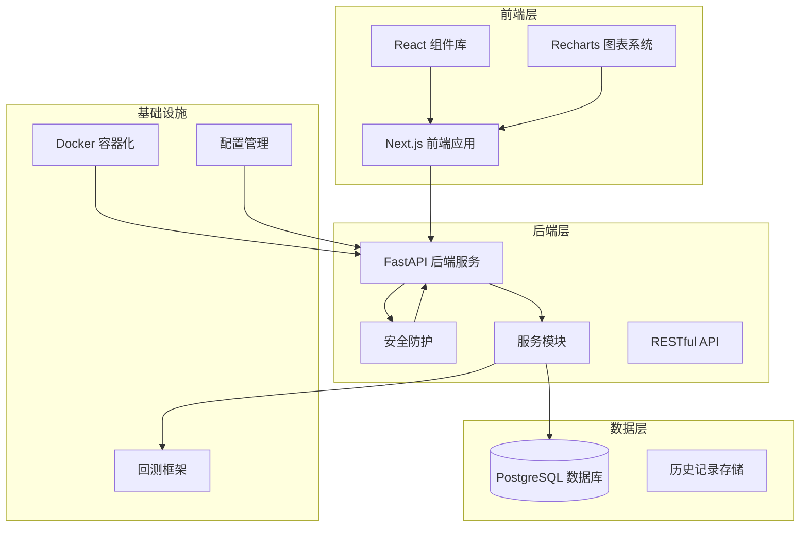
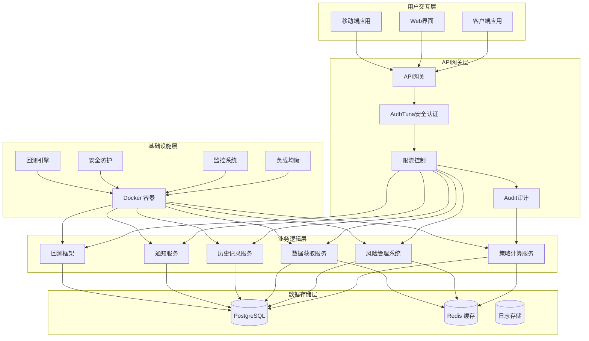
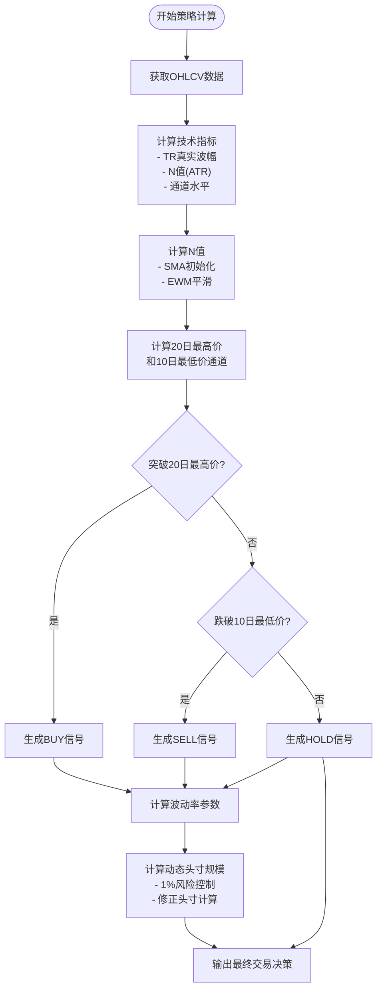
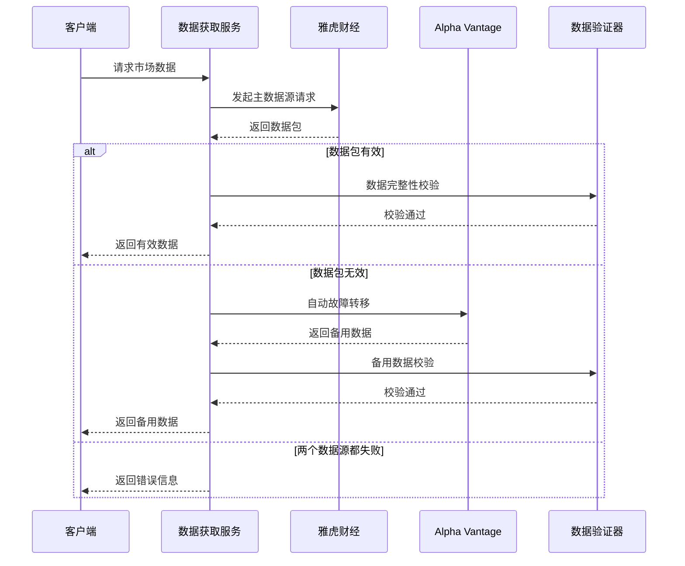
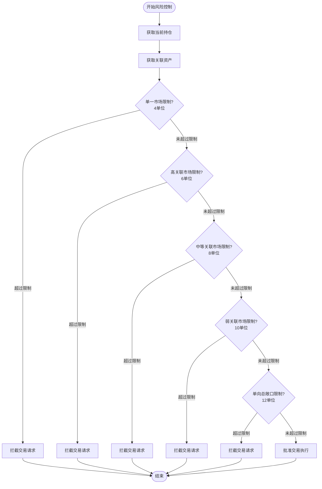
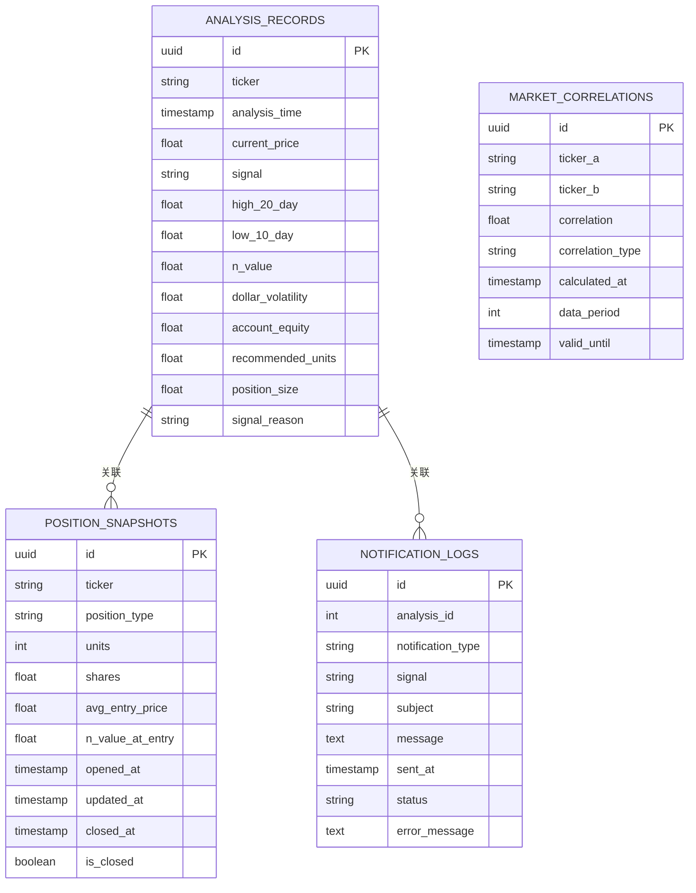
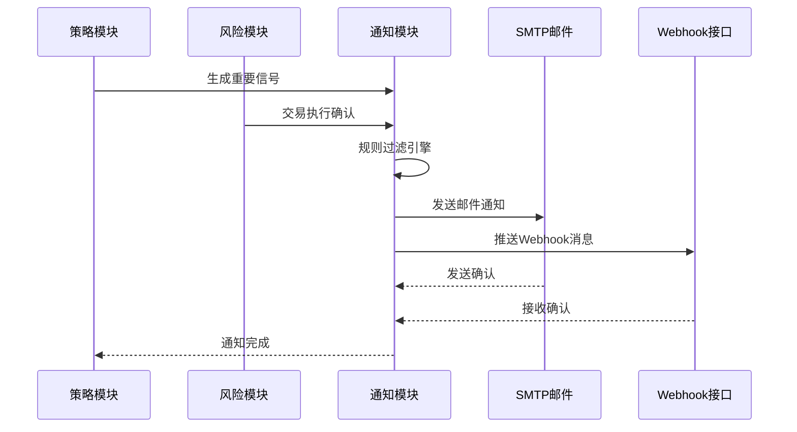
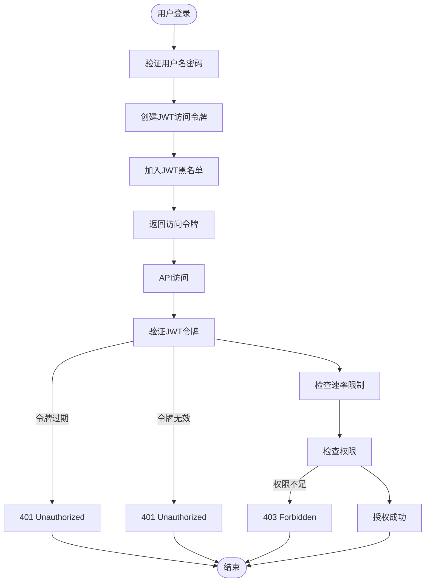
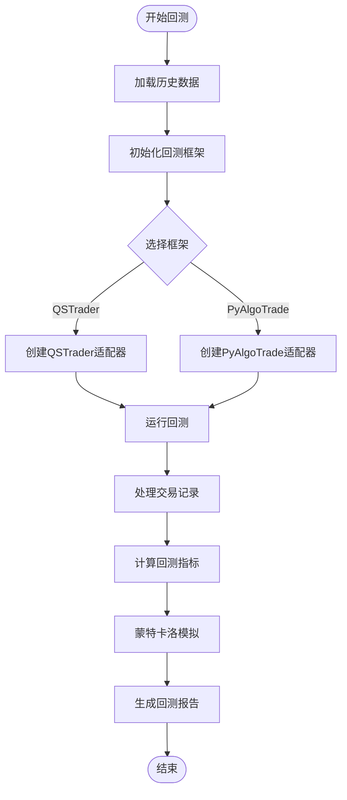
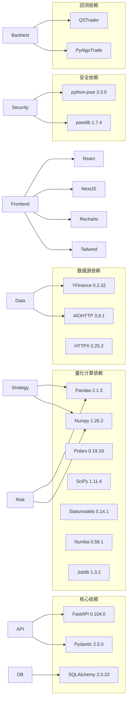

# 核心功能模块

<cite>
**本文档引用的文件**
- [modern_turtle_protocol.md](file://现代海龟协议：基于Python与微服务架构的自动化量化交易系统产品需求文档(PRD).md)
- [security.py](file://app/core/security.py)
- [backtest.py](file://app/services/backtest.py)
- [risk_manager.py](file://app/services/risk_manager.py)
- [strategy.py](file://app/services/strategy.py)
- [config.py](file://app/core/config.py)
- [models.py](file://app/database/models.py)
- [main.py](file://app/main.py)
- [analyze.py](file://app/api/analyze.py)
- [history.py](file://app/api/history.py)
- [requirements.txt](file://requirements.txt)
</cite>

## 更新摘要
**变更内容**
- 新增AuthTuna安全认证框架，实现高强度身份鉴权和RBAC权限控制
- 集成QSTrader和PyAlgoTrade回测框架，支持机构级回测分析
- 重大改进风险管理模块，引入三层关联市场限制和四重熔断机制
- 优化策略计算模块，修正ATR计算和信号生成逻辑
- 增强头寸计算精度，解决高价股低估问题
- 完善审计日志和安全监控机制

## 目录
1. [引言](#引言)
2. [项目结构](#项目结构)
3. [核心组件](#核心组件)
4. [架构概览](#架构概览)
5. [详细组件分析](#详细组件分析)
6. [安全框架集成](#安全框架集成)
7. [回测框架集成](#回测框架集成)
8. [依赖分析](#依赖分析)
9. [性能考虑](#性能考虑)
10. [故障排除指南](#故障排除指南)
11. [结论](#结论)
12. [附录](#附录)

## 引言

《现代海龟协议》是一个基于Python与微服务架构的自动化量化交易系统，旨在将经典的海龟交易法则移植到现代金融科技生态系统中。该系统通过严格的数学模型和系统性风险管理框架，为量化研究员和交易员提供一个完整的自动化交易解决方案。

系统的核心理念来源于1980年代理查德·丹尼斯开发的经典海龟交易法则，该策略证明了卓越的交易能力可以通过严格的规则系统来培养。现代版本在保持原有纪律性交易哲学的同时，融入了现代金融工程的先进技术和架构设计，特别集成了AuthTuna安全认证框架和QSTrader回测框架。

## 项目结构

基于PRD文档描述，系统采用清晰的前后端分离架构，结合领域驱动设计原则，将整体系统划分为多个功能单一的独立模块：

**图表来源**
- [main.py:40-66](file://app/main.py#L40-L66)
- [security.py:1-50](file://app/core/security.py#L1-L50)

**章节来源**
- [modern_turtle_protocol.md:11-34](file://现代海龟协议：基于Python与微服务架构的自动化量化交易系统产品需求文档(PRD).md#L11-L34)

## 核心组件

系统围绕五大核心功能模块构建，每个模块都有明确的职责和实现原理：

### 策略计算模块

策略计算模块是整个系统的大脑，负责实现海龟交易法则的核心算法。该模块承载了现代海龟协议的所有数学推演与信号识别算法，负责扫描价格序列，寻找符合趋势突破定义的异常点。

**主要职责：**
- 实现20日最高价突破买入信号检测
- 实现10日最低价跌破卖出信号检测  
- 提供HOLD观望信号过滤机制
- 支持多资产类别的统一信号生成
- 计算波动率参数和头寸规模

**实现原理：**
- 使用Pandas库的滚动窗口函数计算动态通道
- 通过条件分支判别器识别价格突破点
- 输出标准化的交易信号类型（BUY/SELL/HOLD）
- 修正ATR计算的冷启动偏差问题

### 数据获取模块

数据获取模块是一个具备多源数据仲裁与自动容灾故障转移能力的高弹性微服务架构。该模块专门负责稳定可靠且精准无误的市场数据源获取。

**主要职责：**
- 主数据源（雅虎财经）的异步HTTP请求处理
- 备用数据源（Alpha Vantage API）的自动故障转移
- 数据包结构完整性校验
- 脏数据拦截与错误处理

**实现原理：**
- 降级逻辑的严格执行生命周期
- 受控异常触发的自动故障转移机制
- 终端保护程序的脏数据拦截

### 风险管理系统

风险管理系统是现代海龟协议的核心，基于波动率的动态头寸控制机制。该系统实现了严格的1%风险控制原则，通过数学算法确保每次交易的风险敞口可控。

**主要职责：**
- 真实波幅（ATR）的计算与平滑处理
- 动态头寸规模的数学算法推导
- 投资组合宏观关联度敞口阀值设计
- 多层级风险控制机制

**实现原理：**
- 基于波动率的自适应资金分配方程
- 单个基础交易单位规模的精确计算
- 跨资产类别的风险平价处理
- 四重熔断机制：单一市场、高关联、中等关联、单向总敞口

### 历史记录模块

历史记录模块负责策略运算状态的历史化管理，提供审计追溯能力和长期表现统计分析。

**主要职责：**
- 策略执行日志的结构化持久化
- 分析请求时间戳的记录管理
- 交易信号的历史追踪
- 前端页面的回溯呈现支持

**实现原理：**
- SQLALchemy ORM模型的结构化数据存储
- 不可篡改的日志记录写入机制
- 海量历史数据的高效查询支持

### 通知模块

通知模块处理外部状态通知，建立人机协同的工作闭环，确保重要交易信号能够及时传达给相关人员。

**主要职责：**
- 重要交易信号的异步非阻塞通知
- SMTP邮件协议的配置与发送
- 企业级Webhook接口的集成
- 信号过滤与静音屏蔽机制

**实现原理：**
- 规则过滤引擎的信号识别
- 异步非阻塞的通知触发机制
- 信噪比优化的信号处理

### 安全认证模块

**新增** 安全认证模块是系统的重要组成部分，实现了AuthTuna安全框架，提供高强度的身份鉴权和权限控制。

**主要职责：**
- JWT令牌管理和验证
- RBAC角色权限分割
- 防止恶意并发重放攻击
- 安全审计护城河

**实现原理：**
- 基于bcrypt的密码加密
- JWT令牌的防重放机制
- 速率限制和API Key管理
- 完整的安全审计日志

**章节来源**
- [modern_turtle_protocol.md:35-62](file://现代海龟协议：基于Python与微服务架构的自动化量化交易系统产品需求文档(PRD).md#L35-L62)

## 架构概览

系统采用微服务架构设计，结合事件驱动机制和容灾设计理念，确保在复杂的金融市场环境中保持稳定运行：

**图表来源**
- [main.py:40-66](file://app/main.py#L40-L66)
- [security.py:120-180](file://app/core/security.py#L120-L180)

**章节来源**
- [modern_turtle_protocol.md:103-126](file://现代海龟协议：基于Python与微服务架构的自动化量化交易系统产品需求文档(PRD).md#L103-L126)

## 详细组件分析

### 策略计算模块详细分析

策略计算模块是系统的核心，实现了经典的海龟交易法则。该模块通过数学算法识别市场趋势，为交易决策提供客观依据。

**图表来源**
- [strategy.py:121-190](file://app/services/strategy.py#L121-L190)
- [strategy.py:313-374](file://app/services/strategy.py#L313-L374)

**算法实现细节：**
- 使用Pandas滚动窗口函数计算动态通道边界
- 修正ATR计算：前20日SMA初始化，后续EWM平滑
- 条件分支判别器实现精确的信号识别
- 标准化的信号类型输出确保系统一致性
- 修正头寸计算：解决高价股低估问题

**数据流分析：**
- 输入：OHLCV时间序列数据
- 处理：滚动窗口计算与条件判断
- 输出：标准化交易信号和头寸建议

**错误处理机制：**
- 信号生成失败时的默认HOLD策略
- 数据质量异常时的信号抑制机制
- 系统级异常的优雅降级处理

**章节来源**
- [strategy.py:20-408](file://app/services/strategy.py#L20-L408)

### 数据获取模块详细分析

数据获取模块采用多源容灾架构，确保在单一数据源故障时仍能获得连续有效的市场数据。

**图表来源**
- [modern_turtle_protocol.md:39-44](file://现代海龟协议：基于Python与微服务架构的自动化量化交易系统产品需求文档(PRD).md#L39-L44)

**实现原理：**
- 降级逻辑的严格执行顺序
- 受控异常触发的故障转移机制
- 终端保护程序的脏数据拦截

**接口设计：**
- 标准化的HTTP请求接口
- 异步非阻塞的数据获取
- 结构化的数据响应格式

**模块间协作关系：**
- 与策略计算模块的紧密耦合
- 与风险管理系统的数据依赖
- 与历史记录模块的数据流转

**章节来源**
- [modern_turtle_protocol.md:39-44](file://现代海龟协议：基于Python与微服务架构的自动化量化交易系统产品需求文档(PRD).md#L39-L44)

### 风险管理系统详细分析

风险管理系统是现代海龟协议的核心，实现了基于波动率的动态头寸控制机制。

**图表来源**
- [risk_manager.py:59-100](file://app/services/risk_manager.py#L59-L100)

**算法实现细节：**
- ATR真实波幅的三重校验计算
- 指数移动平均的平滑降噪处理
- 动态头寸规模的数学公式推导
- 三层关联市场限制：高(≥0.7)、中(0.4~0.7)、弱(<0.4)

**数据结构：**
- 波动率参数的实时更新机制
- 风险单位的累计计算
- 相关性矩阵的实时分析

**性能考虑：**
- 并行计算的优化策略
- 内存使用的最小化
- 计算复杂度的控制

**章节来源**
- [risk_manager.py:33-328](file://app/services/risk_manager.py#L33-L328)

### 历史记录模块详细分析

历史记录模块提供完整的策略执行日志管理，支持审计追溯和长期表现分析。

**图表来源**
- [models.py:19-163](file://app/database/models.py#L19-L163)

**数据流分析：**
- 策略执行结果的结构化存储
- 时间戳的精确记录机制
- 多维度查询支持的数据索引

**错误处理机制：**
- 数据库连接异常的重试机制
- 存储失败的补偿处理
- 数据一致性保证机制

**扩展性设计：**
- 可配置的存储策略
- 支持大规模数据的分区机制
- 实时查询与批量分析的平衡

**章节来源**
- [models.py:19-163](file://app/database/models.py#L19-L163)

### 通知模块详细分析

通知模块建立人机协同的工作闭环，确保重要交易信号能够及时传达。

**图表来源**
- [modern_turtle_protocol.md:57-62](file://现代海龟协议：基于Python与微服务架构的自动化量化交易系统产品需求文档(PRD).md#L57-L62)

**实现原理：**
- 规则过滤引擎的信号识别
- 异步非阻塞的通知触发
- 信噪比优化的信号处理

**接口设计：**
- SMTP邮件协议的标准化集成
- Webhook接口的灵活配置
- 多渠道通知的统一管理

**章节来源**
- [modern_turtle_protocol.md:57-62](file://现代海龟协议：基于Python与微服务架构的自动化量化交易系统产品需求文档(PRD).md#L57-L62)

## 安全框架集成

**新增** 系统集成了AuthTuna安全认证框架，提供高强度的身份鉴权和权限控制机制。

### 认证架构

**图表来源**
- [security.py:302-365](file://app/core/security.py#L302-L365)

### RBAC权限模型

系统采用基于角色的权限控制（RBAC），为不同用户角色分配相应的操作权限：

| 角色 | 权限范围 | 允许操作 |
|------|----------|----------|
| ADMIN | 管理员 | 完全权限，包括用户管理、设置管理、API Key管理 |
| TRADER | 交易员 | 策略分析、历史查询、持仓管理、交易执行 |
| ANALYST | 分析师 | 只读分析、历史查询、报告生成 |
| VIEWER | 查看者 | 仅查看权限，只读访问 |

### 安全审计机制

系统内置完整的安全审计日志，记录所有重要的安全事件：

- **访问日志**：记录用户访问API的详细信息
- **认证失败**：记录用户名密码错误等失败尝试
- **权限拒绝**：记录权限不足导致的操作拒绝
- **异常行为**：记录可疑的访问模式和异常行为

**章节来源**
- [security.py:35-480](file://app/core/security.py#L35-L480)

## 回测框架集成

**新增** 系统集成了QSTrader和PyAlgoTrade两大专业回测框架，提供机构级的回测分析能力。

### 回测框架架构

**图表来源**
- [backtest.py:161-260](file://app/services/backtest.py#L161-L260)

### 支持的回测框架

#### QSTrader适配器

QSTrader适配器提供了最全面的回测功能：

- **动态滑点模型**：支持固定、百分比、波动率等多种滑点模型
- **佣金计算**：支持经纪商双向交易佣金损耗计算
- **杠杆压力测试**：支持组合保证金占用比率的极端杠杆压力测试
- **蒙特卡洛模拟**：支持参数优化和风险评估

#### PyAlgoTrade适配器

PyAlgoTrade适配器专注于事件驱动架构：

- **事件驱动**：基于事件驱动的回测架构
- **跨资产回测**：简化跨资产/跨时间维度的复杂回测评价
- **高效执行**：优化的回测执行性能

### 回测指标体系

系统提供完整的回测指标评估：

| 指标名称 | 计算公式 | 用途说明 |
|----------|----------|----------|
| 总收益率 | (最终资金-初始资金)/初始资金 | 衡量整体盈利能力 |
| 夏普比率 | 平均收益/标准差×√252 | 衡量风险调整后收益 |
| 最大回撤 | (峰值-谷底)/峰值 | 衡量最大损失风险 |
| 胜率 | 盈利交易数/总交易数 | 衡量交易成功率 |
| 盈亏比 | 平均盈利/平均亏损 | 衡量盈亏效率 |
| 年化收益率 | 总收益率 | 衡量长期收益能力 |
| 波动率 | 收益率标准差 | 衡量价格波动程度 |

**章节来源**
- [backtest.py:33-487](file://app/services/backtest.py#L33-L487)

## 依赖分析

系统采用模块化设计，各组件之间存在明确的依赖关系和协作机制：

**图表来源**
- [requirements.txt:1-61](file://requirements.txt#L1-L61)

**模块耦合分析：**
- 策略计算模块与数据获取模块的紧密耦合
- 风险管理系统与策略计算模块的双向依赖
- 历史记录模块的低耦合设计便于扩展
- 通知模块的独立性确保系统稳定性
- 安全框架的独立集成不影响核心业务逻辑

**潜在循环依赖：**
- 通过接口抽象避免循环依赖
- 明确的模块边界设计
- 依赖注入的使用减少紧耦合

**外部依赖管理：**
- 版本锁定确保兼容性
- 安全漏洞监控机制
- 依赖更新的自动化流程

**章节来源**
- [requirements.txt:1-61](file://requirements.txt#L1-L61)

## 性能考虑

系统在设计时充分考虑了性能优化，特别是在高并发和大数据量场景下的表现：

### 计算性能优化

- **并行计算**：利用Joblib库实现多核并行计算，提高回测效率
- **JIT编译**：通过Numba库对热点代码进行即时编译优化
- **内存管理**：采用Polars库优化大数据处理的内存使用
- **缓存策略**：Redis缓存常用计算结果，减少重复计算
- **回测优化**：支持QSTrader和PyAlgoTrade的专业回测优化

### 网络性能优化

- **异步I/O**：FastAPI的异步特性确保高并发请求处理
- **连接池管理**：数据库连接池和HTTP连接池的优化配置
- **数据压缩**：传输数据的压缩处理减少网络开销
- **CDN加速**：静态资源的CDN分发提升前端加载速度

### 存储性能优化

- **索引优化**：数据库查询索引的合理设计
- **分区策略**：历史数据的分区存储提高查询效率
- **批量操作**：批量数据写入减少数据库压力
- **归档机制**：冷热数据分离的存储策略

### 安全性能优化

- **令牌缓存**：JWT令牌的本地缓存减少验证开销
- **速率限制**：高效的速率限制算法防止滥用
- **审计日志**：异步审计日志写入避免阻塞主业务流程

## 故障排除指南

### 常见问题诊断

**数据获取失败：**
- 检查网络连接状态和防火墙配置
- 验证API密钥的有效性和配额限制
- 查看数据源的可用性状态和服务端错误码
- 确认代理设置和DNS解析配置

**策略计算异常：**
- 验证输入数据的完整性和格式正确性
- 检查时间序列数据的连续性和完整性
- 确认计算参数的合理范围和精度
- 查看日志文件中的详细错误信息

**风险控制触发：**
- 检查账户资金和持仓状态的实时更新
- 验证波动率计算的准确性和平滑处理
- 确认相关性矩阵计算的时效性
- 查看风险限额配置的正确性

**安全认证问题：**
- 验证JWT令牌的签名和有效期
- 检查API Key的权限和有效期
- 确认用户角色和权限配置
- 查看审计日志中的安全事件

**回测框架问题：**
- 检查回测数据的完整性和格式
- 验证回测参数的正确性
- 确认回测框架的安装和配置
- 查看回测过程中的错误信息

### 错误处理机制

**系统级异常：**
- 全局异常捕获和日志记录
- 用户友好的错误提示信息
- 自动重试机制和退避策略
- 紧急停止和安全降级模式

**数据一致性保证：**
- 事务处理确保操作原子性
- 数据校验和完整性检查
- 备份和恢复机制
- 监控告警和自动修复

**性能监控：**
- 关键指标的实时监控
- 性能瓶颈的自动识别
- 资源使用情况的可视化
- 预测性维护和容量规划

**章节来源**
- [modern_turtle_protocol.md:39-44](file://现代海龟协议：基于Python与微服务架构的自动化量化交易系统产品需求文档(PRD).md#L39-L44)

## 结论

《现代海龟协议》通过将经典海龟交易法则与现代金融科技架构相结合，构建了一个功能完整、架构清晰、性能优异的自动化量化交易系统。五大核心模块各司其职，相互协作，形成了一个完整的交易生态系统。

系统的主要优势包括：

- **严格的纪律性**：基于数学模型的客观决策，避免了人为情绪干扰
- **强大的容灾能力**：多数据源架构确保系统在各种异常情况下都能正常运行
- **精细的风险控制**：基于波动率的动态头寸管理，有效控制投资风险
- **完整的审计追踪**：详细的历史记录为合规和绩效分析提供支持
- **灵活的通知机制**：多种通知渠道满足不同场景的需求
- **高强度安全防护**：AuthTuna安全框架提供企业级的安全保障
- **专业回测能力**：集成QSTrader和PyAlgoTrade，支持机构级回测分析

未来的发展方向包括：

- 集成更多先进的机器学习算法
- 扩展到更多的资产类别和市场
- 增强实时监控和预警能力
- 优化用户体验和界面设计
- 加强安全防护和合规管理
- 扩展回测框架支持更多专业工具

## 附录

### 扩展和定制化指导

**模块扩展建议：**
- 新增技术指标：通过插件化架构添加新的技术分析指标
- 多策略并行：支持多个策略的并行运行和组合
- 自适应参数：基于机器学习的策略参数自适应调整
- 多市场接入：扩展到更多交易所和数据源
- 新的回测框架：支持更多专业的回测工具集成

**定制化配置：**
- 参数调优：提供图形化界面进行策略参数的可视化调优
- 风险偏好：支持不同风险偏好的用户配置
- 通知偏好：个性化通知渠道和频率设置
- 报告定制：可定制的报表格式和分析维度
- 安全策略：可配置的安全认证和权限控制策略

**最佳实践：**
- 代码模块化：保持模块间的低耦合高内聚
- 测试覆盖：完善单元测试和集成测试
- 文档维护：及时更新技术文档和用户手册
- 性能监控：建立完善的性能监控和告警机制
- 安全审计：定期审查安全配置和权限分配
- 回测验证：使用历史数据验证策略的有效性

**章节来源**
- [config.py:11-99](file://app/core/config.py#L11-L99)
- [security.py:230-295](file://app/core/security.py#L230-L295)
- [backtest.py:462-487](file://app/services/backtest.py#L462-L487)