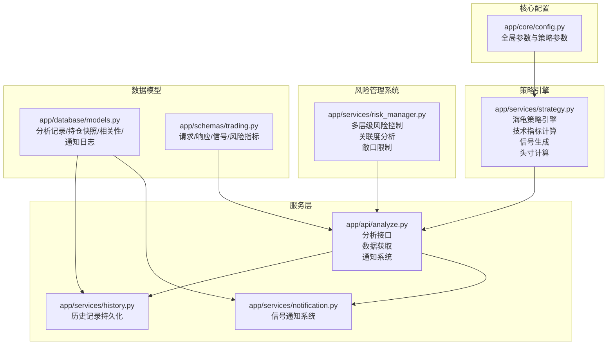
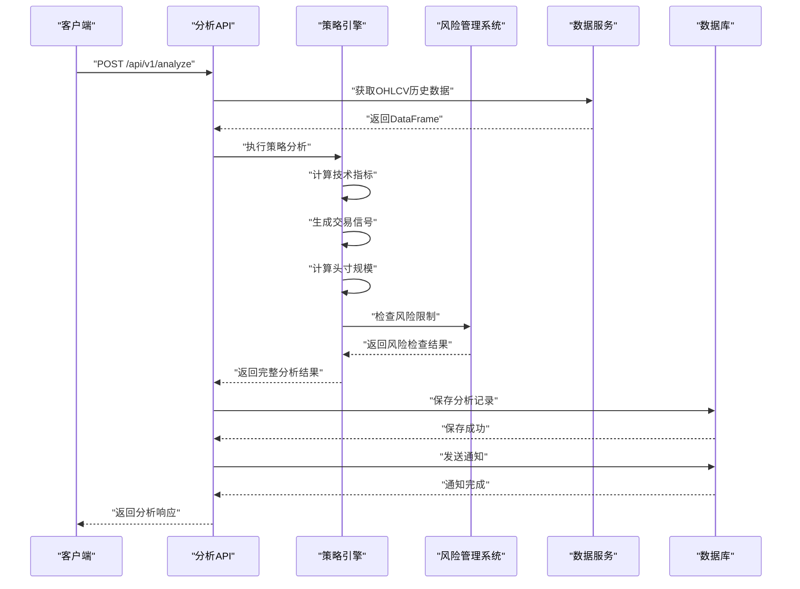
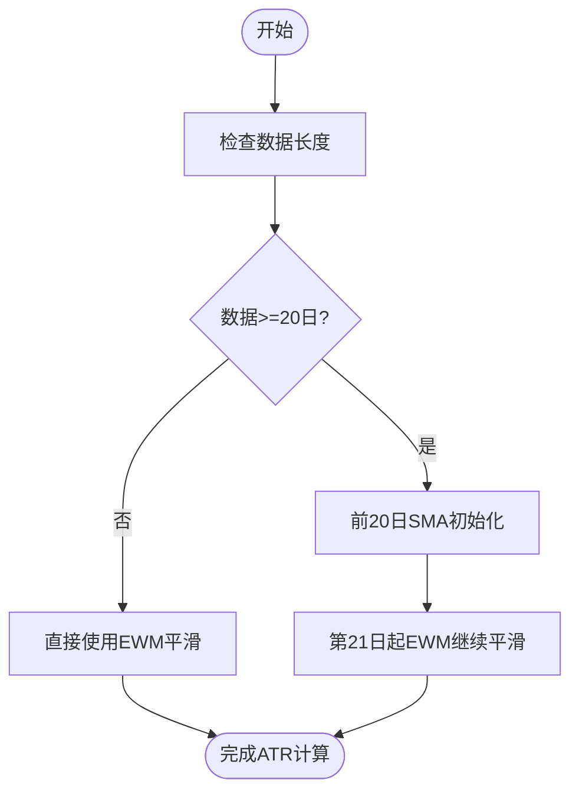
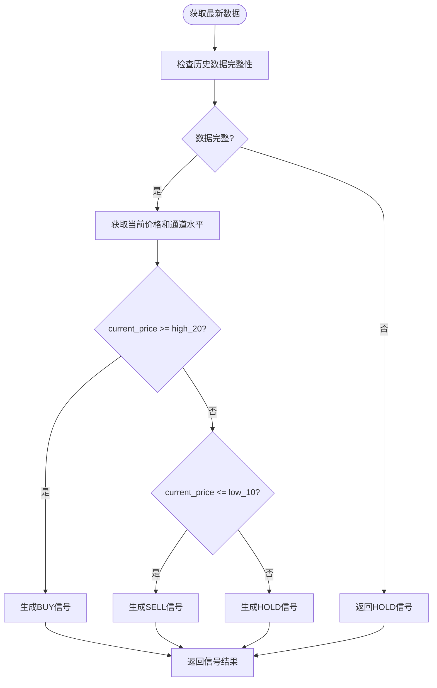
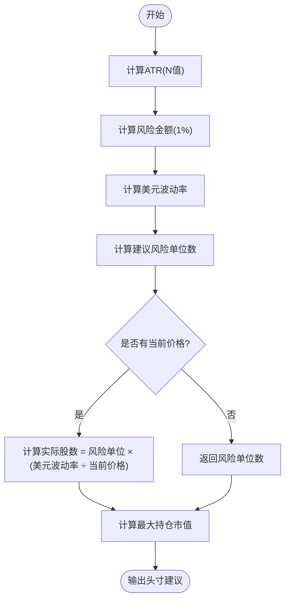
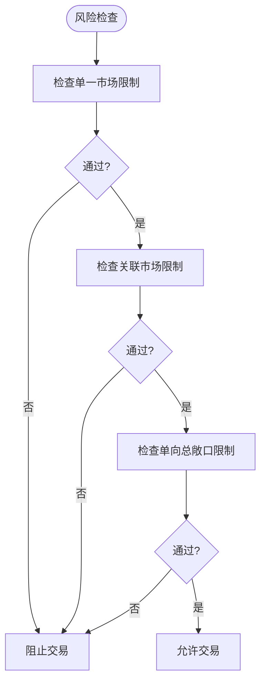
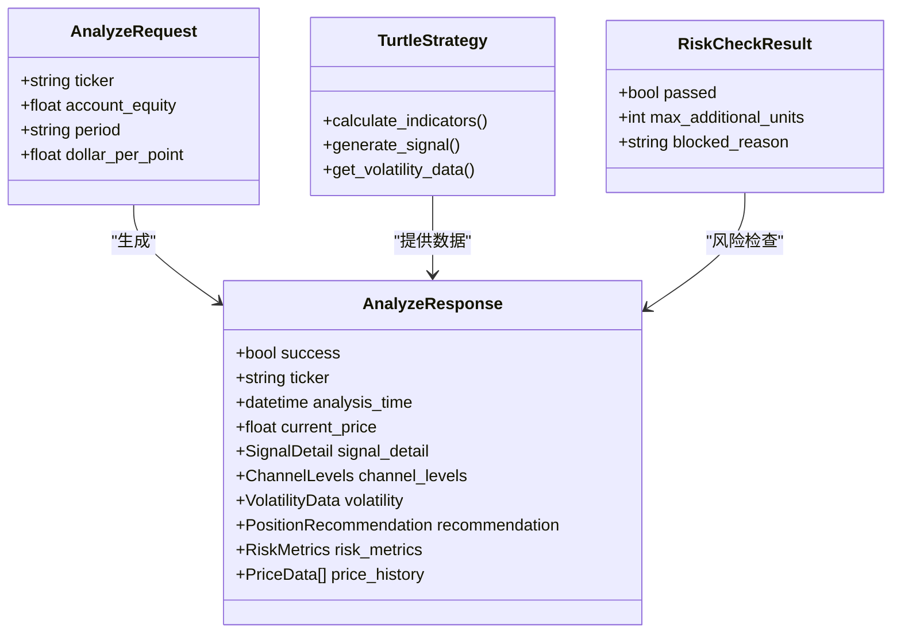
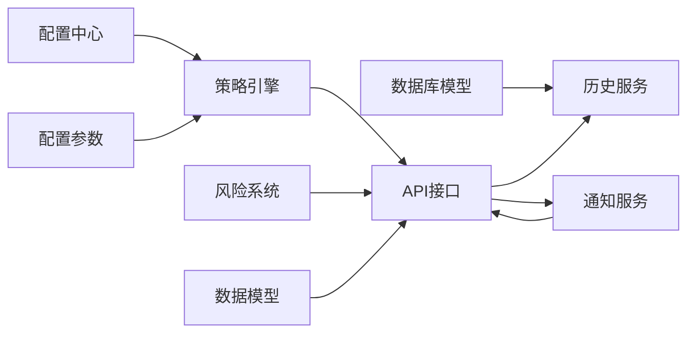

# 策略计算模块

<cite>
**本文档引用的文件**
- [app/services/strategy.py](file://app/services/strategy.py)
- [app/services/risk_manager.py](file://app/services/risk_manager.py)
- [app/api/analyze.py](file://app/api/analyze.py)
- [app/schemas/trading.py](file://app/schemas/trading.py)
- [app/core/config.py](file://app/core/config.py)
- [app/database/models.py](file://app/database/models.py)
- [app/services/history.py](file://app/services/history.py)
- [app/services/notification.py](file://app/services/notification.py)
- [tests/test_strategy.py](file://tests/test_strategy.py)
</cite>

## 更新摘要
**变更内容**
- 重大修复：突破条件逻辑修正（使用>=和<=操作符），使价格等于通道水平时也能触发信号
- ATR计算冷启动修复：实现20日SMA + EWM平滑的冷启动方法，符合经典海龟规则
- 头寸规模算法优化：进一步完善风险单位与实际股数的换算关系
- 风险检查集成：将四重熔断机制集成到主分析流程中

## 目录
1. [简介](#简介)
2. [项目结构](#项目结构)
3. [核心组件](#核心组件)
4. [架构概览](#架构概览)
5. [详细组件分析](#详细组件分析)
6. [依赖分析](#依赖分析)
7. [性能考虑](#性能考虑)
8. [故障排查指南](#故障排查指南)
9. [结论](#结论)
10. [附录](#附录)

## 简介
本文件面向《现代海龟协议》的策略计算模块，系统化阐述海龟交易法则的核心算法实现，包括：
- **海龟交易策略核心算法**：基于20日最高价突破买入信号和10日最低价跌破卖出信号的完整实现
- **技术指标计算**：真实波幅(TR)、ATR(N值)、移动平均线和波动率比率的精确计算
- **波动率分析**：动态波动率监控、历史百分位分析和风险评估
- **头寸规模算法**：基于风险预算(1%)和ATR的动态头寸计算，现已修复Unit与股数的等式关系
- **多层级风险控制**：单一市场限制、关联市场限制和单向总敞口控制
- **信号生成与通知**：完整的信号生成流程和多渠道通知系统
- **数据持久化**：分析记录、持仓快照和相关性分析的完整数据模型

本模块严格遵循PRD中对"以事件为触发机制的客观计算环境"的设计目标，确保交易信号的可重复性与可审计性。

## 项目结构
策略计算模块位于后端服务层，围绕海龟策略引擎、风险管理系统、API接口和数据模型展开，形成完整的量化交易生态系统。



**图示来源**
- [app/core/config.py:46-62](file://app/core/config.py#L46-L62)
- [app/services/strategy.py:20-381](file://app/services/strategy.py#L20-L381)
- [app/services/risk_manager.py:33-319](file://app/services/risk_manager.py#L33-L319)
- [app/api/analyze.py:27-168](file://app/api/analyze.py#L27-L168)

## 核心组件
- **海龟策略引擎**：完整的趋势跟踪策略实现，包含技术指标计算、信号生成和头寸规模计算
- **风险管理系统**：四层风险控制体系，包括单一市场限制、关联市场限制和单向总敞口控制
- **配置管理中心**：集中管理策略参数、风险参数和系统配置
- **数据模型层**：完整的数据库实体模型，支持分析记录、持仓管理和相关性分析
- **API接口层**：RESTful API接口，提供完整的分析流程和实时数据访问
- **通知系统**：多渠道信号通知，支持邮件和Webhook

**章节来源**
- [app/services/strategy.py:20-381](file://app/services/strategy.py#L20-L381)
- [app/services/risk_manager.py:33-319](file://app/services/risk_manager.py#L33-L319)
- [app/core/config.py:46-62](file://app/core/config.py#L46-L62)
- [app/database/models.py:19-163](file://app/database/models.py#L19-L163)

## 架构概览
策略计算模块采用分层架构设计，从API层到服务层再到数据层，形成清晰的职责分离和低耦合的系统结构。



**图示来源**
- [app/api/analyze.py:30-168](file://app/api/analyze.py#L30-L168)
- [app/services/strategy.py:215-284](file://app/services/strategy.py#L215-L284)
- [app/services/risk_manager.py:59-99](file://app/services/risk_manager.py#L59-L99)

## 详细组件分析

### 海龟交易策略引擎
海龟策略引擎是整个系统的核心，实现了完整的趋势跟踪策略，包含以下关键功能：

#### 技术指标计算
策略引擎使用Pandas进行高效的技术指标计算：

- **真实波幅(TR)**：计算当日最高价-最低价、绝对价格差的最大值
- **ATR(N值)**：使用指数加权移动平均计算20日ATR，采用冷启动修复方法
- **动态通道线**：20日最高价作为入场阻力，10日最低价作为出场支撑
- **移动平均线**：20日和10日简单移动平均线用于趋势确认
- **波动率比率**：N值与收盘价的比值，衡量相对波动性

**更新** ATR计算实现了经典的冷启动修复方法：



**图示来源**
- [app/services/strategy.py:79-102](file://app/services/strategy.py#L79-L102)

#### 信号生成算法
基于技术指标生成三种交易信号：

- **买入信号(BUY)**：当日收盘价**大于等于**20日最高价通道
- **卖出信号(SELL)**：当日收盘价**小于等于**10日最低价通道  
- **持有信号(HOLD)**：价格在通道内震荡，根据移动平均线位置确定具体行动

**更新** 突破条件逻辑已修正，使用>=和<=操作符：



**图示来源**
- [app/services/strategy.py:121-190](file://app/services/strategy.py#L121-L190)

**章节来源**
- [app/services/strategy.py:44-75](file://app/services/strategy.py#L44-L75)
- [app/services/strategy.py:77-92](file://app/services/strategy.py#L77-L92)
- [app/services/strategy.py:121-190](file://app/services/strategy.py#L121-L190)

### 波动率分析与头寸规模计算
系统实现了完整的波动率分析和头寸规模计算机制：

#### N值计算与波动率分析
- **ATR计算**：使用指数加权移动平均(α=1/20)计算20日ATR，采用冷启动修复方法
- **波动率百分位**：计算N值在最近60个交易日中的历史百分位
- **波动率比率**：N值与收盘价的比值，衡量相对波动性

#### 头寸规模算法（重大修复）
**更新** 基于海龟交易法则的头寸计算公式已修复，正确区分风险单位和实际股数：

```
风险金额 = 账户净资产 × 1%
美元波动率 = N值 × 每点美元价值
建议风险单位数 = 风险金额 ÷ 美元波动率
实际股数 = 建议风险单位数 × (美元波动率 ÷ 当前价格)
最大持仓市值 = 建议风险单位数 × 美元波动率
```

**重要修复**：
- **错误修正**：之前position_size被错误地等同于recommended_units
- **概念澄清**：recommended_units是风险单位，不是直接等于股数
- **公式更新**：实际股数 = recommended_units × (dollar_volatility / current_price)
- **适用场景**：解决了NVDA等高价股的头寸计算问题



**图示来源**
- [app/services/strategy.py:313-374](file://app/services/strategy.py#L313-L374)

**章节来源**
- [app/services/strategy.py:173-203](file://app/services/strategy.py#L173-L203)
- [app/services/strategy.py:313-374](file://app/services/strategy.py#L313-L374)

### 多层级风险管理系统
风险管理系统实现了四层风险控制机制：

#### 风险控制层次
1. **单一市场限制**：单一资产最多4个单位
2. **高关联市场限制**：高关联资产最多6个单位  
3. **中等关联市场限制**：中等关联资产最多8个单位（新增）
4. **弱关联市场限制**：弱关联资产最多10个单位
5. **单向总敞口限制**：单一方向总敞口最多12个单位

#### 关联度分析
系统能够计算资产间的相关性：
- **高关联**：相关系数≥0.7
- **中关联**：0.4≤相关系数<0.7  
- **弱关联**：相关系数<0.4



**图示来源**
- [app/services/risk_manager.py:59-99](file://app/services/risk_manager.py#L59-L99)

**章节来源**
- [app/services/risk_manager.py:33-319](file://app/services/risk_manager.py#L33-L319)

### 数据模型与持久化
系统提供了完整的数据持久化解决方案：

#### 分析记录表
存储每次策略分析的完整结果：
- 基础信息：资产代码、分析时间、当前价格
- 策略信号：交易信号、信号原因
- 通道参数：20日最高价、10日最低价
- 波动率参数：N值、美元波动率
- 头寸计算：建议单位、建议持仓

#### 持仓快照表
记录投资组合的实时状态：
- 持仓基础信息：资产代码、持仓类型
- 持仓数量：单位数、股数、平均入场价
- 风险参数：入场时N值、止损价格
- 时间戳：开仓时间、更新时间

#### 相关性表与通知日志表
支持多资产相关性分析和通知管理。

**章节来源**
- [app/database/models.py:19-163](file://app/database/models.py#L19-L163)

### API接口与信号响应
API接口提供了完整的分析流程：

#### 请求模型
支持资产代码、账户净资产、历史数据周期和每点美元价值等参数，包含自动大小写转换和范围校验。

#### 响应模型
包含完整的分析结果：
- 价格信息：当前价格、前一日收盘价、价格变动
- 策略信号：交易信号、信号详情、价格行为
- 通道参数：20日最高价、10日最低价
- 波动率数据：N值、美元波动率、真实波幅
- 头寸建议：建议单位、建议持仓、可加仓状态
- 风险指标：风险百分比、风险金额、最大持仓市值
- 图表数据：历史价格数据用于前端可视化

**更新** API接口已集成风险检查机制：



**图示来源**
- [app/schemas/trading.py:30-188](file://app/schemas/trading.py#L30-L188)
- [app/services/strategy.py:20-381](file://app/services/strategy.py#L20-L381)
- [app/services/risk_manager.py:24-31](file://app/services/risk_manager.py#L24-L31)

**章节来源**
- [app/schemas/trading.py:30-188](file://app/schemas/trading.py#L30-L188)
- [app/api/analyze.py:30-168](file://app/api/analyze.py#L30-L168)

### 通知系统与集成
系统集成了完整的信号通知功能：

#### 通知策略
- **信号过滤**：仅对BUY/SELL信号发送通知，HOLD信号自动屏蔽
- **多渠道支持**：支持SMTP邮件和Webhook通知
- **HTML模板**：美观的HTML邮件模板，包含信号详情和头寸建议

#### 集成流程
API层在分析完成后自动调用通知服务，将信号详情发送给配置的接收者。

**章节来源**
- [app/services/notification.py:35-100](file://app/services/notification.py#L35-L100)
- [app/api/analyze.py:82-93](file://app/api/analyze.py#L82-L93)

## 依赖分析
策略计算模块的依赖关系清晰明确：



**图示来源**
- [app/core/config.py:46-62](file://app/core/config.py#L46-L62)
- [app/services/strategy.py:20-381](file://app/services/strategy.py#L20-L381)
- [app/services/risk_manager.py:33-319](file://app/services/risk_manager.py#L33-L319)

**章节来源**
- [app/core/config.py:46-62](file://app/core/config.py#L46-L62)
- [app/services/strategy.py:20-381](file://app/services/strategy.py#L20-L381)
- [app/services/risk_manager.py:33-319](file://app/services/risk_manager.py#L33-L319)

## 性能考虑
系统在设计时充分考虑了性能优化：

### 时间复杂度分析
- **技术指标计算**：对长度为N的历史序列进行一次线性扫描，复杂度为O(N)
- **信号生成**：对单日数据进行常数时间比较，整体复杂度为O(N)
- **风险检查**：对当前持仓进行线性扫描，复杂度为O(M)，M为当前持仓数量
- **波动率百分位**：对最近60个交易日进行比较，复杂度为O(W)，W=60

### 空间复杂度
- **主要为OHLCV数据与中间技术指标结果**，空间复杂度为O(N)
- **风险检查**：额外空间O(M)用于存储当前持仓信息

### 优化策略
- **合并计算**：将TR、ATR、通道线计算合并为一次遍历
- **缓存策略**：对近期计算结果进行缓存，避免重复计算
- **异步处理**：通知系统采用异步发送，不影响主分析流程
- **批量操作**：数据库操作使用批量提交，减少I/O开销
- **索引优化**：数据库表建立适当的索引，加速查询性能

## 故障排查指南
针对策略计算模块可能出现的问题提供详细的排查指导：

### 策略计算问题
- **症状**：信号生成异常或波动率计算错误
- **排查**：检查技术指标计算步骤、确认数据完整性、验证参数配置
- **参考路径**：[app/services/strategy.py:44-75](file://app/services/strategy.py#L44-L75)、[app/services/strategy.py:121-190](file://app/services/strategy.py#L121-L190)

### 突破条件逻辑问题（重大修复）
- **症状**：价格刚好等于通道水平时无法触发信号
- **排查**：检查信号生成中的比较操作符、验证>=和<=逻辑
- **参考路径**：[app/services/strategy.py:154-165](file://app/services/strategy.py#L154-L165)

### ATR冷启动问题（重大修复）
- **症状**：ATR计算在数据初期出现偏差或不稳定
- **排查**：检查ATR计算的冷启动逻辑、验证SMA+EWM切换机制
- **参考路径**：[app/services/strategy.py:79-102](file://app/services/strategy.py#L79-L102)

### 头寸规模计算问题（重大修复）
- **症状**：头寸计算结果异常，特别是高价股的股数过少
- **排查**：检查position sizing算法、验证current_price参数传递、确认风险单位与股数的换算关系
- **参考路径**：[app/services/strategy.py:313-374](file://app/services/strategy.py#L313-L374)、[tests/test_strategy.py:82-183](file://tests/test_strategy.py#L82-L183)

### 风险控制问题
- **症状**：交易被意外阻止或风险检查结果异常
- **排查**：检查风险参数配置、验证关联度计算、确认当前持仓状态
- **参考路径**：[app/services/risk_manager.py:59-99](file://app/services/risk_manager.py#L59-L99)、[app/services/risk_manager.py:139-202](file://app/services/risk_manager.py#L139-L202)

### API接口问题
- **症状**：分析请求失败或响应异常
- **排查**：检查请求参数验证、确认数据源可用性、验证数据库连接
- **参考路径**：[app/api/analyze.py:30-168](file://app/api/analyze.py#L30-L168)

### 数据持久化问题
- **症状**：分析记录未保存或查询结果异常
- **排查**：检查数据库连接、验证表结构、确认索引状态
- **参考路径**：[app/services/history.py:20-70](file://app/services/history.py#L20-L70)、[app/database/models.py:19-68](file://app/database/models.py#L19-L68)

**章节来源**
- [app/services/strategy.py:44-75](file://app/services/strategy.py#L44-L75)
- [app/services/strategy.py:154-165](file://app/services/strategy.py#L154-L165)
- [app/services/strategy.py:79-102](file://app/services/strategy.py#L79-L102)
- [app/services/strategy.py:313-374](file://app/services/strategy.py#L313-L374)
- [app/services/risk_manager.py:59-99](file://app/services/risk_manager.py#L59-L99)
- [app/api/analyze.py:30-168](file://app/api/analyze.py#L30-L168)
- [app/services/history.py:20-70](file://app/services/history.py#L20-L70)
- [app/database/models.py:19-68](file://app/database/models.py#L19-L68)

## 结论
策略计算模块以"客观、可重复、可审计"为核心目标，通过完整的海龟交易策略实现、多层级风险控制系统、完善的API接口和数据持久化机制，最终实现基于动态通道线、波动率分析和头寸规模计算的智能交易信号识别。**重大修复**使得头寸规模计算更加准确，正确区分了风险单位和实际股数的概念，特别解决了高价股的头寸计算问题。**突破条件逻辑修正**确保价格等于通道水平时也能触发信号，提高了策略的敏感性和准确性。**ATR计算冷启动修复**采用经典的SMA+EWM方法，有效减少了数据初期的计算偏差。系统不仅具备稳健的性能表现，还提供了丰富的风险管理工具和通知功能，为量化交易提供了完整的基础设施支持。

## 附录

### 参数配置清单
- **入场周期**：20日（20日最高价突破）
- **出场周期**：10日（10日最低价跌破）
- **ATR平滑周期**：20日（指数加权移动平均）
- **风险百分比**：1%（每笔交易风险预算）
- **头寸限制**：
  - 单一市场：4个单位
  - 高关联市场：6个单位
  - 中等关联市场：8个单位（新增）
  - 弱关联市场：10个单位
  - 单向总敞口：12个单位

### 关键字段说明
- **N值(ATR)**：平均真实波幅，衡量市场波动性
- **20日最高价/10日最低价**：动态通道线，决定入场和出场时机
- **波动率比率**：N值与收盘价的比值，相对波动性指标
- **建议交易单位**：基于风险预算和波动率的头寸规模
- **美元波动率**：N值 × 每点美元价值，衡量单日预期波动金额

### 系统集成关系
- **风险管理系统**：通过N值和账户净资产动态控制每单位风险金额
- **通知系统**：自动发送BUY/SELL信号通知，支持邮件和Webhook
- **历史记录**：完整记录每次分析结果，支持回溯分析和性能评估
- **数据源集成**：支持多数据源，确保数据可用性和准确性

**章节来源**
- [app/core/config.py:48-62](file://app/core/config.py#L48-L62)
- [app/services/strategy.py:313-374](file://app/services/strategy.py#L313-L374)
- [app/services/risk_manager.py:59-62](file://app/services/risk_manager.py#L59-L62)
- [app/database/models.py:38-50](file://app/database/models.py#L38-L50)