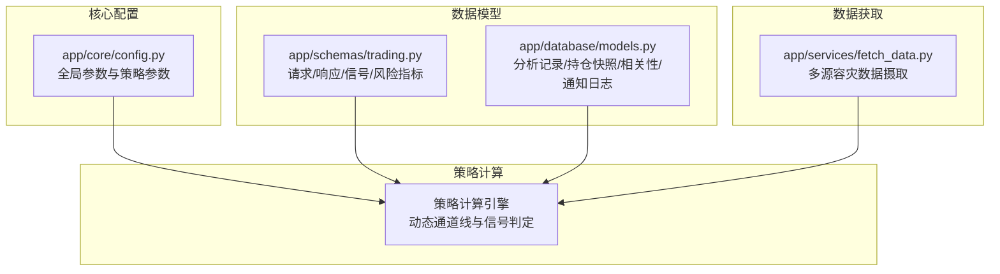
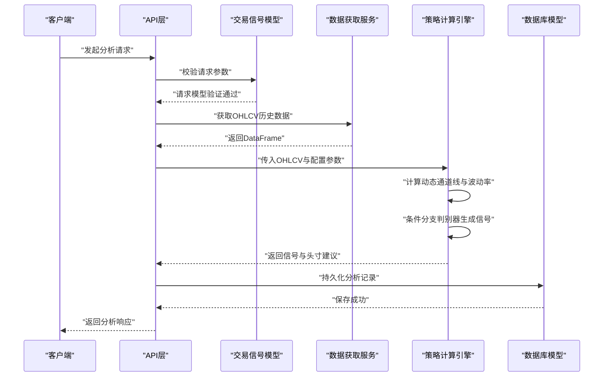
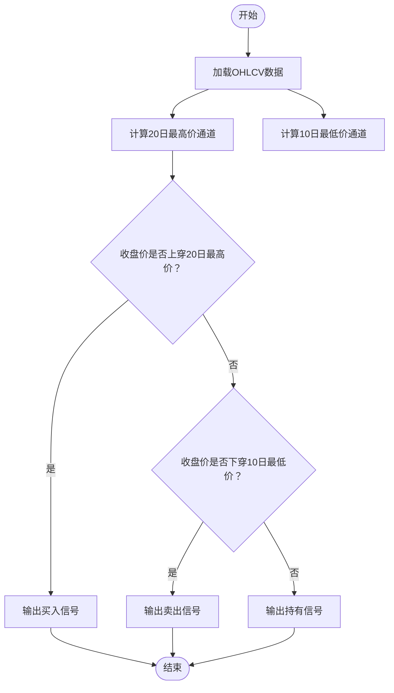
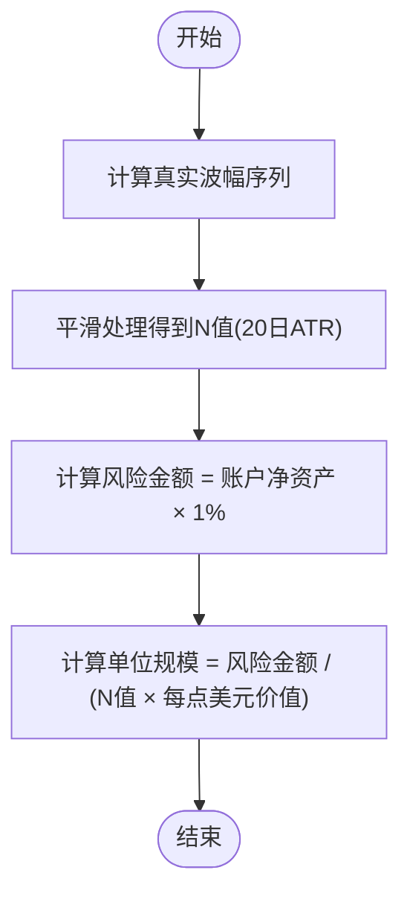
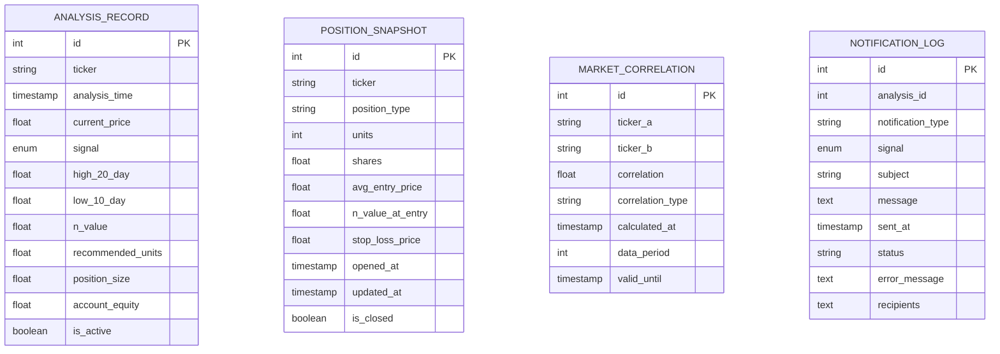
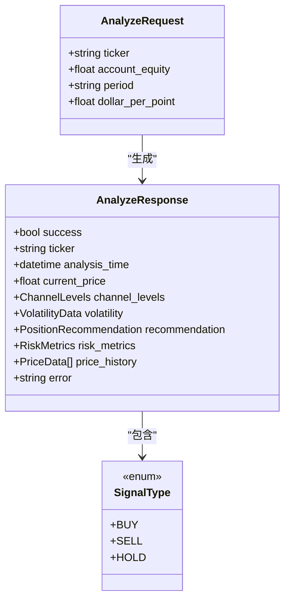
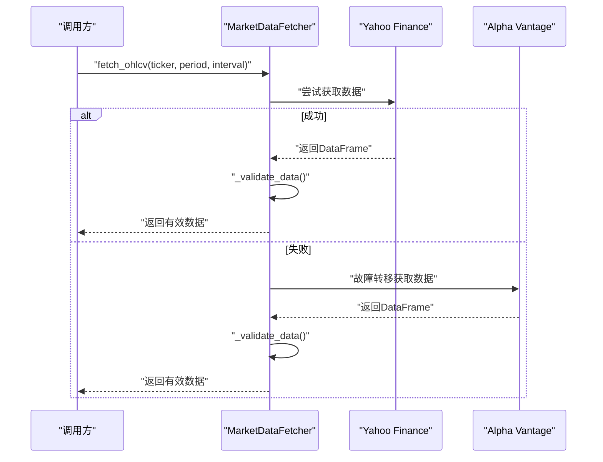
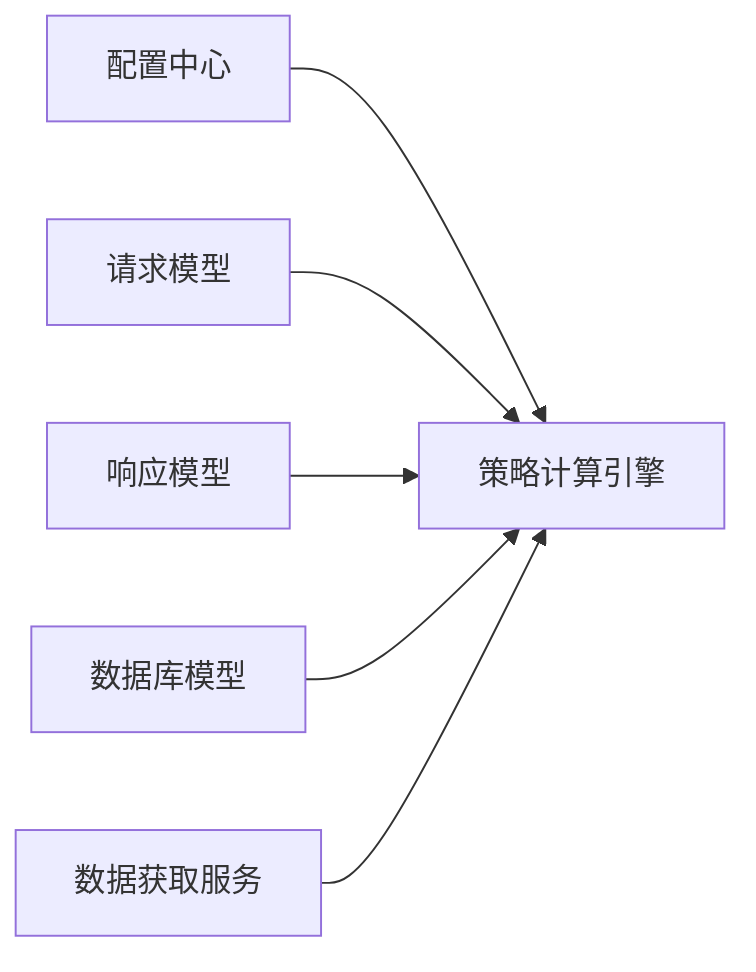

# 策略计算模块

<cite>
**本文档引用的文件**
- [app/core/config.py](file://app/core/config.py)
- [app/schemas/trading.py](file://app/schemas/trading.py)
- [app/database/models.py](file://app/database/models.py)
- [app/services/fetch_data.py](file://app/services/fetch_data.py)
- [现代海龟协议：基于Python与微服务架构的自动化量化交易系统产品需求文档(PRD).md](file://现代海龟协议：基于Python与微服务架构的自动化量化交易系统产品需求文档(PRD).md)
</cite>

## 目录
1. [简介](#简介)
2. [项目结构](#项目结构)
3. [核心组件](#核心组件)
4. [架构概览](#架构概览)
5. [详细组件分析](#详细组件分析)
6. [依赖分析](#依赖分析)
7. [性能考虑](#性能考虑)
8. [故障排查指南](#故障排查指南)
9. [结论](#结论)
10. [附录](#附录)

## 简介
本文件面向《现代海龟协议》的策略计算模块，系统化阐述海龟交易法则的核心算法实现，包括：
- 20日最高价突破买入信号
- 10日最低价跌破卖出信号
- HOLD观望信号的判定逻辑
- 使用Pandas滚动窗口函数计算动态通道线
- 条件分支判别器实现三类信号的智能识别
- 参数配置选项、信号生成的时间复杂度分析与性能优化策略
- 与风险管理系统和数据获取模块的集成关系

本模块严格遵循PRD中对“以事件为触发机制的客观计算环境”的设计目标，确保交易信号的可重复性与可审计性。

## 项目结构
策略计算模块位于后端服务层，围绕配置、数据模型、数据获取与交易信号响应模型展开，形成清晰的职责分离与低耦合架构。

**图示来源**
- [app/core/config.py:46-62](file://app/core/config.py#L46-L62)
- [app/schemas/trading.py:30-188](file://app/schemas/trading.py#L30-L188)
- [app/database/models.py:19-68](file://app/database/models.py#L19-L68)
- [app/services/fetch_data.py:44-84](file://app/services/fetch_data.py#L44-L84)

**章节来源**
- [app/core/config.py:11-99](file://app/core/config.py#L11-L99)
- [app/schemas/trading.py:12-262](file://app/schemas/trading.py#L12-L262)
- [app/database/models.py:19-163](file://app/database/models.py#L19-L163)
- [app/services/fetch_data.py:26-220](file://app/services/fetch_data.py#L26-L220)

## 核心组件
- 配置中心：集中管理策略参数（入场/出场周期、ATR周期、风险管理等），并提供全局缓存实例。
- 数据模型：持久化分析结果、持仓快照、市场相关性与通知日志，支持索引优化与字段注释。
- 交易信号模型：统一的请求/响应结构，明确信号类型、通道水平、波动率、风险指标与头寸建议。
- 数据获取服务：多源容灾数据摄取，支持主备数据源自动切换与数据完整性校验。

**章节来源**
- [app/core/config.py:46-62](file://app/core/config.py#L46-L62)
- [app/database/models.py:19-68](file://app/database/models.py#L19-L68)
- [app/schemas/trading.py:127-188](file://app/schemas/trading.py#L127-L188)
- [app/services/fetch_data.py:44-84](file://app/services/fetch_data.py#L44-L84)

## 架构概览
策略计算模块的调用链路如下：外部请求进入API层，经由数据模型与信号响应模型封装，调用数据获取服务获取OHLCV数据，随后进入策略计算引擎生成信号与头寸建议，并持久化到数据库。

**图示来源**
- [app/schemas/trading.py:30-188](file://app/schemas/trading.py#L30-L188)
- [app/services/fetch_data.py:44-84](file://app/services/fetch_data.py#L44-L84)
- [app/database/models.py:19-68](file://app/database/models.py#L19-L68)

## 详细组件分析

### 动态通道线与信号判定算法
策略计算的核心是基于Pandas滚动窗口函数生成20日最高价与10日最低价的动态通道线，并据此进行条件分支判别：

- 20日最高价通道（入场阻力）：滚动计算过去20个交易日的最高价，作为突破买入的参考边界。
- 10日最低价通道（出场支撑）：滚动计算过去10个交易日的最低价，作为跌破卖出的参考边界。
- 条件分支判别器：
  - 若当日收盘价上穿20日最高价 → 生成“买入”信号
  - 若当日收盘价下穿10日最低价 → 生成“卖出”信号
  - 否则 → 生成“持有”信号

该流程确保在趋势明确时入场/出场，在震荡区间内避免噪音交易。

**图示来源**
- [app/services/fetch_data.py:44-84](file://app/services/fetch_data.py#L44-L84)
- [app/schemas/trading.py:107-118](file://app/schemas/trading.py#L107-L118)

**章节来源**
- [app/services/fetch_data.py:44-84](file://app/services/fetch_data.py#L44-L84)
- [app/schemas/trading.py:107-118](file://app/schemas/trading.py#L107-L118)
- [现代海龟协议：基于Python与微服务架构的自动化量化交易系统产品需求文档(PRD).md:49-55](file://现代海龟协议：基于Python与微服务架构的自动化量化交易系统产品需求文档(PRD).md#L49-L55)

### 波动率与头寸规模计算
- N值（ATR）计算：对过去20个交易日的真实波幅序列进行平滑处理，得到N值，作为动态波动率指标。
- 头寸规模公式：单个基础交易单位规模 = (账户净资产 × 0.01) / (N值 × 每点美元价值)
- 风险管理参数：系统将风险限额设置为账户净资产的1%，并通过N值动态调整每单位风险金额。

**图示来源**
- [app/core/config.py:52-56](file://app/core/config.py#L52-L56)
- [app/schemas/trading.py:120-133](file://app/schemas/trading.py#L120-L133)
- [现代海龟协议：基于Python与微服务架构的自动化量化交易系统产品需求文档(PRD).md:77-82](file://现代海龟协议：基于Python与微服务架构的自动化量化交易系统产品需求文档(PRD).md#L77-L82)

**章节来源**
- [app/core/config.py:52-56](file://app/core/config.py#L52-L56)
- [app/schemas/trading.py:120-133](file://app/schemas/trading.py#L120-L133)
- [现代海龟协议：基于Python与微服务架构的自动化量化交易系统产品需求文档(PRD).md:77-82](file://现代海龟协议：基于Python与微服务架构的自动化量化交易系统产品需求文档(PRD).md#L77-L82)

### 数据模型与持久化
- 分析记录表：存储每次分析的信号、通道水平、波动率、头寸建议与错误信息，支持按资产与时间索引优化。
- 持仓快照表：记录投资组合当前状态，包括单位数、平均入场价、止损价与状态。
- 相关性表与通知日志表：为多资产相关性分析与告警提供数据支撑。

**图示来源**
- [app/database/models.py:19-68](file://app/database/models.py#L19-L68)
- [app/database/models.py:71-104](file://app/database/models.py#L71-L104)
- [app/database/models.py:107-133](file://app/database/models.py#L107-L133)
- [app/database/models.py:136-162](file://app/database/models.py#L136-L162)

**章节来源**
- [app/database/models.py:19-68](file://app/database/models.py#L19-L68)
- [app/database/models.py:71-104](file://app/database/models.py#L71-L104)
- [app/database/models.py:107-133](file://app/database/models.py#L107-L133)
- [app/database/models.py:136-162](file://app/database/models.py#L136-L162)

### 信号响应模型与API契约
- 请求模型：支持资产代码、账户净资产、历史数据周期与每点美元价值等字段，并进行大小写标准化与范围校验。
- 响应模型：包含当前价格、信号详情、通道水平、波动率、头寸建议、风险指标与图表数据等字段，便于前端可视化与审计。

**图示来源**
- [app/schemas/trading.py:30-188](file://app/schemas/trading.py#L30-L188)

**章节来源**
- [app/schemas/trading.py:30-188](file://app/schemas/trading.py#L30-L188)

### 数据获取与容灾
- 多源数据获取：优先使用Yahoo Finance，失败时自动切换至Alpha Vantage；支持异步非阻塞请求与线程池执行同步库。
- 数据完整性校验：检查空数据、必要列、缺失率、价格合理性与OHLC逻辑关系，防止脏数据进入策略引擎。
- 实时价格获取：提供当前价格便捷函数，支持备用方案。

**图示来源**
- [app/services/fetch_data.py:44-84](file://app/services/fetch_data.py#L44-L84)
- [app/services/fetch_data.py:162-196](file://app/services/fetch_data.py#L162-L196)

**章节来源**
- [app/services/fetch_data.py:44-84](file://app/services/fetch_data.py#L44-L84)
- [app/services/fetch_data.py:162-196](file://app/services/fetch_data.py#L162-L196)

## 依赖分析
- 配置依赖：策略参数（ENTRY_PERIOD、EXIT_PERIOD、ATR_PERIOD、RISK_PERCENTAGE）由配置中心提供，贯穿信号计算与头寸规模。
- 数据模型依赖：分析记录与波动率字段用于信号持久化与回溯分析。
- 信号模型依赖：统一的请求/响应模型保证API一致性与前后端协作。
- 数据获取依赖：多源容灾确保数据可用性，完整性校验降低策略噪声。

**图示来源**
- [app/core/config.py:46-62](file://app/core/config.py#L46-L62)
- [app/schemas/trading.py:30-188](file://app/schemas/trading.py#L30-L188)
- [app/database/models.py:19-68](file://app/database/models.py#L19-L68)
- [app/services/fetch_data.py:44-84](file://app/services/fetch_data.py#L44-L84)

**章节来源**
- [app/core/config.py:46-62](file://app/core/config.py#L46-L62)
- [app/schemas/trading.py:30-188](file://app/schemas/trading.py#L30-L188)
- [app/database/models.py:19-68](file://app/database/models.py#L19-L68)
- [app/services/fetch_data.py:44-84](file://app/services/fetch_data.py#L44-L84)

## 性能考虑
- 时间复杂度
  - 滚动窗口计算：对长度为N的历史序列进行一次线性扫描，复杂度为O(N)，其中N为数据长度。
  - 条件分支判别器：对单日数据进行常数时间比较，整体复杂度为O(N)。
  - 波动率平滑：同样为O(N)，可与滚动窗口合并计算以减少遍历次数。
- 空间复杂度
  - 主要为OHLCV数据与中间滚动窗口结果，空间复杂度为O(N)。
- 优化策略
  - 合并计算：将滚动最高价、最低价与真实波幅计算合并为一次遍历，减少I/O与内存拷贝。
  - 缓存策略：对近期计算结果进行缓存，避免重复计算。
  - 并行化：对多个资产的独立计算进行并发调度，提升吞吐量。
  - 数据压缩：对历史数据进行压缩存储，降低磁盘与网络压力。
  - 异步化：充分利用异步IO与线程池，提高数据获取与计算效率。

[本节为通用性能讨论，无需具体文件分析]

## 故障排查指南
- 数据源问题
  - 症状：无法获取市场数据或返回空数据
  - 排查：检查配置中的API密钥与URL、网络连通性、数据源可用性
  - 参考路径：[app/services/fetch_data.py:110-111](file://app/services/fetch_data.py#L110-L111)、[app/services/fetch_data.py:101-106](file://app/services/fetch_data.py#L101-L106)
- 数据验证失败
  - 症状：数据缺失率过高、价格不合理或OHLC逻辑错误
  - 排查：确认数据源返回格式、缺失值比例阈值、价格范围与逻辑关系
  - 参考路径：[app/services/fetch_data.py:180-194](file://app/services/fetch_data.py#L180-L194)
- 信号生成异常
  - 症状：信号与预期不符或波动率异常
  - 排查：核对参数配置（ENTRY_PERIOD、EXIT_PERIOD、ATR_PERIOD）、检查滚动窗口边界与真实波幅计算
  - 参考路径：[app/core/config.py:48-56](file://app/core/config.py#L48-L56)、[app/schemas/trading.py:107-118](file://app/schemas/trading.py#L107-L118)
- 持久化问题
  - 症状：分析记录未入库或索引异常
  - 排查：检查数据库连接、索引定义与字段注释
  - 参考路径：[app/database/models.py:60-65](file://app/database/models.py#L60-L65)

**章节来源**
- [app/services/fetch_data.py:110-111](file://app/services/fetch_data.py#L110-L111)
- [app/services/fetch_data.py:101-106](file://app/services/fetch_data.py#L101-L106)
- [app/services/fetch_data.py:180-194](file://app/services/fetch_data.py#L180-L194)
- [app/core/config.py:48-56](file://app/core/config.py#L48-L56)
- [app/schemas/trading.py:107-118](file://app/schemas/trading.py#L107-L118)
- [app/database/models.py:60-65](file://app/database/models.py#L60-L65)

## 结论
策略计算模块以“客观、可重复、可审计”为核心目标，通过配置中心统一参数、数据模型承载分析结果、信号响应模型规范API契约、数据获取服务保障数据质量，最终实现基于动态通道线与波动率的三类交易信号智能识别。配合完善的风险管理与头寸规模计算，系统在趋势跟踪场景下具备稳健的性能与良好的可扩展性。

[本节为总结性内容，无需具体文件分析]

## 附录
- 参数配置清单
  - 入场周期：20日
  - 出场周期：10日
  - ATR平滑周期：20日
  - 风险百分比：1%
  - 头寸限制：单市场、高/中/弱关联与单向总敞口上限
- 关键字段说明
  - 20日最高价/10日最低价：动态通道线
  - N值（ATR）：波动率指标
  - 建议交易单位/建议持仓：基于风险预算与波动率的头寸规模
- 集成关系
  - 风险管理：通过N值与账户净资产动态控制每单位风险金额
  - 数据获取：多源容灾与完整性校验确保输入数据质量

**章节来源**
- [app/core/config.py:48-62](file://app/core/config.py#L48-L62)
- [app/schemas/trading.py:107-133](file://app/schemas/trading.py#L107-L133)
- [app/database/models.py:38-50](file://app/database/models.py#L38-L50)