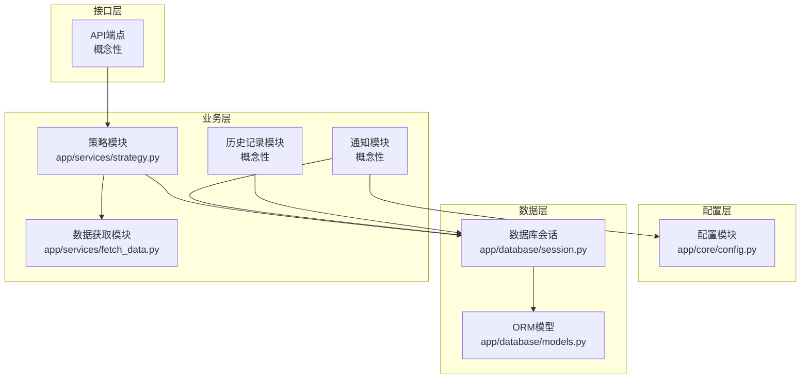
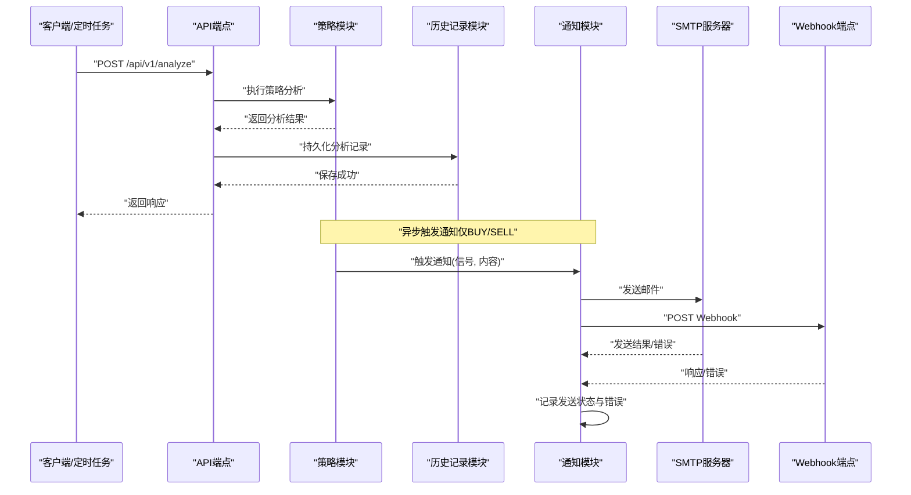
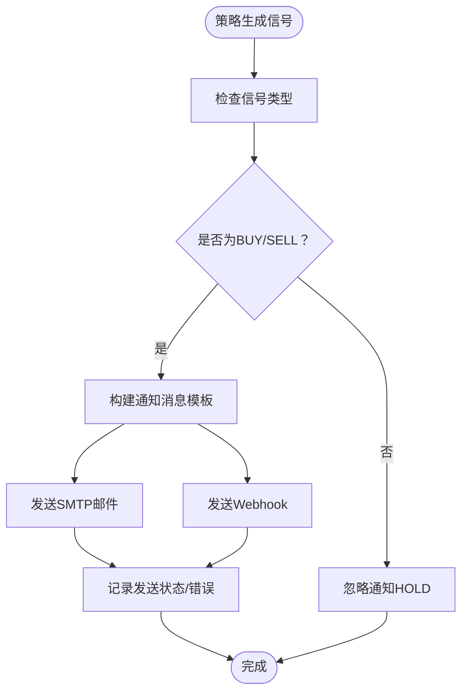
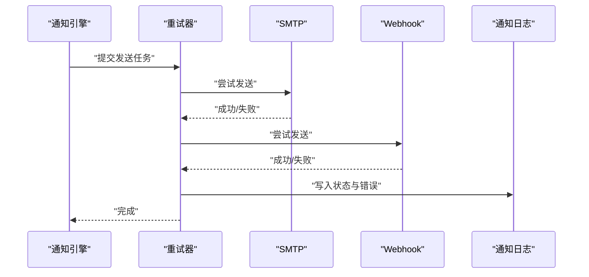
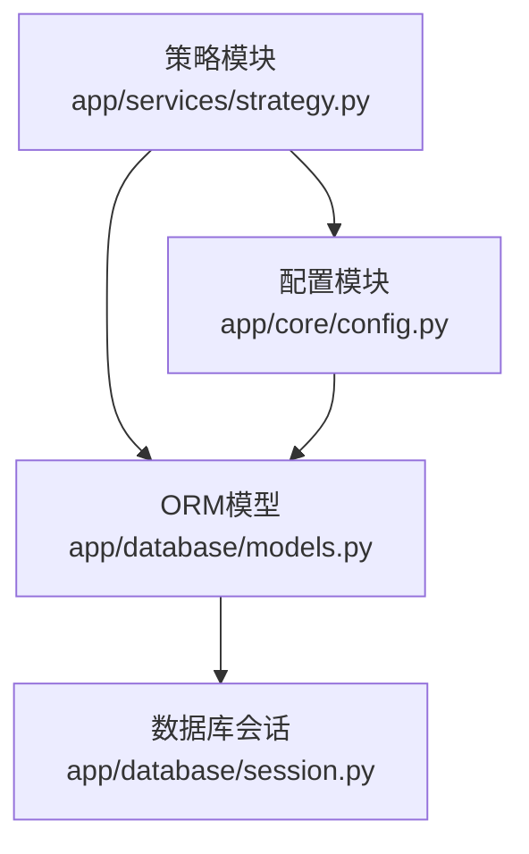

# 通知模块

<cite>
**本文档引用的文件**
- [现代海龟协议：基于Python与微服务架构的自动化量化交易系统产品需求文档(PRD).md](file://现代海龟协议：基于Python与微服务架构的自动化量化交易系统产品需求文档(PRD).md)
- [app/core/config.py](file://app/core/config.py)
- [app/database/models.py](file://app/database/models.py)
- [app/schemas/trading.py](file://app/schemas/trading.py)
- [app/services/fetch_data.py](file://app/services/fetch_data.py)
- [app/services/strategy.py](file://app/services/strategy.py)
- [app/database/session.py](file://app/database/session.py)
</cite>

## 目录
1. [简介](#简介)
2. [项目结构](#项目结构)
3. [核心组件](#核心组件)
4. [架构概览](#架构概览)
5. [详细组件分析](#详细组件分析)
6. [依赖分析](#依赖分析)
7. [性能考虑](#性能考虑)
8. [故障排查指南](#故障排查指南)
9. [结论](#结论)
10. [附录](#附录)

## 简介
本文件为《现代海龟协议》的通知模块技术文档，围绕外部状态通知系统的设计与实现展开，重点覆盖以下方面：
- 通知规则过滤引擎：如何识别具有实际账户操作意义的BUY入场与SELL平仓信号，并自动屏蔽日常产生的HOLD观望信号以提升信噪比。
- 异步非阻塞通知机制：事件驱动的消息队列、通知发送的重试策略与失败处理机制。
- SMTP邮件协议与Webhook接口的集成实现：配置要点、模板定制与优先级管理。
- 与人工复核流程的集成方式：通知触发时机、目标受众与后续处置。

## 项目结构
通知模块在当前代码库中以“概念性设计+数据模型”的形式出现，核心实现尚未落地。通知系统的关键要素包括：
- 配置层：位于配置模块中，定义SMTP与Webhook的开关与参数。
- 数据层：定义通知日志表，用于持久化通知记录与状态。
- 业务层：策略模块生成信号，历史模块负责持久化分析记录，通知模块负责在特定信号触发时发送外部通知。
- 接口层：通过API对外提供分析与历史查询能力，通知模块在后台异步触发。

**图表来源**
- [app/core/config.py:65-79](file://app/core/config.py#L65-L79)
- [app/database/models.py:135-163](file://app/database/models.py#L135-L163)
- [app/services/strategy.py:20-43](file://app/services/strategy.py#L20-L43)
- [app/services/fetch_data.py:26-43](file://app/services/fetch_data.py#L26-L43)
- [app/database/session.py:11-26](file://app/database/session.py#L11-L26)

**章节来源**
- [现代海龟协议：基于Python与微服务架构的自动化量化交易系统产品需求文档(PRD).md:57-62](file://现代海龟协议：基于Python与微服务架构的自动化量化交易系统产品需求文档(PRD).md#L57-L62)
- [app/core/config.py:65-79](file://app/core/config.py#L65-L79)
- [app/database/models.py:135-163](file://app/database/models.py#L135-L163)

## 核心组件
- 通知规则过滤引擎（概念性）
  - 触发条件：仅在策略模块输出BUY或SELL信号时触发通知。
  - 屏蔽策略：自动忽略HOLD信号，避免噪声干扰。
  - 人工复核集成：通知内容包含信号详情、通道参数与波动率指标，便于风控与交易员审阅。
- 异步非阻塞通知机制（概念性）
  - 事件驱动：在分析完成后，异步触发通知发送流程。
  - 重试策略：对SMTP与Webhook发送失败进行有限次数重试。
  - 失败处理：记录错误信息与状态，支持人工干预与重试。
- SMTP与Webhook集成（配置层）
  - SMTP：主机、端口、用户名、密码、发件人、收件人列表等。
  - Webhook：目标URL与可选的认证参数。
- 通知日志持久化（数据层）
  - 表结构：包含通知类型、触发信号、主题、内容、发送状态、错误信息与目标列表等字段。

**章节来源**
- [现代海龟协议：基于Python与微服务架构的自动化量化交易系统产品需求文档(PRD).md:57-62](file://现代海龟协议：基于Python与微服务架构的自动化量化交易系统产品需求文档(PRD).md#L57-L62)
- [app/database/models.py:135-163](file://app/database/models.py#L135-L163)
- [app/core/config.py:65-79](file://app/core/config.py#L65-L79)

## 架构概览
通知模块在系统中的位置与交互如下：

**图表来源**
- [app/services/strategy.py:200-273](file://app/services/strategy.py#L200-L273)
- [app/database/models.py:135-163](file://app/database/models.py#L135-L163)
- [app/core/config.py:65-79](file://app/core/config.py#L65-L79)

## 详细组件分析

### 通知规则过滤引擎
- 设计目标
  - 仅对具有实际账户操作意义的信号进行通知，避免HOLD信号干扰。
  - 通知内容需包含信号详情、通道参数与波动率指标，便于人工复核。
- 实现要点
  - 在策略模块生成信号后，通知模块进行规则判断：BUY/SELL触发通知，HOLD忽略。
  - 通知内容模板化，支持邮件与Webhook两种输出格式。
  - 发送状态与错误信息记录到通知日志表，便于审计与重试。

**图表来源**
- [app/services/strategy.py:94-161](file://app/services/strategy.py#L94-L161)
- [app/database/models.py:135-163](file://app/database/models.py#L135-L163)

**章节来源**
- [app/services/strategy.py:94-161](file://app/services/strategy.py#L94-L161)
- [app/database/models.py:135-163](file://app/database/models.py#L135-L163)

### 异步非阻塞通知机制
- 事件驱动
  - 分析完成后，异步触发通知发送流程，不阻塞主流程。
- 重试策略
  - 对SMTP与Webhook发送失败进行最多N次重试，间隔递增。
- 失败处理
  - 记录错误信息与状态（PENDING/SENT/FAILED），支持人工干预与手动重试。

**图表来源**
- [app/database/models.py:135-163](file://app/database/models.py#L135-L163)
- [app/core/config.py:65-79](file://app/core/config.py#L65-L79)

**章节来源**
- [app/database/models.py:135-163](file://app/database/models.py#L135-L163)
- [app/core/config.py:65-79](file://app/core/config.py#L65-L79)

### SMTP邮件协议集成
- 配置项
  - 主机、端口、用户名、密码、发件人、收件人列表。
- 发送流程
  - 构建主题与正文，按模板填充信号详情与指标。
  - 异步发送，记录发送时间与状态。
- 安全与合规
  - 凭证通过环境变量管理，避免硬编码。

**章节来源**
- [app/core/config.py:69-75](file://app/core/config.py#L69-L75)
- [现代海龟协议：基于Python与微服务架构的自动化量化交易系统产品需求文档(PRD).md:124-125](file://现代海龟协议：基于Python与微服务架构的自动化量化交易系统产品需求文档(PRD).md#L124-L125)

### Webhook接口集成
- 配置项
  - Webhook目标URL。
- 发送流程
  - 构建JSON负载，包含信号、价格、通道与波动率等关键指标。
  - 异步POST请求，记录响应与错误信息。
- 适用场景
  - 企业级消息系统、监控告警平台或内部协作工具。

**章节来源**
- [app/core/config.py:77-79](file://app/core/config.py#L77-L79)
- [app/database/models.py:149-151](file://app/database/models.py#L149-L151)

### 通知日志与审计
- 表结构要点
  - 关联分析记录ID、通知类型（EMAIL/WEBHOOK）、触发信号、主题、内容、发送状态、错误信息、目标列表。
- 审计与重试
  - 通过状态字段区分待发送、已发送、失败，支持人工重试与清理。

**章节来源**
- [app/database/models.py:135-163](file://app/database/models.py#L135-L163)

## 依赖分析
通知模块与其他组件的依赖关系如下：

**图表来源**
- [app/services/strategy.py:20-43](file://app/services/strategy.py#L20-L43)
- [app/core/config.py:65-79](file://app/core/config.py#L65-L79)
- [app/database/models.py:135-163](file://app/database/models.py#L135-L163)
- [app/database/session.py:11-26](file://app/database/session.py#L11-L26)

**章节来源**
- [app/services/strategy.py:20-43](file://app/services/strategy.py#L20-L43)
- [app/core/config.py:65-79](file://app/core/config.py#L65-L79)
- [app/database/models.py:135-163](file://app/database/models.py#L135-L163)
- [app/database/session.py:11-26](file://app/database/session.py#L11-L26)

## 性能考虑
- 异步发送：避免阻塞策略分析主流程，提升整体吞吐。
- 连接池与超时：合理配置SMTP与Webhook的连接池与超时时间，减少资源占用。
- 重试退避：采用指数退避策略，降低对下游服务的压力峰值。
- 日志与监控：记录发送状态与错误，便于性能分析与故障定位。

## 故障排查指南
- SMTP发送失败
  - 检查凭证与收件人列表配置。
  - 查看通知日志表中的错误信息字段。
- Webhook发送失败
  - 确认目标URL可达且认证正确。
  - 检查负载格式与字段完整性。
- 信号未触发通知
  - 确认通知开关已启用。
  - 检查信号类型是否为BUY或SELL。
- 数据库写入异常
  - 检查数据库连接与权限。
  - 确认通知日志表已创建。

**章节来源**
- [app/core/config.py:65-79](file://app/core/config.py#L65-L79)
- [app/database/models.py:135-163](file://app/database/models.py#L135-L163)
- [app/database/session.py:44-47](file://app/database/session.py#L44-L47)

## 结论
通知模块在当前代码库中以“概念性设计+数据模型”形式呈现，明确了通知规则过滤、异步发送与持久化审计的关键思路。建议在后续开发中：
- 实现通知模块的异步发送与重试逻辑。
- 完成SMTP与Webhook的集成与模板化配置。
- 提供通知日志的查询与重试界面，完善人工复核流程。

## 附录

### 配置示例（基于现有配置项）
- 通知开关
  - NOTIFICATION_ENABLED: 启用/禁用通知功能
- SMTP配置
  - SMTP_HOST: SMTP服务器地址
  - SMTP_PORT: 端口（默认587）
  - SMTP_USER: 用户名
  - SMTP_PASSWORD: 密码
  - SMTP_FROM: 发件人邮箱
  - SMTP_TO: 收件人列表
- Webhook配置
  - WEBHOOK_URL: Webhook目标URL

**章节来源**
- [app/core/config.py:65-79](file://app/core/config.py#L65-L79)

### 通知模板定制（建议字段）
- 邮件主题：包含资产代码、信号类型与时间戳
- 邮件正文：信号详情、通道参数（20日最高价、10日最低价）、波动率指标（N值、美元波动率）、建议头寸规模与风险金额
- Webhook负载：与邮件正文一致的JSON结构，便于下游系统消费

**章节来源**
- [app/services/strategy.py:200-273](file://app/services/strategy.py#L200-L273)
- [app/database/models.py:149-151](file://app/database/models.py#L149-L151)