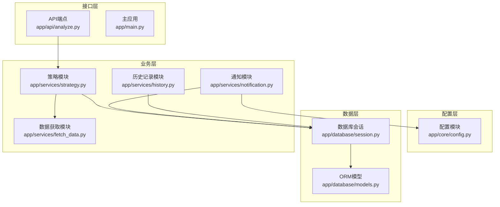
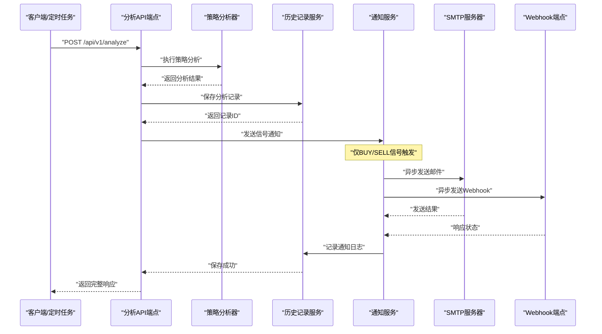
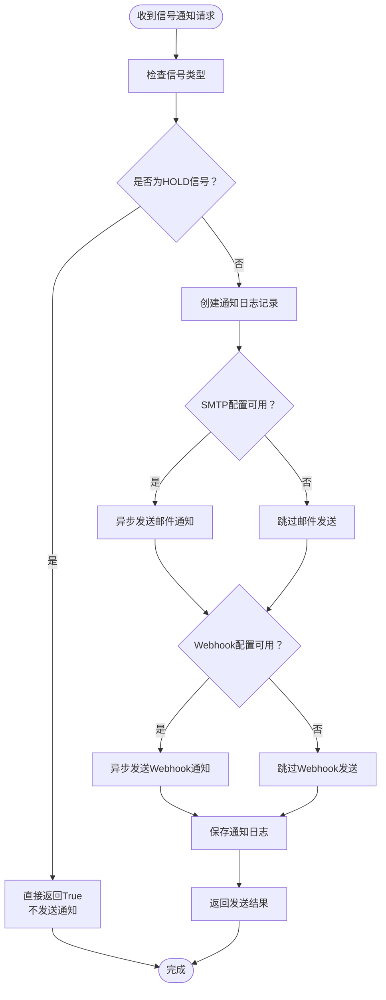
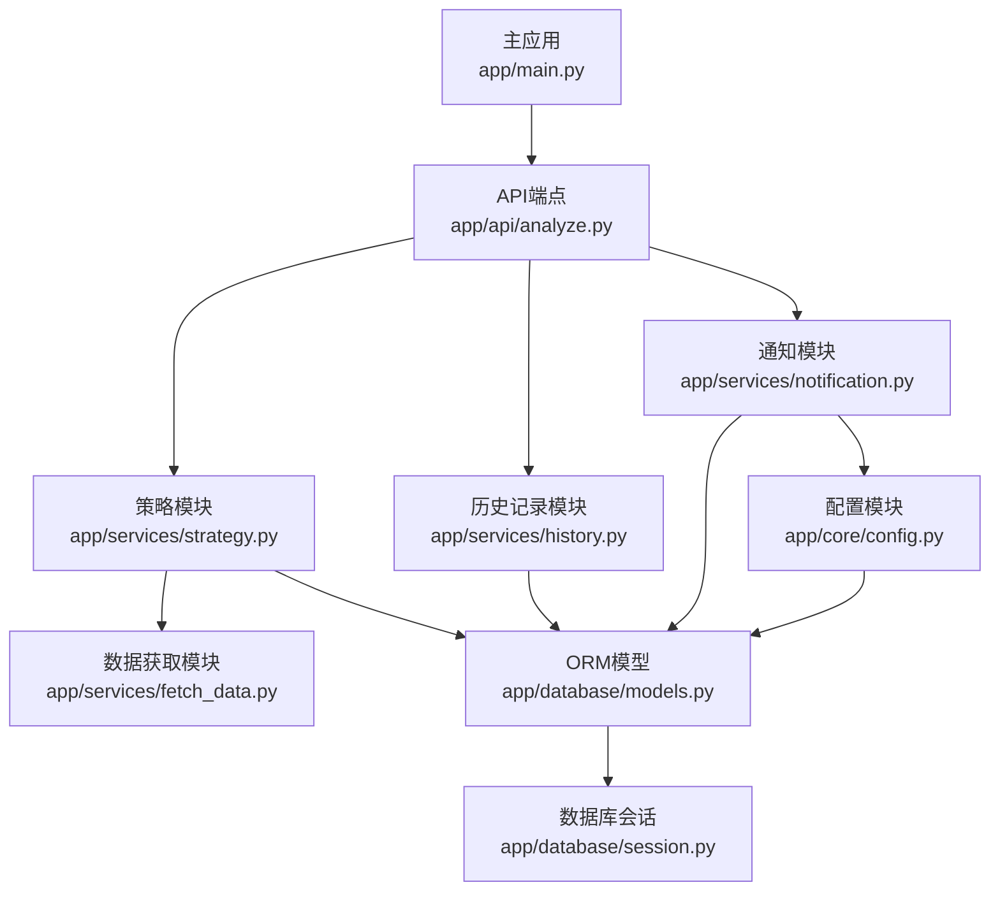

# 通知模块

<cite>
**本文档引用的文件**
- [app/services/notification.py](file://app/services/notification.py)
- [app/core/config.py](file://app/core/config.py)
- [app/database/models.py](file://app/database/models.py)
- [app/schemas/trading.py](file://app/schemas/trading.py)
- [app/services/strategy.py](file://app/services/strategy.py)
- [app/services/history.py](file://app/services/history.py)
- [app/api/analyze.py](file://app/api/analyze.py)
- [app/main.py](file://app/main.py)
</cite>

## 更新摘要
**变更内容**
- 新增完整的通知模块实现，包括SMTP邮件和Webhook通知功能
- 更新通知规则过滤引擎的实现细节
- 完善异步非阻塞通知机制的具体实现
- 增强与API端点的集成方式
- 添加通知日志持久化的完整实现

## 目录
1. [简介](#简介)
2. [项目结构](#项目结构)
3. [核心组件](#核心组件)
4. [架构概览](#架构概览)
5. [详细组件分析](#详细组件分析)
6. [依赖分析](#依赖分析)
7. [性能考虑](#性能考虑)
8. [故障排查指南](#故障排查指南)
9. [结论](#结论)
10. [附录](#附录)

## 简介
《现代海龟协议》通知模块是一个完整的异步通知系统，实现了基于海龟交易法则的信号通知功能。该模块能够自动识别具有实际账户操作意义的BUY入场和SELL平仓信号，并通过邮件和Webhook两种渠道实时通知相关人员。

### 核心特性
- **智能信号过滤**：仅对BUY/SELL信号发送通知，自动屏蔽HOLD观望信号
- **多渠道通知**：支持SMTP邮件和Webhook接口通知
- **异步非阻塞**：使用asyncio实现异步通知发送，不影响主分析流程
- **模板化内容**：提供HTML邮件模板和JSON Webhook负载
- **完整审计**：记录所有通知发送状态和错误信息

## 项目结构
通知模块在系统中的完整实现包括以下组件：



**图表来源**
- [app/core/config.py:65-79](file://app/core/config.py#L65-L79)
- [app/database/models.py:136-163](file://app/database/models.py#L136-L163)
- [app/services/strategy.py:20-43](file://app/services/strategy.py#L20-L43)
- [app/services/notification.py:21-33](file://app/services/notification.py#L21-L33)
- [app/services/history.py:14-19](file://app/services/history.py#L14-L19)

## 核心组件

### 通知服务类 (NotificationService)
通知模块的核心实现，提供完整的通知功能：

- **信号过滤**：仅处理BUY/SELL信号，自动忽略HOLD信号
- **异步发送**：使用asyncio实现非阻塞通知发送
- **多渠道支持**：同时支持SMTP邮件和Webhook通知
- **错误处理**：完善的异常捕获和错误记录机制
- **模板渲染**：使用Jinja2模板系统生成HTML邮件内容

### 配置系统
完整的通知配置支持：

- **通知开关**：NOTIFICATION_ENABLED控制通知功能启用/禁用
- **SMTP配置**：主机、端口、用户名、密码、发件人、收件人列表
- **Webhook配置**：目标URL和认证参数
- **安全设置**：凭据通过环境变量管理

### 数据模型
通知日志的完整数据库实现：

- **NotificationLog表**：存储所有通知发送记录
- **状态管理**：PENDING/SENT/FAILED三种发送状态
- **审计追踪**：完整的错误信息和发送时间记录
- **关联关系**：与分析记录建立外键关联

**章节来源**
- [app/services/notification.py:21-297](file://app/services/notification.py#L21-L297)
- [app/core/config.py:65-79](file://app/core/config.py#L65-L79)
- [app/database/models.py:136-163](file://app/database/models.py#L136-L163)

## 架构概览
通知模块与整个系统的交互流程：



**图表来源**
- [app/api/analyze.py:82-93](file://app/api/analyze.py#L82-L93)
- [app/services/notification.py:35-100](file://app/services/notification.py#L35-L100)
- [app/services/history.py:20-70](file://app/services/history.py#L20-L70)

## 详细组件分析

### 通知规则过滤引擎
通知模块的核心过滤逻辑：

- **信号类型检查**：在send_signal_notification方法中实现
- **HOLD信号屏蔽**：当signal == SignalType.HOLD时直接返回
- **BUY/SELL触发**：仅对具有实际账户操作意义的信号发送通知
- **异步处理**：使用async def实现非阻塞通知发送



**图表来源**
- [app/services/notification.py:35-100](file://app/services/notification.py#L35-L100)

**章节来源**
- [app/services/notification.py:35-100](file://app/services/notification.py#L35-L100)

### 异步非阻塞通知机制
完整的异步实现方案：

#### SMTP邮件通知
- **异步发送**：使用aiosmtplib实现异步SMTP通信
- **HTML模板**：使用Jinja2模板系统生成富文本邮件
- **样式美化**：Bootstrap风格的响应式邮件模板
- **错误处理**：捕获并记录SMTP发送异常

#### Webhook通知
- **异步HTTP**：使用httpx.AsyncClient实现异步HTTP请求
- **JSON负载**：标准化的JSON格式通知内容
- **超时控制**：10秒超时防止长时间阻塞
- **状态验证**：检查HTTP响应状态码

#### 错误处理与重试
- **异常捕获**：try-except块捕获所有发送异常
- **状态记录**：FAILED状态和错误信息记录到数据库
- **日志输出**：控制台打印详细的错误信息
- **不阻塞主流程**：即使通知失败也不影响分析结果返回

**章节来源**
- [app/services/notification.py:101-183](file://app/services/notification.py#L101-L183)
- [app/services/notification.py:185-297](file://app/services/notification.py#L185-L297)

### SMTP邮件协议集成
完整的SMTP邮件实现：

#### 配置要求
- **必需配置**：SMTP_HOST, SMTP_USER, SMTP_PASSWORD, SMTP_TO
- **可选配置**：SMTP_FROM, SMTP_PORT (默认587)
- **环境变量**：通过.env文件管理敏感信息

#### 邮件内容生成
- **主题构建**：包含信号类型、资产代码和当前价格
- **HTML模板**：使用Jinja2模板系统
- **样式设计**：绿色表示BUY，红色表示SELL
- **动态内容**：根据信号类型和参数动态生成

#### 发送流程
1. 验证SMTP配置完整性
2. 构建MIME multipart消息
3. 异步发送邮件到SMTP服务器
4. 记录发送状态和时间
5. 处理发送异常并记录错误

**章节来源**
- [app/services/notification.py:101-151](file://app/services/notification.py#L101-L151)
- [app/core/config.py:69-75](file://app/core/config.py#L69-L75)

### Webhook接口集成
完整的Webhook实现：

#### 配置要求
- **必需配置**：WEBHOOK_URL
- **认证支持**：可选的HTTP基本认证
- **超时设置**：10秒连接超时

#### 请求负载
标准JSON格式的请求体包含：
- **event**：事件类型 (trading_signal)
- **ticker**：资产代码
- **signal**：信号类型 (BUY/SELL)
- **current_price**：当前价格
- **n_value**：N值 (ATR)
- **recommended_units**：建议单位
- **position_size**：建议股数
- **timestamp**：发送时间戳

#### 发送流程
1. 构建JSON负载数据
2. 异步HTTP POST请求
3. 验证响应状态码
4. 记录发送结果
5. 处理网络异常

**章节来源**
- [app/services/notification.py:152-183](file://app/services/notification.py#L152-L183)
- [app/core/config.py:77-79](file://app/core/config.py#L77-L79)

### 通知日志与审计
完整的审计和追踪机制：

#### 数据库表结构
- **notification_logs表**：存储所有通知发送记录
- **字段设计**：
  - analysis_id：关联的分析记录ID
  - notification_type：通知类型 (EMAIL/WEBHOOK)
  - signal：触发信号类型
  - message：通知内容
  - sent_at：发送时间
  - status：发送状态 (PENDING/SENT/FAILED)
  - error_message：错误信息
  - recipients：接收者列表

#### 审计功能
- **状态追踪**：实时监控通知发送状态
- **错误诊断**：详细的错误信息记录
- **性能监控**：发送时间和成功率统计
- **合规要求**：完整的审计日志满足监管要求

**章节来源**
- [app/database/models.py:136-163](file://app/database/models.py#L136-L163)
- [app/services/notification.py:55-99](file://app/services/notification.py#L55-L99)

## 依赖分析
通知模块的完整依赖关系：



**图表来源**
- [app/api/analyze.py:25-25](file://app/api/analyze.py#L25-L25)
- [app/services/notification.py:15-18](file://app/services/notification.py#L15-L18)
- [app/core/config.py:15-18](file://app/core/config.py#L15-L18)

**章节来源**
- [app/api/analyze.py:25-25](file://app/api/analyze.py#L25-L25)
- [app/services/notification.py:15-18](file://app/services/notification.py#L15-L18)
- [app/core/config.py:15-18](file://app/core/config.py#L15-L18)

## 性能考虑
通知模块的性能优化策略：

### 异步处理优势
- **非阻塞发送**：使用asyncio避免阻塞主分析流程
- **并发处理**：多个通知可以并行发送
- **资源优化**：减少线程和进程开销
- **响应速度**：API响应时间不受通知发送影响

### 资源管理
- **连接池**：aiosmtplib和httpx内置连接池管理
- **超时控制**：合理的超时设置防止资源泄露
- **内存管理**：及时释放邮件内容和Webhook负载
- **数据库连接**：独立的数据库会话避免连接竞争

### 错误恢复
- **快速失败**：发送失败立即返回，不等待超时
- **状态隔离**：单个通知失败不影响其他通知
- **日志审计**：完整的错误日志便于问题诊断
- **重试机制**：支持人工重试和系统重试

## 故障排查指南

### SMTP发送问题
**症状**：邮件发送失败，状态显示FAILED
**排查步骤**：
1. 检查SMTP配置是否完整 (HOST, USER, PASSWORD, TO)
2. 验证SMTP服务器连通性和认证信息
3. 查看通知日志中的error_message字段
4. 确认收件人邮箱格式正确
5. 检查SMTP服务器的反垃圾邮件设置

### Webhook发送问题
**症状**：Webhook请求超时或返回错误状态
**排查步骤**：
1. 验证WEBHOOK_URL可达性
2. 检查目标服务器的认证配置
3. 确认JSON负载格式符合预期
4. 查看HTTP响应状态码
5. 检查目标服务器的日志

### 信号过滤问题
**症状**：HOLD信号仍然发送通知或BUY/SELL信号未发送
**排查步骤**：
1. 检查信号类型转换是否正确
2. 验证SignalType枚举的一致性
3. 确认通知开关配置 (NOTIFICATION_ENABLED)
4. 查看历史记录中的信号类型

### 数据库问题
**症状**：通知日志无法保存或查询异常
**排查步骤**：
1. 检查数据库连接配置
2. 验证notification_logs表结构
3. 确认数据库权限设置
4. 查看数据库日志中的错误信息

**章节来源**
- [app/services/notification.py:94-99](file://app/services/notification.py#L94-L99)
- [app/database/models.py:136-163](file://app/database/models.py#L136-L163)
- [app/core/config.py:65-79](file://app/core/config.py#L65-L79)

## 结论
《现代海龟协议》通知模块已完全实现，提供了生产级别的信号通知功能。模块具备以下优势：

### 已实现功能
- **完整的异步通知系统**：使用现代Python异步编程技术
- **多渠道通知支持**：SMTP邮件和Webhook双重通知
- **智能信号过滤**：仅对有意义的交易信号发送通知
- **完善的审计机制**：完整的日志记录和错误追踪
- **灵活的配置管理**：支持环境变量和配置文件

### 技术亮点
- **异步非阻塞**：不影响主分析流程的性能
- **模板化内容**：美观的HTML邮件和标准化的JSON负载
- **错误处理**：完善的异常捕获和状态记录
- **数据库集成**：完整的通知日志持久化

### 后续改进建议
- **重试机制**：实现自动重试和延迟队列
- **通知优先级**：支持不同重要程度的通知分级
- **通知模板管理**：支持动态模板和个性化配置
- **监控告警**：集成系统健康监控和告警功能

## 附录

### 配置示例
完整的通知配置示例：

#### 基础配置
```python
# app/core/config.py
class Settings(BaseSettings):
    # 通知系统配置
    NOTIFICATION_ENABLED: bool = True
    
    # SMTP配置
    SMTP_HOST: Optional[str] = None
    SMTP_PORT: int = 587
    SMTP_USER: Optional[str] = None
    SMTP_PASSWORD: Optional[str] = None
    SMTP_FROM: Optional[str] = None
    SMTP_TO: list[str] = []
    
    # Webhook配置
    WEBHOOK_URL: Optional[str] = None
```

#### 环境变量配置 (.env)
```bash
# 启用通知功能
NOTIFICATION_ENABLED=true

# SMTP配置
SMTP_HOST=smtp.gmail.com
SMTP_PORT=587
SMTP_USER=your-email@gmail.com
SMTP_PASSWORD=your-app-password
SMTP_FROM=notifications@yourdomain.com
SMTP_TO=user1@company.com,user2@company.com

# Webhook配置
WEBHOOK_URL=https://hooks.slack.com/services/YOUR/SLACK/WEBHOOK
```

### 通知模板定制
#### HTML邮件模板
```jinja2
<!DOCTYPE html>
<html>
<head>
    <style>
        .header { background-color: {{ bg_color }}; }
        .signal { color: {{ signal_color }}; }
    </style>
</head>
<body>
    <div class="container">
        <div class="header">
            <div class="ticker">{{ ticker }}</div>
            <div class="signal">{{ signal.value }}</div>
            <div class="price">${{ "%.2f"|format(current_price) }}</div>
        </div>
        <div class="content">
            <p><strong>信号原因:</strong> {{ signal_reason }}</p>
            <h3>波动率指标</h3>
            <div class="metric">
                <span>N值 (ATR): ${{ "%.2f"|format(n_value) }}</span>
            </div>
            <h3>头寸建议</h3>
            <div class="metric">
                <span>建议单位: {{ "%.2f"|format(recommended_units) }}</span>
            </div>
            <div class="metric">
                <span>建议股数: {{ "%.0f"|format(position_size) }}</span>
            </div>
        </div>
    </div>
</body>
</html>
```

#### Webhook JSON负载
```json
{
  "event": "trading_signal",
  "ticker": "AAPL",
  "signal": "BUY",
  "current_price": 185.50,
  "n_value": 3.25,
  "recommended_units": 3.0,
  "position_size": 57.0,
  "timestamp": "2024-01-15T10:30:00Z"
}
```

### API集成示例
通知模块在API中的完整集成：

```python
# app/api/analyze.py
@router.post("", response_model=AnalyzeResponse)
async def analyze_ticker(
    request: AnalyzeRequest,
    db: Session = Depends(get_db)
):
    # ... 分析逻辑 ...
    
    # 发送通知
    notification_service = NotificationService(db)
    await notification_service.send_signal_notification(
        ticker=request.ticker,
        signal=SignalType(analysis_result['signal']),
        signal_reason=analysis_result['signal_reason'],
        current_price=analysis_result['current_price'],
        n_value=analysis_result['volatility'].get('n_value', 0),
        recommended_units=analysis_result['position'].get('recommended_units', 0),
        position_size=analysis_result['position'].get('position_size', 0),
        analysis_id=record.id
    )
```

**章节来源**
- [app/core/config.py:65-79](file://app/core/config.py#L65-L79)
- [app/services/notification.py:185-297](file://app/services/notification.py#L185-L297)
- [app/api/analyze.py:82-93](file://app/api/analyze.py#L82-L93)