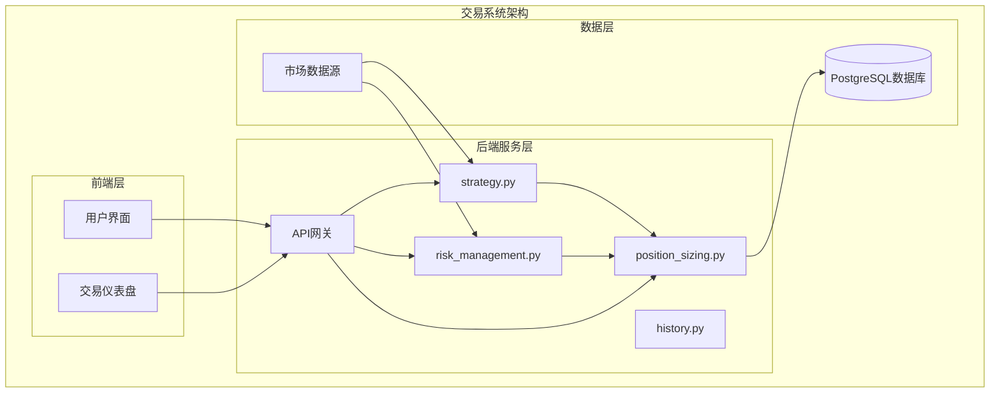
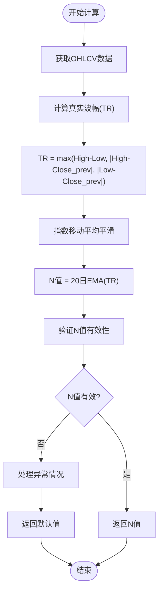
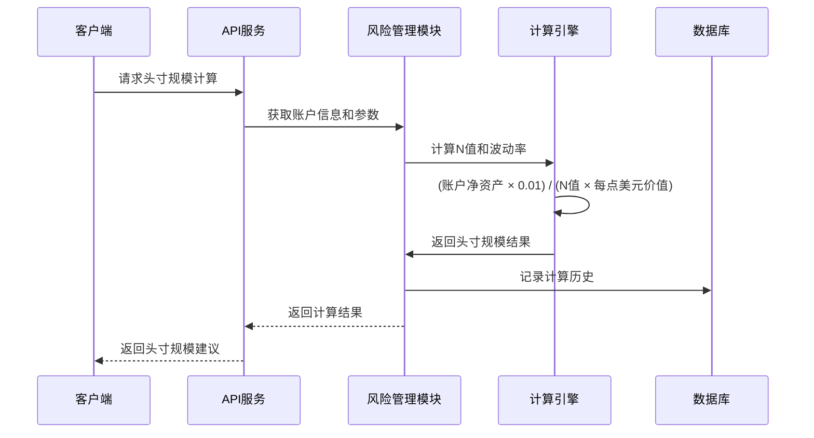
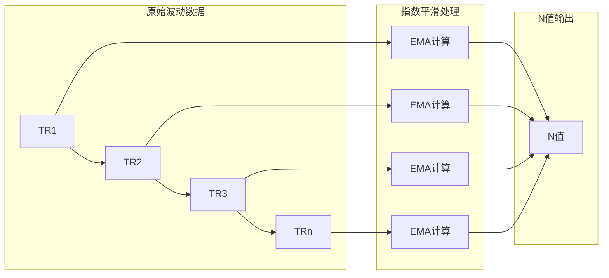
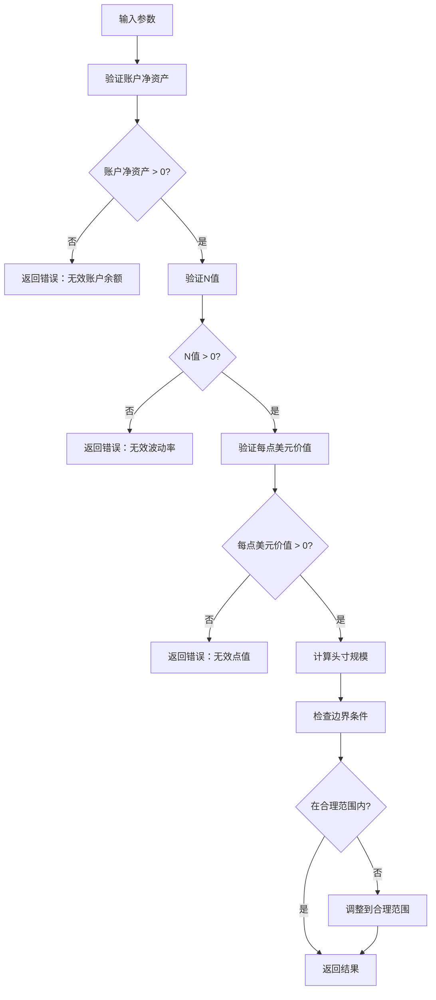
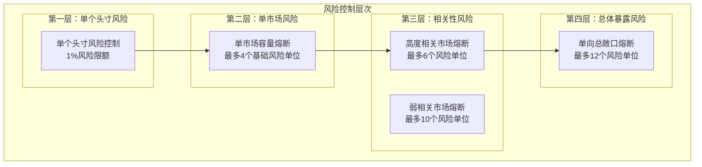
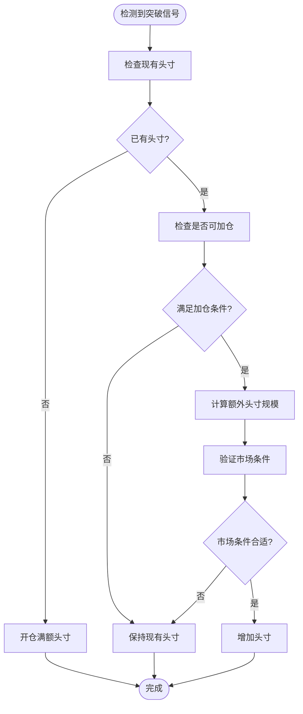
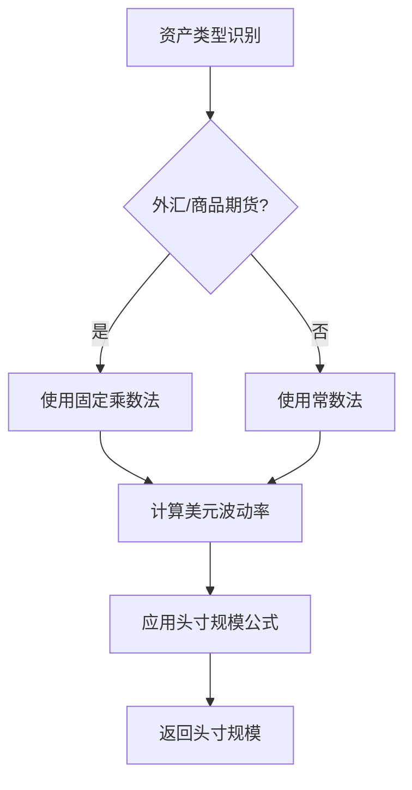
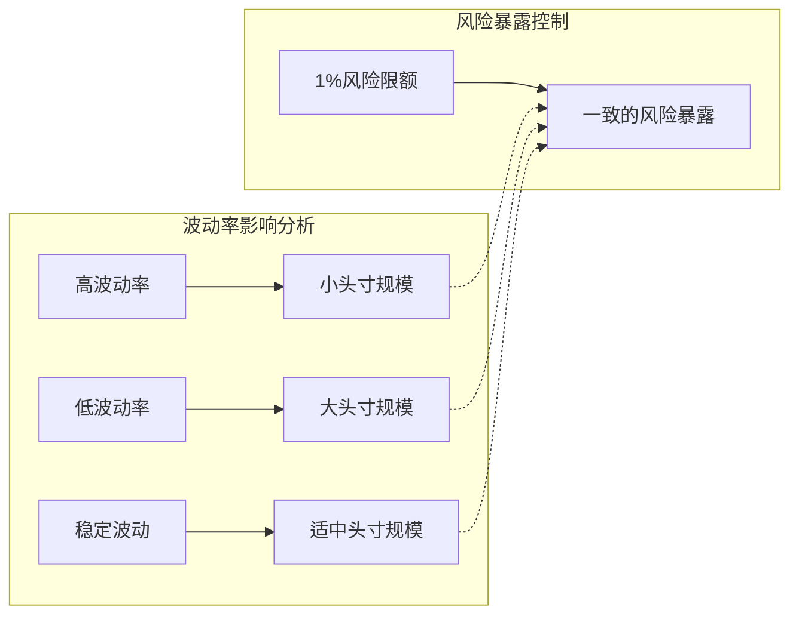

# 头寸规模控制系统

<cite>
**本文档引用的文件**
- [现代海龟协议：基于Python与微服务架构的自动化量化交易系统产品需求文档(PRD).md](file://现代海龟协议：基于Python与微服务架构的自动化量化交易系统产品需求文档(PRD).md)
</cite>

## 目录
1. [引言](#引言)
2. [系统架构概览](#系统架构概览)
3. [核心组件分析](#核心组件分析)
4. [波动率计算引擎](#波动率计算引擎)
5. [头寸规模计算算法](#头寸规模计算算法)
6. [风险控制机制](#风险控制机制)
7. [金字塔式加仓策略](#金字塔式加仓策略)
8. [资产类别适配方案](#资产类别适配方案)
9. [可视化与示例](#可视化与示例)
10. [性能考虑](#性能考虑)
11. [故障排除指南](#故障排除指南)
12. [结论](#结论)

## 引言

头寸规模控制系统是现代海龟协议的核心风险管理组件，基于波动率的动态头寸规模计算公式实现了跨资产类别的风险平价控制。该系统通过数学公式将账户风险暴露严格限制在总资产的1%以内，确保在任何市场条件下都能维持可持续的交易表现。

系统采用"N值"（20日指数平滑平均真实波幅）作为波动率指标，结合每点美元价值计算，实现了对不同市场条件的自适应头寸管理。这种设计不仅简化了复杂的资金管理逻辑，更重要的是通过数学原理确保了风险控制的有效性和一致性。

## 系统架构概览

头寸规模控制系统在整个交易架构中扮演着关键的风控中枢角色，与策略引擎、数据采集模块和通知系统形成紧密的协作关系。



**图表来源**
- [现代海龟协议：基于Python与微服务架构的自动化量化交易系统产品需求文档(PRD).md](file://现代海龟协议：基于Python与微服务架构的自动化量化交易系统产品需求文档(PRD).md#L35-L62)

## 核心组件分析

### 波动率计算引擎

波动率计算引擎是头寸规模控制系统的基础，负责实时计算N值（20日指数平滑平均真实波幅）。



**图表来源**
- [现代海龟协议：基于Python与微服务架构的自动化量化交易系统产品需求文档(PRD).md](file://现代海龟协议：基于Python与微服务架构的自动化量化交易系统产品需求文档(PRD).md#L67-L77)

### 头寸规模计算核心算法

头寸规模计算采用经典的海龟协议公式，通过数学推导实现了严格的风险控制。



**图表来源**
- [现代海龟协议：基于Python与微服务架构的自动化量化交易系统产品需求文档(PRD).md](file://现代海龟协议：基于Python与微服务架构的自动化量化交易系统产品需求文档(PRD).md#L79-L90)

**章节来源**
- [现代海龟协议：基于Python与微服务架构的自动化量化交易系统产品需求文档(PRD).md](file://现代海龟协议：基于Python与微服务架构的自动化量化交易系统产品需求文档(PRD).md#L63-L102)

## 波动率计算引擎

### 真实波幅（True Range）计算

真实波幅是衡量资产波动性的关键指标，通过三重比较确保了对跳空缺口的完整捕捉。

| 计算要素 | 数学表达式 | 说明 |
|---------|-----------|------|
| 传统振幅 | High - Low | 常规日内波动范围 |
| 上跳空缺口 | | High - Close_prev |
| 下跳空缺口 | | Close_prev - Low |
| 真实波幅(TR) | TR = max(振幅, 上跳空, 下跳空) | 全面反映潜在波动 |

### N值平滑处理

N值通过20日指数移动平均算法实现平滑处理，消除短期波动干扰。



**图表来源**
- [现代海龟协议：基于Python与微服务架构的自动化量化交易系统产品需求文档(PRD).md](file://现代海龟协议：基于Python与微服务架构的自动化量化交易系统产品需求文档(PRD).md#L67-L77)

**章节来源**
- [现代海龟协议：基于Python与微服务架构的自动化量化交易系统产品需求文档(PRD).md](file://现代海龟协议：基于Python与微服务架构的自动化量化交易系统产品需求文档(PRD).md#L67-L77)

## 头寸规模计算算法

### 核心公式推导

头寸规模计算基于严格的数学原理，确保风险暴露的精确控制。

#### 基础公式

**单个基础交易单位规模（Units） = (账户总净资产 × 0.01) / (N值 × 每点美元价值)**

#### 风险限额原理

1%风险限额的数学基础：
- 单次交易最大损失 = 账户净资产 × 1%
- 单点损失 = N值 × 每点美元价值
- 交易单位数 = 最大损失 ÷ 单点损失

### 参数验证与边界检查

系统实现多层次的参数验证机制：



**图表来源**
- [现代海龟协议：基于Python与微服务架构的自动化量化交易系统产品需求文档(PRD).md](file://现代海龟协议：基于Python与微服务架构的自动化量化交易系统产品需求文档(PRD).md#L79-L90)

**章节来源**
- [现代海龟协议：基于Python与微服务架构的自动化量化交易系统产品需求文档(PRD).md](file://现代海龟协议：基于Python与微服务架构的自动化量化交易系统产品需求文档(PRD).md#L79-L90)

## 风险控制机制

### 多层级风险控制架构

系统实施四重风险控制机制，确保投资组合的整体风险暴露在安全范围内。



**图表来源**
- [现代海龟协议：基于Python与微服务架构的自动化量化交易系统产品需求文档(PRD).md](file://现代海龟协议：基于Python与微服务架构的自动化量化交易系统产品需求文档(PRD).md#L92-L102)

### 投资组合宏观关联度控制

系统通过相关性矩阵算法实时监控投资组合的宏观风险暴露：

| 风险类别 | 熔断阈值 | 控制逻辑 | 触发条件 |
|---------|---------|---------|---------|
| 单一市场容量 | 4个基础风险单位 | 限制单个标的加仓总量 | 单一资产累计风险单位超过阈值 |
| 高度相关市场 | 6个风险单位 | 控制同板块/同货币对风险暴露 | 相关系数>0.7的相关资产组合 |
| 弱相关市场 | 10个风险单位 | 控制跨板块风险暴露 | 相关系数0.3-0.7的相关资产组合 |
| 单向总敞口 | 12个风险单位 | 控制整体多/空方向风险 | 做多或做空总风险单位超过阈值 |

**章节来源**
- [现代海龟协议：基于Python与微服务架构的自动化量化交易系统产品需求文档(PRD).md](file://现代海龟协议：基于Python与微服务架构的自动化量化交易系统产品需求文档(PRD).md#L92-L102)

## 金字塔式加仓策略

### 加仓逻辑实现

金字塔式加仓是海龟协议的重要组成部分，通过分批建仓实现风险控制和收益最大化。



**图表来源**
- [现代海龟协议：基于Python与微服务架构的自动化量化交易系统产品需求文档(PRD).md](file://现代海龟协议：基于Python与微服务架构的自动化量化交易系统产品需求文档(PRD).md#L96-L101)

### 风险控制措施

金字塔式加仓的风险控制体现在多个层面：

1. **加仓时机控制**：仅在价格突破确认后进行加仓
2. **加仓幅度限制**：每次加仓不超过原有头寸的一定比例
3. **总敞口限制**：单个标的累计风险单位不超过4个
4. **相关性监控**：避免对高度相关的资产进行重复加仓

**章节来源**
- [现代海龟协议：基于Python与微服务架构的自动化量化交易系统产品需求文档(PRD).md](file://现代海龟协议：基于Python与微服务架构的自动化量化交易系统产品需求文档(PRD).md#L96-L101)

## 资产类别适配方案

### 外汇和商品期货市场

在外汇和商品期货市场中，每点美元价值采用固定乘数法计算：

| 资产类别 | 每点美元价值 | 乘数说明 | 示例 |
|---------|-------------|---------|------|
| 标准外汇合约 | 10美元 | EUR/USD等标准货币对 | 1点波动 = 10美元 |
| 商品期货合约 | 变化的固定值 | 根据商品类型确定 | 黄金：100美元/盎司 |
| 金融期货合约 | 变化的固定值 | 根据指数类型确定 | S&P 500：25美元/点 |

### 股票市场

股票市场的每点美元价值采用简化常数法：

**每点美元价值 = 1.00美元**

这种简化处理的原因：
- 股票交易不涉及期货合约的杠杆乘数效应
- 股票价格波动相对标准化
- 简化计算复杂度，提高系统响应速度

### 资产类别切换逻辑



**图表来源**
- [现代海龟协议：基于Python与微服务架构的自动化量化交易系统产品需求文档(PRD).md](file://现代海龟协议：基于Python与微服务架构的自动化量化交易系统产品需求文档(PRD).md#L87-L88)

**章节来源**
- [现代海龟协议：基于Python与微服务架构的自动化量化交易系统产品需求文档(PRD).md](file://现代海龟协议：基于Python与微服务架构的自动化量化交易系统产品需求文档(PRD).md#L87-L88)

## 可视化与示例

### 头寸规模计算关系曲线

头寸规模与波动率呈反比关系，体现了海龟协议的核心风险控制原理：



### 不同市场条件下的计算示例

#### 外汇市场示例

| 参数 | 数值 | 计算过程 |
|------|------|---------|
| 账户净资产 | $100,000 | 基础资金 |
| N值 | 0.0005 | EUR/USD波动率 |
| 每点美元价值 | 10美元 | 标准外汇乘数 |
| 头寸规模 | 200单位 | (100,000×0.01)/(0.0005×10)=200 |

#### 股票市场示例

| 参数 | 数值 | 计算过程 |
|------|------|---------|
| 账户净资产 | $50,000 | 基础资金 |
| N值 | 0.02 | 股票波动率 |
| 每点美元价值 | 1.00美元 | 股票常数 |
| 头寸规模 | 250股 | (50,000×0.01)/(0.02×1.00)=250 |

#### 商品期货市场示例

| 参数 | 数值 | 计算过程 |
|------|------|---------|
| 账户净资产 | $75,000 | 基础资金 |
| N值 | 0.005 | 商品波动率 |
| 每点美元价值 | 50美元 | 商品乘数 |
| 头寸规模 | 300手 | (75,000×0.01)/(0.005×50)=300 |

### 风险暴露分析

系统通过以下指标监控风险暴露：

```mermaid
graph TB
subgraph "风险指标监控"
subgraph "单头寸风险"
PositionRisk[单头寸风险<br/>= 头寸规模 × N值 × 每点美元价值]
PercentRisk[占总资产百分比<br/>= (PositionRisk/账户净资产) × 100%]
end
subgraph "组合风险"
PortfolioRisk[投资组合总风险]
CorrelationImpact[相关性影响]
DirectionExposure[方向性暴露]
end
subgraph "控制指标"
RiskLimit[1%风险限额]
MarketLimit[单市场4单位限制]
CorrelationLimit[相关性6单位限制]
DirectionLimit[方向性12单位限制]
end
end
PositionRisk --> PercentRisk
PercentRisk --> RiskLimit
PortfolioRisk --> MarketLimit
CorrelationImpact --> CorrelationLimit
DirectionExposure --> DirectionLimit
```

## 性能考虑

### 计算复杂度分析

头寸规模计算的计算复杂度为O(n)，其中n为数据点数量。主要计算包括：

1. **波动率计算**：O(n) - 计算真实波幅和指数平滑
2. **头寸规模计算**：O(1) - 基础数学运算
3. **风险控制检查**：O(m) - m为已存在头寸数量

### 内存使用优化

系统采用流式计算方式，避免存储大量历史数据：

- 实时计算当前N值，不保存历史波动率序列
- 使用滑动窗口技术，只维护必要的计算状态
- 采用增量更新机制，减少重复计算

### 并发处理能力

系统支持高并发请求处理：

- 异步计算引擎，支持多请求并行处理
- 缓存机制，避免重复计算相同参数
- 连接池管理，优化数据库访问性能

## 故障排除指南

### 常见问题诊断

| 问题类型 | 症状 | 可能原因 | 解决方案 |
|---------|------|---------|---------|
| 计算结果异常 | 头寸规模为负数或无穷大 | 输入参数无效 | 验证账户净资产和波动率参数 |
| 风险控制触发 | 系统拒绝下单 | 超过熔断阈值 | 检查投资组合配置和市场条件 |
| 性能问题 | 计算响应缓慢 | 数据量过大或计算复杂 | 优化数据访问和算法实现 |
| 数据异常 | 波动率计算错误 | 市场数据质量差 | 检查数据源和数据完整性 |

### 异常处理机制

系统实现多层次异常处理：

1. **输入验证异常**：参数格式或范围错误
2. **计算异常**：数值溢出或除零错误
3. **系统异常**：数据库连接或网络故障
4. **业务异常**：超出风险控制阈值

### 监控与告警

系统提供全面的监控功能：

- 实时计算性能监控
- 风险指标实时跟踪
- 异常事件自动告警
- 历史记录完整审计

**章节来源**
- [现代海龟协议：基于Python与微服务架构的自动化量化交易系统产品需求文档(PRD).md](file://现代海龟协议：基于Python与微服务架构的自动化量化交易系统产品需求文档(PRD).md#L111-L125)

## 结论

头寸规模控制系统作为现代海龟协议的核心组件，通过严格的数学原理和多层次的风险控制机制，实现了跨资产类别的风险平价管理。系统的核心优势体现在：

1. **数学基础扎实**：基于1%风险限额的严格数学推导
2. **自适应性强**：通过波动率动态调整头寸规模
3. **风险控制完善**：四重风险控制机制确保系统稳定性
4. **跨市场适用**：针对不同资产类别提供适配方案
5. **性能优化**：高效的计算算法和内存管理

该系统不仅为量化交易提供了可靠的风控框架，更为现代金融工程的发展提供了重要的理论支撑和实践指导。通过持续的优化和完善，头寸规模控制系统将继续在复杂的金融市场环境中发挥重要作用。