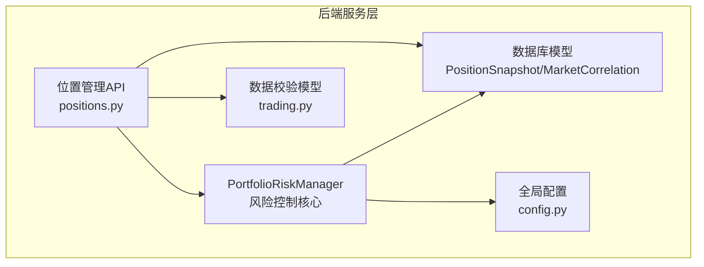
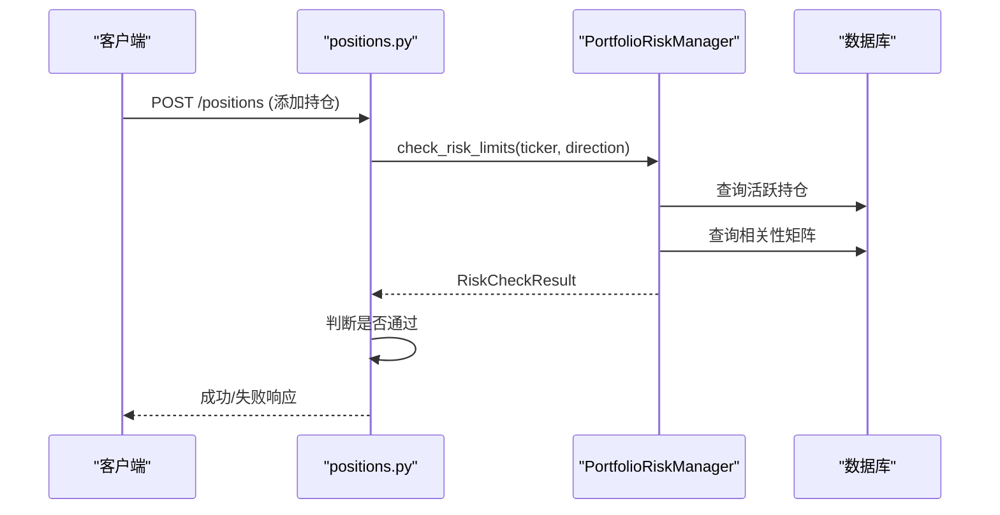
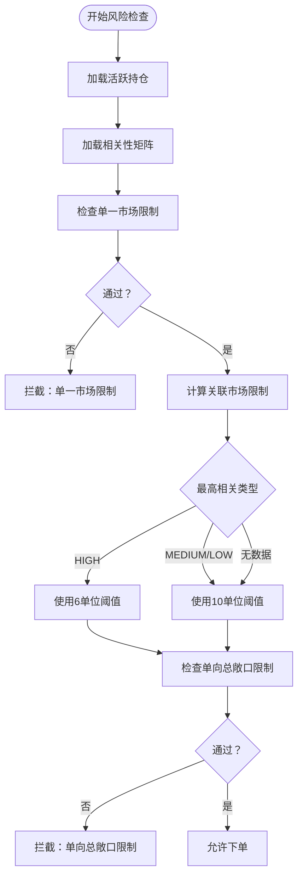
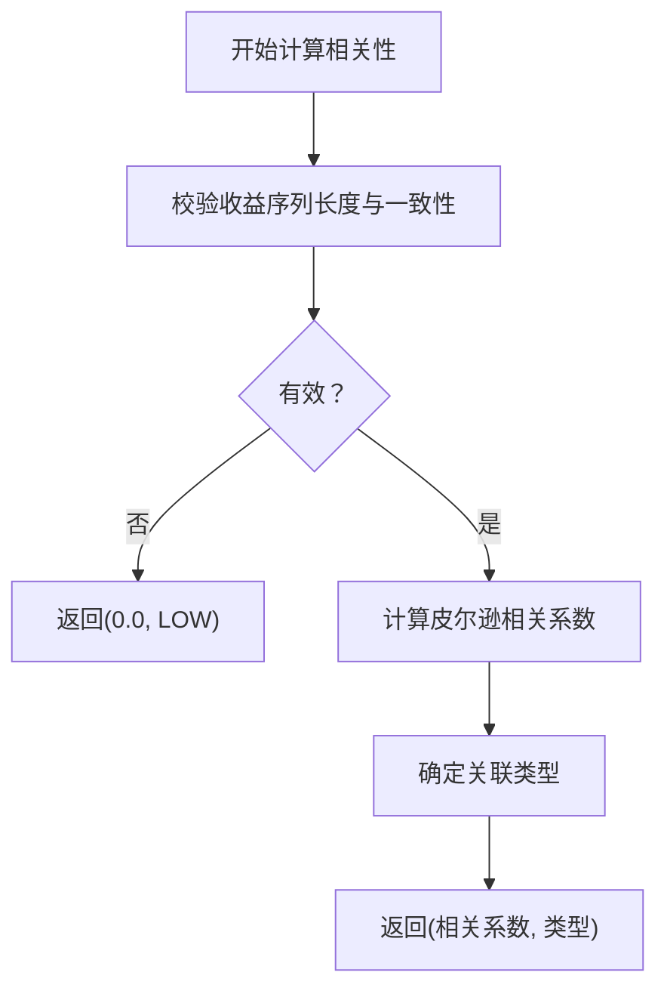
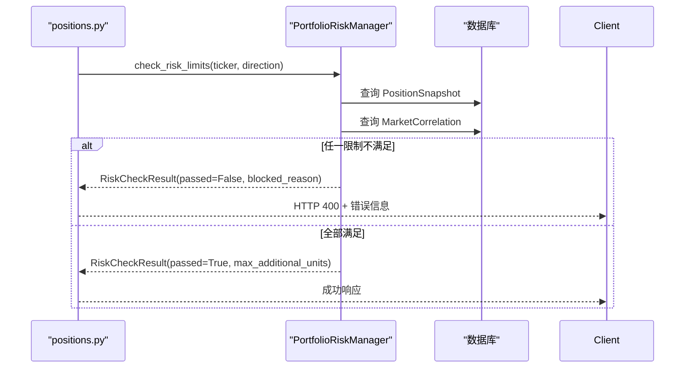
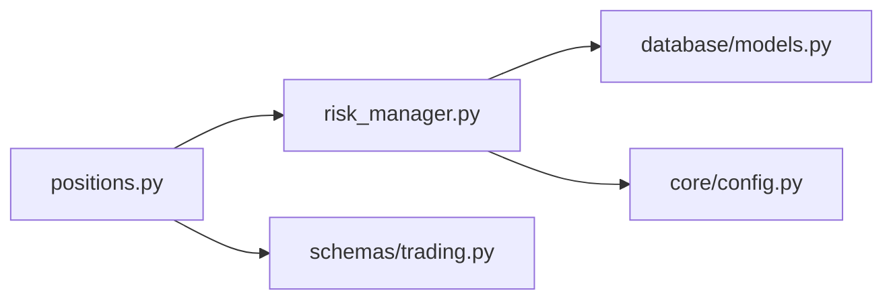
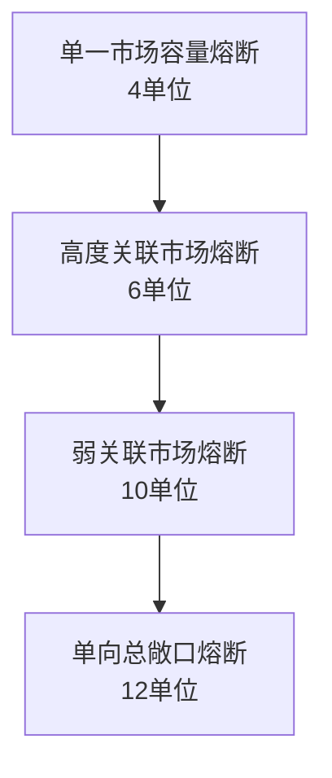

# 投资组合风险控制

<cite>
**本文档引用的文件**
- [app/services/risk_manager.py](file://app/services/risk_manager.py)
- [app/database/models.py](file://app/database/models.py)
- [app/schemas/trading.py](file://app/schemas/trading.py)
- [app/api/positions.py](file://app/api/positions.py)
- [app/core/config.py](file://app/core/config.py)
</cite>

## 目录
1. [简介](#简介)
2. [项目结构](#项目结构)
3. [核心组件](#核心组件)
4. [架构概览](#架构概览)
5. [详细组件分析](#详细组件分析)
6. [依赖关系分析](#依赖关系分析)
7. [性能考量](#性能考量)
8. [故障排查指南](#故障排查指南)
9. [结论](#结论)
10. [附录](#附录)

## 简介
本文件为《现代海龟协议》投资组合风险控制模块的技术文档，围绕四重熔断阀值设计（单一市场容量熔断、高度关联市场熔断、弱关联市场熔断、单向总敞口熔断）与相关性矩阵算法展开，系统阐述风险单位概念、风险归一化处理方法、实时风险监控与熔断触发机制、自动拦截逻辑，以及投资组合分散化策略与宏观系统性风险防范措施。文档同时提供完整的代码实现路径与可视化图表说明，帮助读者在极端市场条件下理解风险控制的效果与边界。

## 项目结构
本项目采用前后端分离与领域驱动设计（DDD）原则，风险控制模块位于后端服务层，核心文件分布如下：
- 风险控制核心：app/services/risk_manager.py
- 数据模型与数据库表：app/database/models.py
- API 接口与路由：app/api/positions.py
- 数据校验与响应模型：app/schemas/trading.py
- 全局配置与阈值设置：app/core/config.py

**图表来源**
- [app/services/risk_manager.py:33-301](file://app/services/risk_manager.py#L33-L301)
- [app/database/models.py:71-133](file://app/database/models.py#L71-L133)
- [app/api/positions.py:16-152](file://app/api/positions.py#L16-L152)
- [app/schemas/trading.py:30-262](file://app/schemas/trading.py#L30-L262)
- [app/core/config.py:55-63](file://app/core/config.py#L55-L63)

**章节来源**
- [app/services/risk_manager.py:33-301](file://app/services/risk_manager.py#L33-L301)
- [app/database/models.py:71-133](file://app/database/models.py#L71-L133)
- [app/api/positions.py:16-152](file://app/api/positions.py#L16-L152)
- [app/schemas/trading.py:30-262](file://app/schemas/trading.py#L30-L262)
- [app/core/config.py:55-63](file://app/core/config.py#L55-L63)

## 核心组件
- PortfolioRiskManager：实现四重熔断检查、相关性矩阵计算与投资组合风险摘要生成。
- PositionSnapshot：记录当前活跃持仓状态与风险参数。
- MarketCorrelation：存储资产间的皮尔逊相关系数与关联类型。
- RiskUnit/RiskCheckResult：封装风险单位与检查结果的数据结构。
- API 路由 positions.py：对外提供添加/查询/平仓接口，并集成风险检查。
- 配置 settings：集中管理风险阈值与策略参数。

**章节来源**
- [app/services/risk_manager.py:14-31](file://app/services/risk_manager.py#L14-L31)
- [app/database/models.py:71-133](file://app/database/models.py#L71-L133)
- [app/api/positions.py:53-108](file://app/api/positions.py#L53-L108)
- [app/core/config.py:55-63](file://app/core/config.py#L55-L63)

## 架构概览
风险控制模块在下单请求到达时，先通过 PortfolioRiskManager 执行四重熔断检查，随后根据检查结果决定是否拦截或继续下单。相关性矩阵通过 MarketCorrelation 表提供，支持实时查询与动态阈值调整。

**图表来源**
- [app/api/positions.py:53-108](file://app/api/positions.py#L53-L108)
- [app/services/risk_manager.py:57-97](file://app/services/risk_manager.py#L57-L97)
- [app/database/models.py:71-133](file://app/database/models.py#L71-L133)

## 详细组件分析

### 四重熔断阀值设计
- 单一市场容量熔断（4个风险单位）
  - 含义：同一标的累计风险单位不得超过阈值。
  - 实现：按 ticker 聚合当前活跃持仓，与阈值比较。
- 高度关联市场熔断（6个风险单位）
  - 含义：与目标资产高度相关（|相关系数| ≥ 0.7）的资产群组累计风险单位不得超过阈值。
  - 实现：查询相关性表，计算最高相关系数并选择对应阈值。
- 弱关联市场熔断（10个风险单位）
  - 含义：对无明确相关性数据或低相关性资产，采用宽松阈值。
  - 实现：无相关性数据时使用该阈值。
- 单向总敞口熔断（12个风险单位）
  - 含义：任一方向（LONG 或 SHORT）的总风险单位不得超过阈值。
  - 实现：按方向聚合活跃持仓，分别与阈值比较。

**图表来源**
- [app/services/risk_manager.py:57-97](file://app/services/risk_manager.py#L57-L97)
- [app/services/risk_manager.py:112-212](file://app/services/risk_manager.py#L112-L212)

**章节来源**
- [app/services/risk_manager.py:33-48](file://app/services/risk_manager.py#L33-L48)
- [app/services/risk_manager.py:112-212](file://app/services/risk_manager.py#L112-L212)
- [app/core/config.py:58-62](file://app/core/config.py#L58-L62)

### 相关性矩阵算法实现
- 皮尔逊相关系数计算
  - 输入：两资产的收益序列（长度需相同且≥10）。
  - 输出：相关系数与关联类型（HIGH/MEDIUM/LOW）。
- 实时相关性监控
  - 通过 MarketCorrelation 表存储与查询，支持按资产对检索。
- 动态阈值调整机制
  - 根据最高相关系数绝对值选择阈值：≥0.7 使用高度关联阈值，≥0.4 使用弱关联阈值，否则使用弱关联阈值。

**图表来源**
- [app/services/risk_manager.py:233-261](file://app/services/risk_manager.py#L233-L261)
- [app/database/models.py:107-133](file://app/database/models.py#L107-L133)

**章节来源**
- [app/services/risk_manager.py:233-261](file://app/services/risk_manager.py#L233-L261)
- [app/database/models.py:107-133](file://app/database/models.py#L107-L133)

### 风险单位（Risk Unit）与归一化
- 风险单位定义
  - 以 N 值（ATR）与每点美元价值为基准的标准化头寸单位，确保跨资产风险可比。
- 归一化处理
  - 通过 N 值与合约乘数映射，将不同波动率资产的潜在损失统一换算为美元波动率，实现跨市场风险平价。
- 在风控中的应用
  - 活跃持仓以风险单位计量，熔断检查基于单位总数而非名义头寸规模。

**章节来源**
- [app/services/risk_manager.py:14-21](file://app/services/risk_manager.py#L14-L21)
- [app/database/models.py:86-89](file://app/database/models.py#L86-L89)
- [app/api/positions.py:87](file://app/api/positions.py#L87)

### 实时风险监控与自动拦截
- 监控范围
  - 单一标的累计风险单位、高度/弱关联资产群组累计风险单位、单向总敞口（多/空）。
- 触发机制
  - 任一检查未通过即拦截，返回明确的阻断原因与剩余可加仓单位数。
- 自动拦截逻辑
  - API 层在创建新持仓前调用风险检查，失败时直接返回 HTTP 400。

**图表来源**
- [app/api/positions.py:53-108](file://app/api/positions.py#L53-L108)
- [app/services/risk_manager.py:57-97](file://app/services/risk_manager.py#L57-L97)

**章节来源**
- [app/api/positions.py:53-108](file://app/api/positions.py#L53-L108)
- [app/services/risk_manager.py:57-97](file://app/services/risk_manager.py#L57-L97)

### 投资组合分散化策略与宏观系统性风险防范
- 分散化策略
  - 通过高度/弱关联市场熔断，避免在同质化或强联动资产上过度集中。
- 宏观系统性风险防范
  - 单向总敞口熔断确保在极端单边行情下仍保留足够现金进行系统重启与再平衡。
- 风险摘要与利用率
  - 提供按方向与按资产的汇总视图，便于风控官实时掌握组合暴露情况。

**章节来源**
- [app/services/risk_manager.py:263-301](file://app/services/risk_manager.py#L263-L301)

## 依赖关系分析
- 组件耦合
  - API 层依赖风险控制服务；风险控制服务依赖数据库模型与配置。
- 外部依赖
  - NumPy 用于相关系数计算；SQLAlchemy ORM 用于数据持久化。
- 配置集中化
  - 风险阈值与策略参数集中在配置类中，便于统一管理与热更新。

**图表来源**
- [app/api/positions.py:16-152](file://app/api/positions.py#L16-L152)
- [app/services/risk_manager.py:33-301](file://app/services/risk_manager.py#L33-L301)
- [app/database/models.py:71-133](file://app/database/models.py#L71-L133)
- [app/schemas/trading.py:30-262](file://app/schemas/trading.py#L30-L262)
- [app/core/config.py:55-63](file://app/core/config.py#L55-L63)

**章节来源**
- [app/api/positions.py:16-152](file://app/api/positions.py#L16-L152)
- [app/services/risk_manager.py:33-301](file://app/services/risk_manager.py#L33-L301)
- [app/database/models.py:71-133](file://app/database/models.py#L71-L133)
- [app/schemas/trading.py:30-262](file://app/schemas/trading.py#L30-L262)
- [app/core/config.py:55-63](file://app/core/config.py#L55-L63)

## 性能考量
- 计算复杂度
  - 相关性计算：O(n)，其中 n 为收益序列长度；熔断检查：O(m)，m 为活跃持仓数量。
- 数据访问
  - 通过索引优化的查询减少数据库负载；批量查询活跃持仓与相关性矩阵。
- 并发与扩展
  - FastAPI 异步特性与 SQLAlchemy 会话管理支持高并发请求处理。

## 故障排查指南
- 常见问题
  - 相关性数据缺失：系统自动采用弱关联阈值，不影响下单流程。
  - 收益序列长度不足：相关性计算返回低关联类型，避免误判。
  - 阈值告警：检查配置项与数据库相关性表的有效期与准确性。
- 排查步骤
  - 确认活跃持仓与相关性表数据是否正确。
  - 核对配置类中的阈值设置是否符合预期。
  - 查看 API 返回的阻断原因与剩余可加仓单位数，定位具体限制。

**章节来源**
- [app/services/risk_manager.py:144-156](file://app/services/risk_manager.py#L144-L156)
- [app/services/risk_manager.py:246-247](file://app/services/risk_manager.py#L246-L247)
- [app/core/config.py:58-62](file://app/core/config.py#L58-L62)

## 结论
本风险控制模块以四重熔断为核心，结合相关性矩阵算法与动态阈值调整，实现了对单一市场、关联市场与宏观系统性风险的多维防护。通过风险单位归一化与实时监控，系统在极端市场条件下仍能保持稳健的头寸暴露与可控的组合风险。配合 API 层的自动拦截逻辑，为实盘交易提供了坚实的风险底线。

## 附录

### 风险控制阈值可视化
- 阈值对照表
  - 单一市场容量熔断：4 单位
  - 高度关联市场熔断：6 单位
  - 弱关联市场熔断：10 单位
  - 单向总敞口熔断：12 单位

**图表来源**
- [app/core/config.py:58-62](file://app/core/config.py#L58-L62)

### 极端市场条件下的风险控制效果分析
- 单边断崖式反转
  - 单向总敞口熔断确保多/空方向的累计暴露不突破 12 单位，保留现金以应对流动性危机。
- 高相关性资产共振下跌
  - 高度关联市场熔断限制在高度相关资产上的累计暴露，避免系统性风险传导。
- 单一标的过度集中
  - 单一市场容量熔断防止对某一标的的过度加仓，降低黑天鹅冲击的集中度风险。

**章节来源**
- [app/services/risk_manager.py:33-48](file://app/services/risk_manager.py#L33-L48)
- [app/services/risk_manager.py:148-156](file://app/services/risk_manager.py#L148-L156)