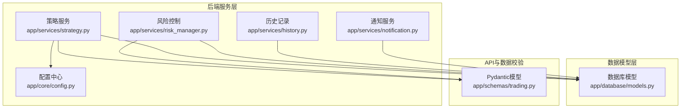
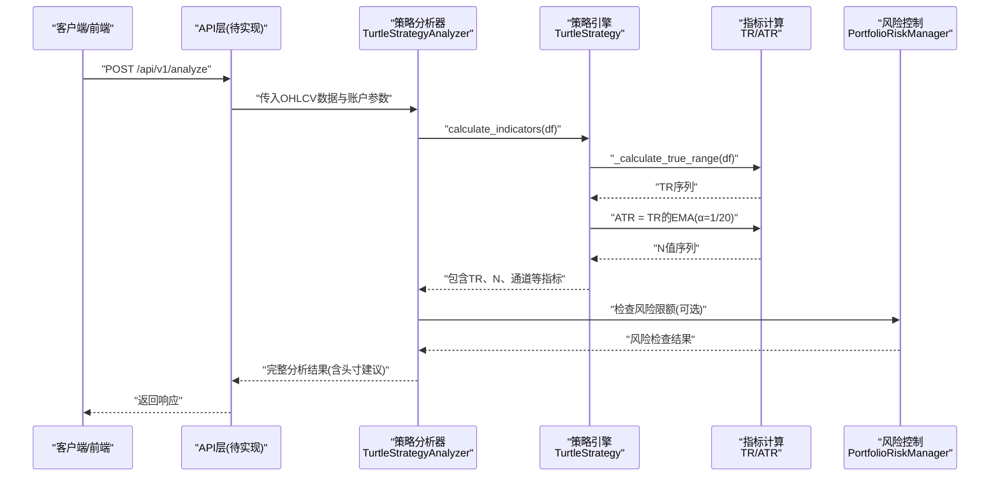
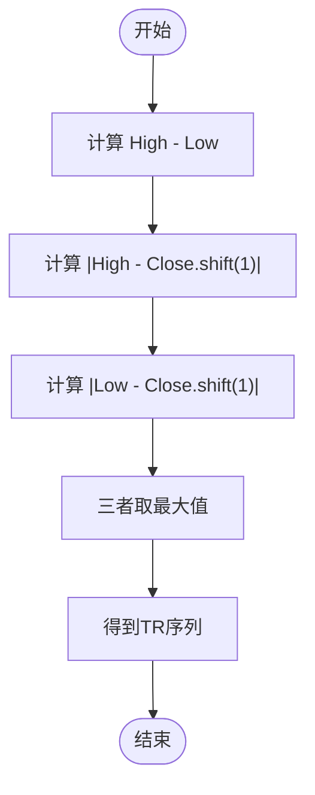
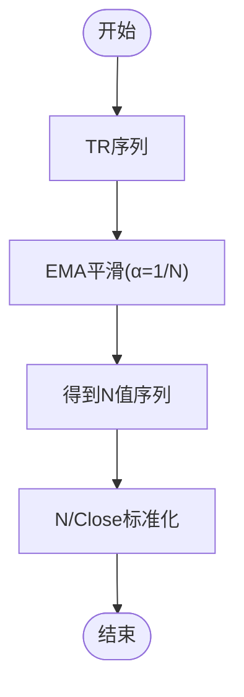
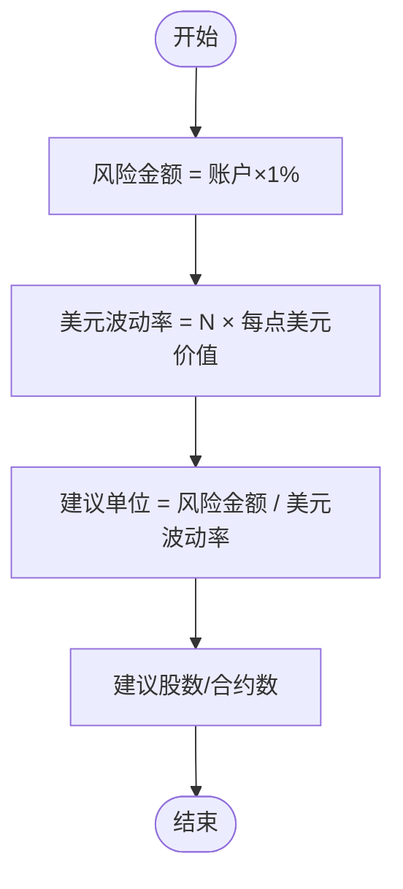
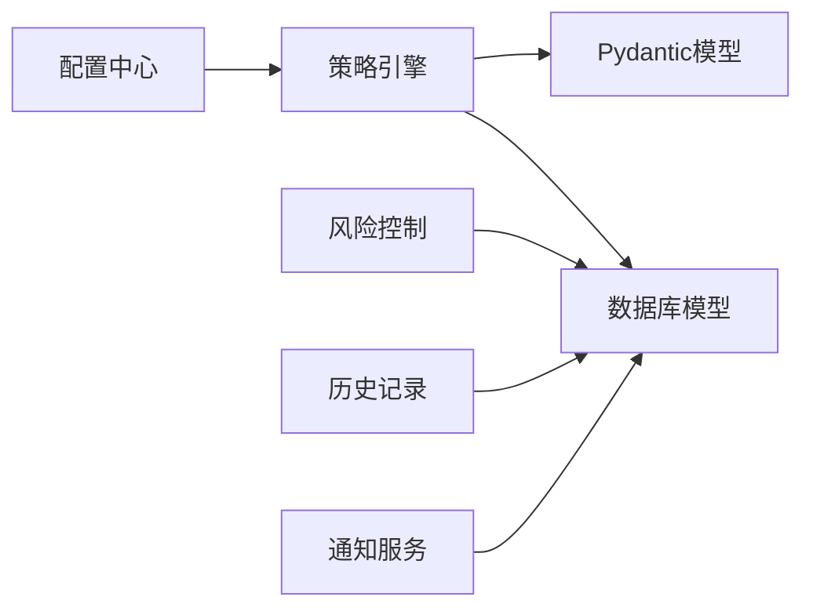

# 波动率计算引擎

<cite>
**本文档引用的文件**
- [app/services/strategy.py](file://app/services/strategy.py)
- [app/core/config.py](file://app/core/config.py)
- [app/schemas/trading.py](file://app/schemas/trading.py)
- [app/services/risk_manager.py](file://app/services/risk_manager.py)
- [app/database/models.py](file://app/database/models.py)
- [app/services/history.py](file://app/services/history.py)
- [app/services/notification.py](file://app/services/notification.py)
</cite>

## 目录
1. [简介](#简介)
2. [项目结构](#项目结构)
3. [核心组件](#核心组件)
4. [架构概览](#架构概览)
5. [详细组件分析](#详细组件分析)
6. [依赖分析](#依赖分析)
7. [性能考量](#性能考量)
8. [故障排查指南](#故障排查指南)
9. [结论](#结论)
10. [附录](#附录)

## 简介
本文件为《现代海龟协议》波动率计算引擎的详细技术文档，围绕真实波幅（True Range）与20日指数平滑平均真实波幅（ATR）的数学定义、算法实现与工程化落地展开。文档将解释：
- 真实波幅的三差值最大值计算逻辑；
- EMA指数移动平均的权重与平滑因子选择依据；
- 数值稳定性处理与边界条件；
- 使用Pandas滚动窗口与指数平滑函数的实现要点；
- 不同时间周期（5日、10日、20日、55日）对ATR与策略信号的影响；
- 波动率指标的可视化与历史对比分析思路。

## 项目结构
本项目采用前后端分离与领域驱动设计，波动率计算引擎位于后端服务层，核心实现集中在策略服务模块中，配合配置中心、数据模型与风险控制模块协同工作。

**图表来源**
- [app/services/strategy.py:44-75](file://app/services/strategy.py#L44-L75)
- [app/core/config.py:46-62](file://app/core/config.py#L46-L62)
- [app/database/models.py:19-68](file://app/database/models.py#L19-L68)
- [app/schemas/trading.py:142-188](file://app/schemas/trading.py#L142-L188)

**章节来源**
- [app/services/strategy.py:1-353](file://app/services/strategy.py#L1-L353)
- [app/core/config.py:1-99](file://app/core/config.py#L1-L99)
- [app/database/models.py:1-163](file://app/database/models.py#L1-L163)
- [app/schemas/trading.py:1-262](file://app/schemas/trading.py#L1-L262)

## 核心组件
- 真实波幅（TR）计算：基于当日最高价-最低价、最高价-前收、最低价-前收的三差值绝对值最大值。
- ATR（N值）计算：对TR序列进行EMA平滑，平滑因子α=2/(N+1)，其中N为ATR周期（默认20日）。
- 波动率标准化指标：N值与收盘价的比值，用于观察相对波动强度。
- 头寸规模计算：基于账户净资产×1%风险限额与美元波动率（N值×每点美元价值）的归一化。

**章节来源**
- [app/services/strategy.py:56-75](file://app/services/strategy.py#L56-L75)
- [app/services/strategy.py:77-92](file://app/services/strategy.py#L77-L92)
- [app/services/strategy.py:275-319](file://app/services/strategy.py#L275-L319)

## 架构概览
波动率计算引擎在策略分析流程中的位置如下：

**图表来源**
- [app/services/strategy.py:44-75](file://app/services/strategy.py#L44-L75)
- [app/services/strategy.py:205-273](file://app/services/strategy.py#L205-L273)
- [app/services/risk_manager.py:57-97](file://app/services/risk_manager.py#L57-L97)

## 详细组件分析

### 真实波幅（True Range）计算
- 数学定义：取以下三项绝对差值的最大值：
  - 当日最高价 − 最低价；
  - |当日最高价 − 前一日收盘价|；
  - |当日最低价 − 前一日收盘价|。
- 实现要点：
  - 使用Pandas的shift(1)获取前一交易日收盘价；
  - 通过列拼接与axis=1取max(axis=1)完成三者取最大值；
  - 该实现天然覆盖跳空缺口的捕捉，避免传统ATR仅用最高-最低的遗漏。

**图表来源**
- [app/services/strategy.py:77-92](file://app/services/strategy.py#L77-L92)

**章节来源**
- [app/services/strategy.py:77-92](file://app/services/strategy.py#L77-L92)

### ATR（N值）与EMA平滑
- 平滑算法：指数移动平均（EMA），平滑因子α=2/(N+1)。在实现中以alpha=1/N的形式给出，N为ATR周期（默认20）。
- 权重与记忆衰减：
  - α越大，近期权重越高，序列对新信息反应越敏感；
  - α越小，远期权重更大，序列更平滑、滞后更强。
- 数值稳定性：
  - EMA默认adjust=False，避免对初始值的过度修正；
  - 在TR序列存在缺失或异常时，需确保输入序列长度充足；
  - 对于首期ATR，EMA会以简单平均作为初始值，随后按指数权重递推。

**图表来源**
- [app/services/strategy.py:59-60](file://app/services/strategy.py#L59-L60)
- [app/services/strategy.py:72-73](file://app/services/strategy.py#L72-L73)

**章节来源**
- [app/services/strategy.py:59-60](file://app/services/strategy.py#L59-L60)
- [app/services/strategy.py:72-73](file://app/services/strategy.py#L72-L73)

### 头寸规模与波动率归一化
- 核心公式：建议单位数 = (账户净资产 × 1%) / (N值 × 每点美元价值)
- 设计思想：以波动率对不同资产进行风险归一，使高波动资产降低头寸，低波动资产提高头寸，确保每笔交易风险恒定为账户的1%。
- 边界处理：当N值≤0时，建议单位数为0，防止除零与负风险。

**图表来源**
- [app/services/strategy.py:275-319](file://app/services/strategy.py#L275-L319)

**章节来源**
- [app/services/strategy.py:275-319](file://app/services/strategy.py#L275-L319)

### 不同时间周期对ATR与策略的影响
- 5日ATR：对短期波动更敏感，可能产生更多假突破与噪声信号，适合高频或短线策略；
- 10日ATR：平衡短期波动与噪声，适合作为出场或短期止损基准；
- 20日ATR：经典海龟参数，兼顾趋势捕捉与波动平滑，适合中线趋势跟踪；
- 55日ATR：对长期趋势更敏感，波动更平滑，适合超长期趋势与宏观择时。

周期选择建议：
- 入场/出场通道与ATR周期可错位配置，如20日通道+10日ATR，以减少共振回撤；
- 在波动率高企时期适当提高ATR周期，降低头寸规模，反之可适度降低周期以提高灵敏度。

### 波动率指标的可视化与历史对比
- 可视化要素：
  - K线与20日通道（高/低）；
  - N值曲线（ATR）与收盘价比值（波动率标准化）；
  - 信号锚点（突破入场/跌破出场）。
- 历史对比：
  - 计算N值的历史百分位，评估当前波动率处于历史相对位置；
  - 对比不同周期（5/10/20/55）ATR的收敛性与稳定性。

**章节来源**
- [app/services/strategy.py:184-193](file://app/services/strategy.py#L184-L193)
- [app/services/strategy.py:171-182](file://app/services/strategy.py#L171-L182)

## 依赖分析
- 配置依赖：ATR周期、突破周期、风险百分比等参数来自配置中心；
- 数据模型：分析结果持久化至数据库，包含N值、通道水平、头寸建议等字段；
- 风险控制：多层级风险限额（单一市场、高/弱关联市场、单向总敞口）依赖N值与相关性矩阵；
- API与数据校验：Pydantic模型定义请求/响应结构，确保输入合法性与输出一致性。

**图表来源**
- [app/core/config.py:46-62](file://app/core/config.py#L46-L62)
- [app/services/strategy.py:44-75](file://app/services/strategy.py#L44-L75)
- [app/database/models.py:19-68](file://app/database/models.py#L19-L68)
- [app/schemas/trading.py:142-188](file://app/schemas/trading.py#L142-L188)

**章节来源**
- [app/core/config.py:46-62](file://app/core/config.py#L46-L62)
- [app/database/models.py:19-68](file://app/database/models.py#L19-L68)
- [app/schemas/trading.py:142-188](file://app/schemas/trading.py#L142-L188)

## 性能考量
- 向量化计算：Pandas的rolling与ewm均为向量化实现，避免显式循环，具备良好性能；
- 内存与索引：对齐OHLCV索引，确保TR与ATR计算的对齐性，减少不必要的副本；
- 初始值处理：EMA默认初始值为简单平均，避免对首个ATR值的过度修正；
- 批量处理：在批量回测或历史分析场景中，建议先进行缺失值与异常值清洗，再进行指标计算。

## 故障排查指南
- TR为空或NaN：
  - 检查是否存在缺失的OHLCV数据或索引未对齐；
  - 确认前收字段的shift(1)是否正确生成。
- ATR为0或负值：
  - 检查ATR周期设置是否合理；
  - 确认输入序列长度是否足够覆盖平滑窗口。
- 头寸为0：
  - 当N值≤0时，建议单位数将为0；
  - 检查每点美元价值是否为正数。
- 历史记录异常：
  - 核对数据库模型字段与序列化模型是否一致；
  - 检查保存逻辑中活跃信号的标记规则。

**章节来源**
- [app/services/strategy.py:286-294](file://app/services/strategy.py#L286-L294)
- [app/services/history.py:35-70](file://app/services/history.py#L35-L70)

## 结论
波动率计算引擎以真实波幅为核心，结合EMA平滑与标准化指标，形成稳健的ATR（N值）计算框架。通过将N值与头寸规模挂钩，系统实现了跨资产的风险平价与动态资金分配。不同周期的ATR可满足从短期到长期的不同策略需求，并可通过可视化与历史百分位进行辅助判断。配合多层级风险控制与历史记录持久化，该引擎为《现代海龟协议》提供了坚实的波动率风险管理基础。

## 附录

### ATR算法实现要点（基于Pandas）
- 数据预处理：
  - 确保OHLCV数据按交易日升序排列；
  - 处理缺失值与异常值，必要时进行插值或剔除。
- TR计算：
  - 使用shift(1)获取前收；
  - 三差值取绝对值并取最大值。
- ATR计算：
  - 使用ewm(alpha=1/N, adjust=False)进行指数平滑；
  - N为ATR周期，默认20。
- 标准化与头寸：
  - N/Close得到波动率标准化指标；
  - 建议单位 = 账户×1% / (N × 每点美元价值)。

**章节来源**
- [app/services/strategy.py:56-75](file://app/services/strategy.py#L56-L75)
- [app/services/strategy.py:77-92](file://app/services/strategy.py#L77-L92)
- [app/services/strategy.py:275-319](file://app/services/strategy.py#L275-L319)