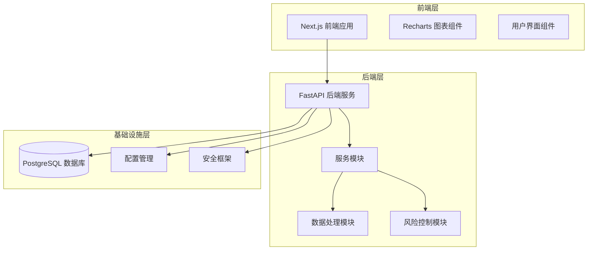
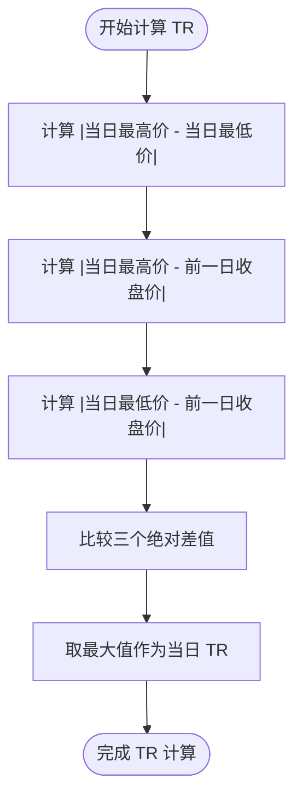
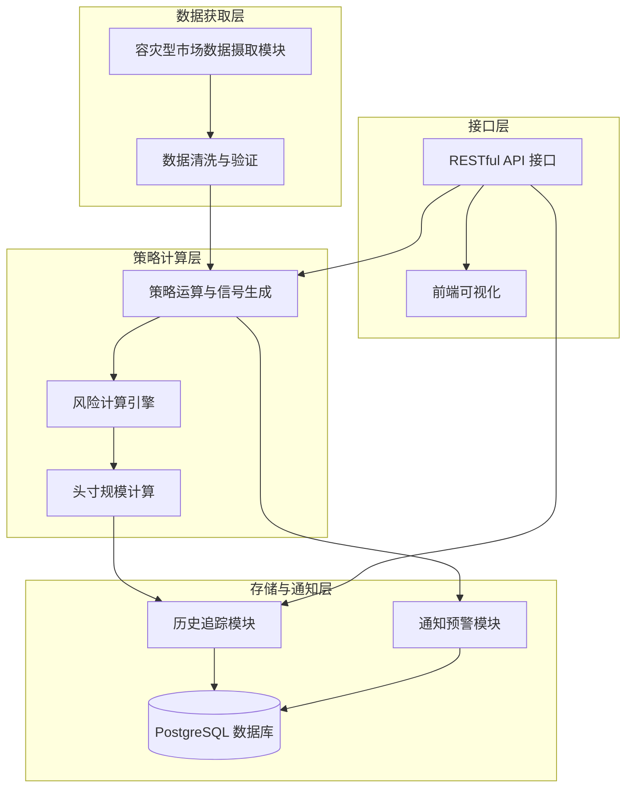
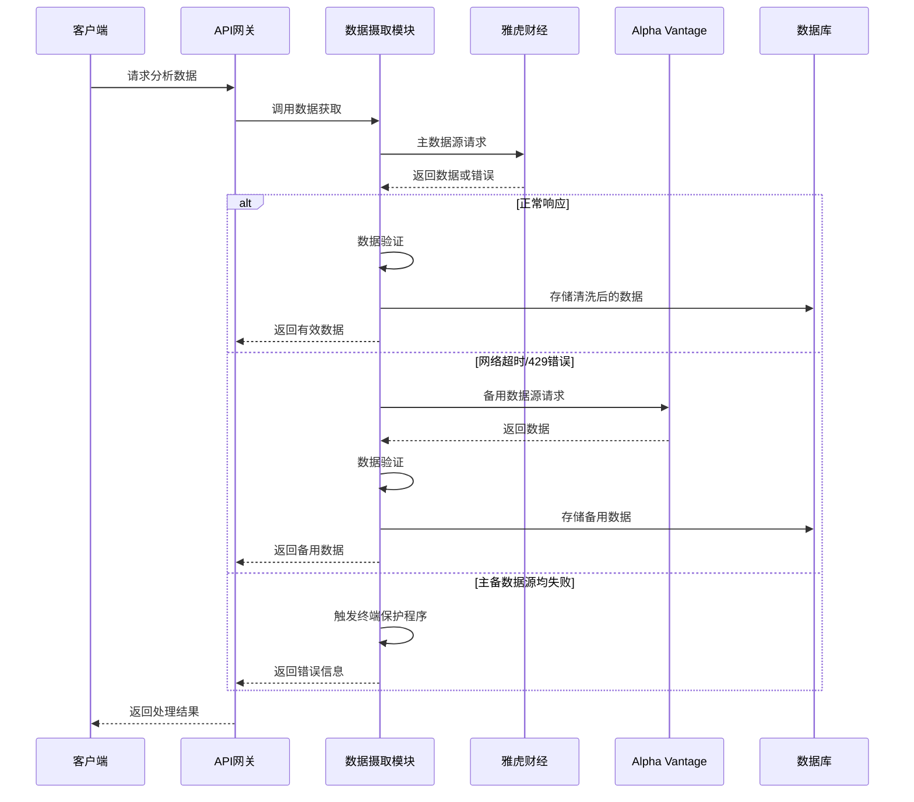
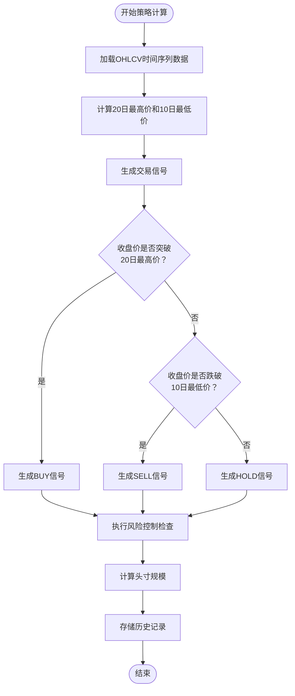
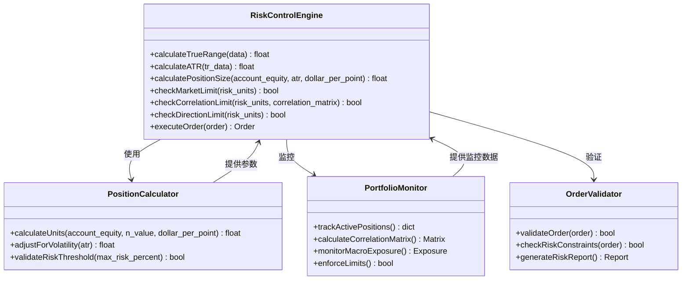
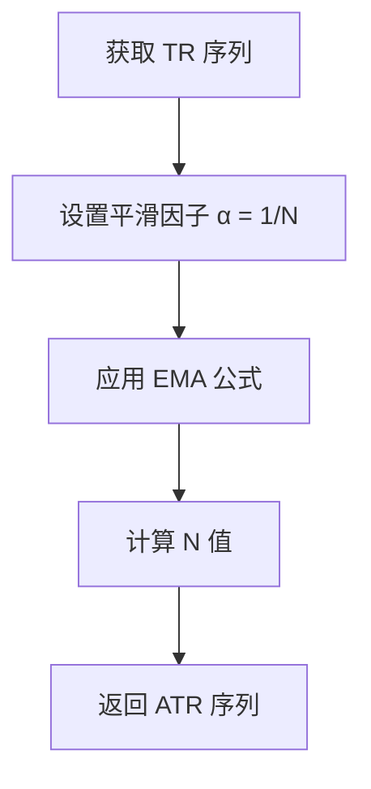
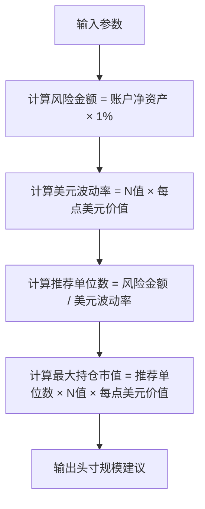
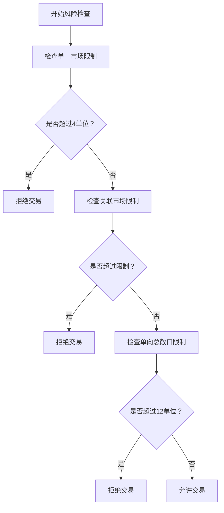
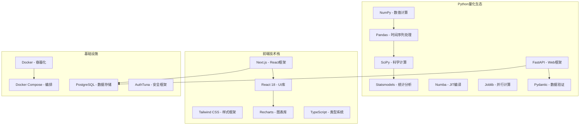

# 风险管理系统

<cite>
**本文档引用的文件**
- [risk_manager.py](file://app/services/risk_manager.py)
- [strategy.py](file://app/services/strategy.py)
- [config.py](file://app/core/config.py)
- [models.py](file://app/database/models.py)
- [analyze.py](file://app/api/analyze.py)
- [positions.py](file://app/api/positions.py)
- [PRD.md](file://现代海龟协议：基于Python与微服务架构的自动化量化交易系统产品需求文档(PRD).md)
</cite>

## 更新摘要
**变更内容**
- 新增完整的波动率计算引擎实现
- 增强头寸规模控制系统
- 完善投资组合风险控制功能
- 集成实时风险监控和拦截机制
- 实现多层级风险控制架构

## 目录
1. [引言](#引言)
2. [项目结构](#项目结构)
3. [核心组件](#核心组件)
4. [架构概览](#架构概览)
5. [详细组件分析](#详细组件分析)
6. [波动率计算引擎](#波动率计算引擎)
7. [头寸规模控制系统](#头寸规模控制系统)
8. [投资组合风险控制](#投资组合风险控制)
9. [依赖分析](#依赖分析)
10. [性能考虑](#性能考虑)
11. [故障排除指南](#故障排除指南)
12. [结论](#结论)
13. [附录](#附录)

## 引言

《现代海龟协议》风险管理系统是一个基于Python与微服务架构的自动化量化交易系统，专注于实现基于波动率的动态头寸规模控制。该系统继承了经典海龟交易法则的核心理念，通过严格的数学模型和系统性风险管理框架，为现代金融机构提供了一套完整的量化交易基础设施。

系统的核心创新在于将传统的海龟交易法则与现代技术栈相结合，通过波动率导向的资金管理和多层次的投资组合风险控制机制，实现了对市场风险的精确量化和有效控制。系统现已实现完整的波动率计算引擎、头寸规模控制和投资组合风险控制功能。

## 项目结构

基于产品需求文档，系统采用清晰的前后端分离架构，主要包含以下核心模块：



**图表来源**
- [PRD.md: 11-34](file://现代海龟协议：基于Python与微服务架构的自动化量化交易系统产品需求文档(PRD).md#L11-L34)

## 核心组件

### 波动率导向的动态头寸规模控制系统

系统的核心是基于波动率的动态头寸规模控制，这一机制完全摒弃了传统的固定股数或固定市值静态买入模式，转而采用严格的数学公式进行风险控制。

#### 真实波幅（True Range）计算引擎

真实波幅（TR）的计算考虑了三个关键因素：
1. 当日最高价与最低价的绝对差值
2. 当日最高价与前一交易日收盘价的绝对距离（向上跳空缺口）
3. 当日最低价与前一交易日收盘价的绝对距离（向下跳空缺口）



**图表来源**
- [strategy.py: 77-92:77-92](file://app/services/strategy.py#L77-L92)

#### ATR（平均真实波幅）平滑算法

系统采用20日指数平滑平均真实波幅（ATR）作为"N"值的核心计算方法。这一算法通过指数移动平均（EMA）对过去20个交易日的真实波幅序列进行平滑降噪处理。

#### 头寸规模计算公式

单个基础交易单位规模（Units）的计算公式为：
**单个基础交易单位规模（Units） = (账户总净资产 × 0.01) / (N值 × 每点美元价值)**

这个公式的数学原理在于：
- 分子部分（账户总净资产 × 0.01）确保每次新建头寸的最大理论亏损被严格限制在1%以内
- 分母部分（N值 × 每点美元价值）代表了该资产基于近期绝对波动率在单一交易日内预期可能产生的最大单边资金价值波动

**章节来源**
- [strategy.py: 275-320:275-320](file://app/services/strategy.py#L275-L320)

### 投资组合宏观关联度敞口阀值设计

系统实现了四重拦截审查机制，用于防御宏观层面的系统性风险：

#### 1. 单一市场容量熔断

对于任何一个独立的交易标的，通过加仓所累积的总风险敞口绝对不可超过4个基础风险单位。

#### 2. 高度关联市场熔断

对于相关性极高的品种（如同属半导体板块的两支股票或欧元兑美元与瑞郎兑美元），它们在组合中累积暴露的总和被严格限制在最多6个风险单位内。

#### 3. 弱关联市场熔断

对于相关性较弱但仍受宏观大势影响的广泛板块，其累积的总风险单位上限被硬性设定为10个单位。

#### 4. 单向总敞口熔断

在任何一个特定的时点，整个账户体系中所有做多（Gross Long）方向的风险单位总和，或所有做空（Gross Short）方向的风险单位总和，都绝不允许超越12个单位的极限阈值。

**章节来源**
- [risk_manager.py: 33-48:33-48](file://app/services/risk_manager.py#L33-L48)

## 架构概览

系统采用微服务架构，将复杂的量化计算与风险控制功能分解为独立的服务模块：



**图表来源**
- [PRD.md: 35-62](file://现代海龟协议：基于Python与微服务架构的自动化量化交易系统产品需求文档(PRD).md#L35-L62)

## 详细组件分析

### 容灾型市场数据摄取模块

该模块设计了严格的降级逻辑来对抗单一数据源的单点故障风险：



**图表来源**
- [PRD.md: 39-44](file://现代海龟协议：基于Python与微服务架构的自动化量化交易系统产品需求文档(PRD).md#L39-L44)

### 策略运算与信号生成模块

该模块实现了经典的海龟协议信号生成逻辑：



**图表来源**
- [PRD.md: 45-56](file://现代海龟协议：基于Python与微服务架构的自动化量化交易系统产品需求文档(PRD).md#L45-L56)

### 风险控制与资金分配模块

该模块实现了完整的波动率导向风险管理体系：



**图表来源**
- [PRD.md: 63-102](file://现代海龟协议：基于Python与微服务架构的自动化量化交易系统产品需求文档(PRD).md#L63-L102)

**章节来源**
- [PRD.md: 39-102](file://现代海龟协议：基于Python与微服务架构的自动化量化交易系统产品需求文档(PRD).md#L39-L102)

## 波动率计算引擎

### 真实波幅（True Range）计算

系统实现了精确的TR计算算法，考虑了跳空缺口的影响：

```mermaid
flowchart TD
A[开始 TR 计算] --> B[计算 High - Low]
B --> C[计算 |High - Previous Close|]
C --> D[计算 |Low - Previous Close|]
D --> E[取三个值的最大值]
E --> F[返回 TR 值]
```

**图表来源**
- [strategy.py: 77-92:77-92](file://app/services/strategy.py#L77-L92)

### ATR（平均真实波幅）计算

系统使用指数移动平均（EMA）对TR序列进行平滑处理：



**图表来源**
- [strategy.py: 59-60:59-60](file://app/services/strategy.py#L59-L60)

### 波动率百分位分析

系统提供波动率历史百分位分析功能：

```mermaid
flowchart TD
A[获取 N 值序列] --> B[计算最近 W 天的 N 值]
B --> C[计算当前 N 值]
C --> D[统计小于当前值的数量]
D --> E[计算百分位 = (count/W) × 100]
E --> F[返回百分位结果]
```

**图表来源**
- [strategy.py: 184-193:184-193](file://app/services/strategy.py#L184-L193)

**章节来源**
- [strategy.py: 56-75:56-75](file://app/services/strategy.py#L56-L75)
- [strategy.py: 77-92:77-92](file://app/services/strategy.py#L77-L92)
- [strategy.py: 184-193:184-193](file://app/services/strategy.py#L184-L193)

## 头寸规模控制系统

### 动态头寸规模计算

系统实现了基于波动率的动态头寸规模控制：



**图表来源**
- [strategy.py: 275-320:275-320](file://app/services/strategy.py#L275-L320)

### 头寸规模计算公式详解

**Units = (账户净资产 × 0.01) / (N值 × 每点美元价值)**

系统支持多种资产类别的每点美元价值：
- **股票**: 每点美元价值 = 1.0
- **外汇**: 每点美元价值 = 10.0（标准合约）
- **商品期货**: 每点美元价值 = 变化（根据具体合约）

**章节来源**
- [strategy.py: 275-320:275-320](file://app/services/strategy.py#L275-L320)

## 投资组合风险控制

### 多层级风险控制架构

系统实现了四重拦截审查机制：



**图表来源**
- [risk_manager.py: 57-97:57-97](file://app/services/risk_manager.py#L57-L97)

### 风险控制阈值配置

系统使用配置文件管理风险控制参数：

| 风险类型 | 阈值 | 配置参数 |
|---------|------|----------|
| 单一市场限制 | 4个风险单位 | SINGLE_MARKET_LIMIT |
| 高关联市场限制 | 6个风险单位 | CLOSELY_CORRELATED_LIMIT |
| 弱关联市场限制 | 10个风险单位 | LOOSELY_CORRELATED_LIMIT |
| 单向总敞口限制 | 12个风险单位 | SINGLE_DIRECTION_LIMIT |

**章节来源**
- [risk_manager.py: 44-48:44-48](file://app/services/risk_manager.py#L44-L48)
- [config.py: 58-62:58-62](file://app/core/config.py#L58-L62)

### 相关性分析与分类

系统提供资产相关性分析功能：

```mermaid
flowchart TD
A[计算皮尔逊相关系数] --> B{|相关系数| ≥ 0.7?}
B --> |是| C[标记为高关联]
B --> |否| D{|相关系数| ≥ 0.4?}
D --> |是| E[标记为中等关联]
D --> |否| F[标记为低关联]
```

**图表来源**
- [risk_manager.py: 233-261:233-261](file://app/services/risk_manager.py#L233-L261)

**章节来源**
- [risk_manager.py: 137-184:137-184](file://app/services/risk_manager.py#L137-L184)
- [risk_manager.py: 233-261:233-261](file://app/services/risk_manager.py#L233-L261)

## 依赖分析

系统的技术栈选择体现了对性能和可扩展性的重视：



**图表来源**
- [PRD.md: 15-26](file://现代海龟协议：基于Python与微服务架构的自动化量化交易系统产品需求文档(PRD).md#L15-L26)

**章节来源**
- [PRD.md: 15-26](file://现代海龟协议：基于Python与微服务架构的自动化量化交易系统产品需求文档(PRD).md#L15-L26)

## 性能考虑

系统在设计时充分考虑了性能优化和可扩展性：

### 计算性能优化

1. **并行计算能力**：通过Joblib库提供并行计算能力，能够在多核CPU架构下同时分析数百支不同股票的策略表现
2. **JIT编译加速**：Numba库通过即时编译（JIT）技术，将高度嵌套的Python循环逻辑直接转化为机器码
3. **内存优化**：系统同时保留了对Polars库的支持空间，以应对未来可能接入的毫秒级高频Tick数据

### 网络性能优化

1. **异步非阻塞架构**：FastAPI框架的原生异步事件循环机制确保了高并发场景下的响应性能
2. **数据缓存策略**：通过指数移动平均算法对波动率数据进行缓存，减少重复计算
3. **批量数据处理**：支持批量历史数据处理，提高回测效率

### 存储性能优化

1. **索引优化**：PostgreSQL数据库采用合适的索引策略，优化查询性能
2. **数据分区**：历史数据按时间分区存储，提高查询效率
3. **连接池管理**：SQLAlchemy连接池管理，减少数据库连接开销

## 故障排除指南

### 常见问题与解决方案

#### 数据获取失败

**问题症状**：API返回429请求频率超限错误或网络连接超时

**解决步骤**：
1. 检查备用数据源配置
2. 实现指数退避重试机制
3. 验证API密钥有效性
4. 检查网络连接状态

#### 计算精度问题

**问题症状**：波动率计算结果异常或头寸规模计算错误

**解决步骤**：
1. 验证输入数据的质量和完整性
2. 检查时间序列数据的连续性
3. 确认计算参数的正确性
4. 实施数值稳定性检查

#### 风险控制触发

**问题症状**：订单被系统自动拦截或风险限额触发

**解决步骤**：
1. 检查当前投资组合的暴露情况
2. 分析相关性矩阵的变化
3. 评估市场波动率的异常情况
4. 调整风险参数配置

**章节来源**
- [PRD.md: 41-44](file://现代海龟协议：基于Python与微服务架构的自动化量化交易系统产品需求文档(PRD).md#L41-L44)

## 结论

《现代海龟协议》风险管理系统通过将经典海龟交易法则与现代技术栈相结合，成功构建了一套完整的量化交易基础设施。系统的核心优势在于：

1. **严格的数学基础**：基于波动率的动态头寸规模控制确保了风险的精确量化和有效控制
2. **多层次风险防护**：从单个头寸到整个投资组合的多层级风险控制机制
3. **高可用架构设计**：容灾型数据摄取和微服务架构确保了系统的稳定性和可扩展性
4. **完整的工程实现**：从前端可视化到后端计算的全栈解决方案

该系统不仅为现代量化研究员提供了强大的工具，更为机构级量化交易提供了可扩展的基础设施原型，具备成长为全球多重资产自动化交易执行引擎的巨大潜力。

## 附录

### 参数配置指南

#### 基础参数配置

| 参数名称 | 默认值 | 说明 | 可调范围 |
|---------|--------|------|----------|
| 最大单笔损失比例 | 0.01 | 账户总净资产的1% | 0.005-0.03 |
| ATR计算周期 | 20 | 天数 | 10-50 |
| 单一市场熔断阈值 | 4 | 风险单位 | 2-8 |
| 高度关联市场熔断阈值 | 6 | 风险单位 | 4-10 |
| 弱关联市场熔断阈值 | 10 | 风险单位 | 8-15 |
| 单向总敞口熔断阈值 | 12 | 风险单位 | 10-15 |

#### 资产类别参数

| 资产类别 | 每点美元价值 | 适用范围 |
|---------|-------------|----------|
| 股票 | 1.0 | 现货股票市场 |
| 外汇 | 10.0 | 标准外汇合约 |
| 商品期货 | 变化 | 根据具体合约 |

### 风险监控指标体系

#### 实时监控指标

| 指标名称 | 计算方法 | 正常范围 | 预警阈值 |
|---------|----------|----------|----------|
| 当前风险暴露 | 所有活跃头寸的总风险单位 | 0-12 | >10 |
| 相关性指数 | 资产间的皮尔逊相关系数 | -1到1 | >0.7 |
| 波动率指数 | ATR/价格 | 变化 | 上升>20% |
| 市场集中度 | 单一市场的风险占比 | 0-1 | >0.4 |

#### 历史分析指标

| 指标名称 | 计算方法 | 分析用途 |
|---------|----------|----------|
| 最大单日损失 | 历史回测中的最大单日损失 | 风险评估 |
| 夏普比率 | 收益率/波动率 | 风险调整收益 |
| 回撤幅度 | 最大回撤百分比 | 回撤控制 |
| 交易频率 | 单位时间内的交易次数 | 流动性影响 |

**章节来源**
- [config.py: 55-62:55-62](file://app/core/config.py#L55-L62)
- [risk_manager.py: 263-300:263-300](file://app/services/risk_manager.py#L263-L300)