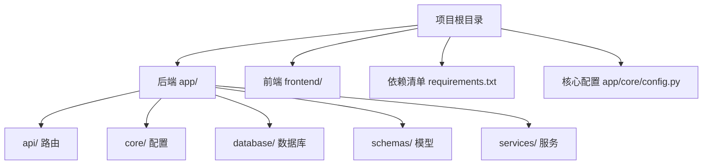
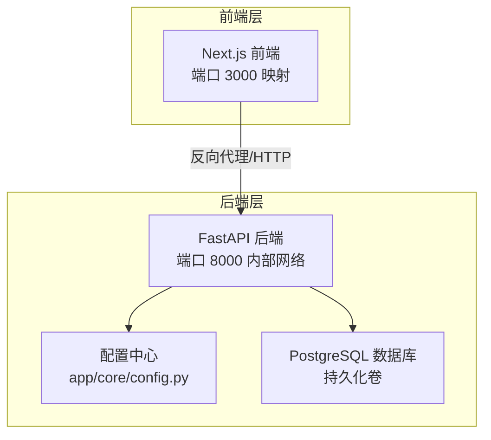
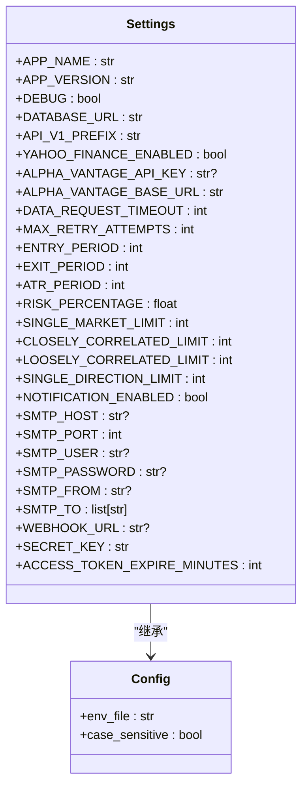
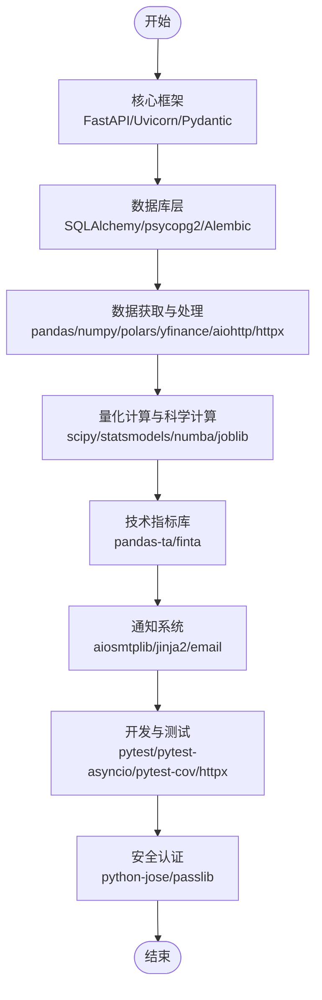
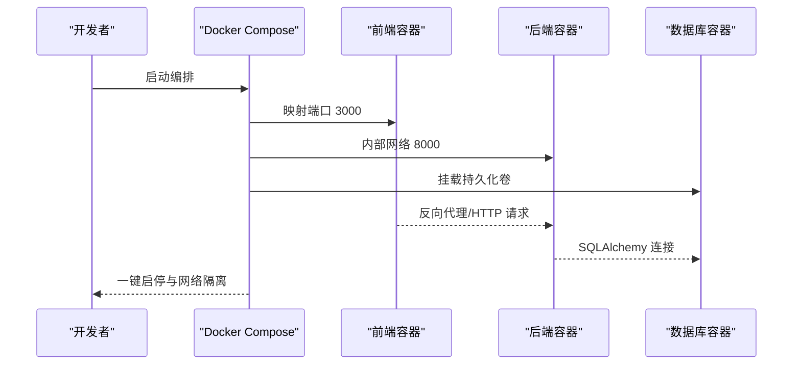
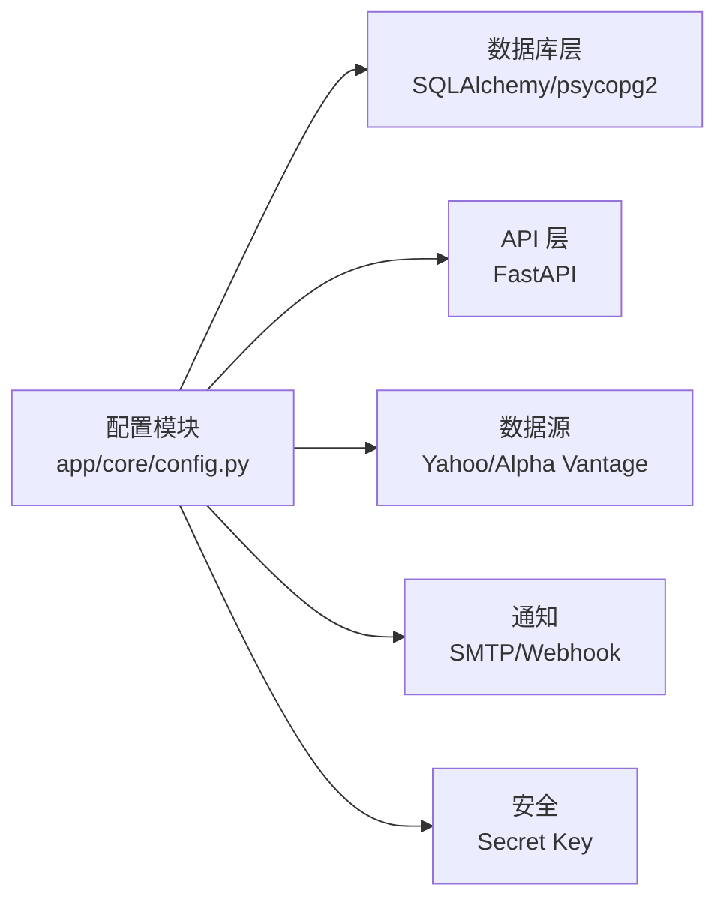

# 部署与配置

<cite>
**本文引用的文件**
- [现代海龟协议：基于Python与微服务架构的自动化量化交易系统产品需求文档(PRD).md](file://现代海龟协议：基于Python与微服务架构的自动化量化交易系统产品需求文档(PRD).md)
- [requirements.txt](file://requirements.txt)
- [app/core/config.py](file://app/core/config.py)
</cite>

## 目录
1. [简介](#简介)
2. [项目结构](#项目结构)
3. [核心组件](#核心组件)
4. [架构总览](#架构总览)
5. [详细组件分析](#详细组件分析)
6. [依赖分析](#依赖分析)
7. [性能考量](#性能考量)
8. [故障排除指南](#故障排除指南)
9. [结论](#结论)
10. [附录](#附录)

## 简介
本指南面向《现代海龟协议》项目的部署与配置，围绕容器化部署方案、开发/生产/云端部署流程、数据库与环境变量管理、安全密钥处理、网络配置、安装步骤、配置选项与故障排除展开。内容严格依据仓库现有文件与PRD文档中的部署与架构描述，确保可操作性与一致性。

## 项目结构
- 后端应用位于 app/ 目录，包含 api、core、database、schemas、services 等子模块。
- 前端应用位于 frontend/ 目录，包含分析与历史等页面与组件。
- 顶层提供依赖清单 requirements.txt 与核心配置模块 app/core/config.py。
- PRD 文档明确指出根目录包含容器化与编排相关清单（Dockerfile、docker-compose.yml）与部署说明。

**章节来源**
- [现代海龟协议：基于Python与微服务架构的自动化量化交易系统产品需求文档(PRD).md:27-33](file://现代海龟协议：基于Python与微服务架构的自动化量化交易系统产品需求文档(PRD).md#L27-L33)
- [requirements.txt:1-61](file://requirements.txt#L1-L61)
- [app/core/config.py:1-99](file://app/core/config.py#L1-L99)

## 核心组件
- 应用配置中心：通过 Pydantic Settings 提供集中式配置，支持从 .env 文件加载，包含数据库、API、数据源、策略参数、通知与安全等配置项。
- 依赖清单：定义后端所需的核心库与版本，覆盖 FastAPI、SQLAlchemy、pandas、numpy、scipy、statsmodels、numba、joblib、技术指标库、通知与安全等模块。
- PRD 中的部署与编排：强调容器化与 Docker Compose 编排，定义前端、后端与数据库的服务边界与端口映射。

**章节来源**
- [app/core/config.py:11-99](file://app/core/config.py#L11-L99)
- [requirements.txt:5-61](file://requirements.txt#L5-L61)
- [现代海龟协议：基于Python与微服务架构的自动化量化交易系统产品需求文档(PRD).md:119-123](file://现代海龟协议：基于Python与微服务架构的自动化量化交易系统产品需求文档(PRD).md#L119-L123)

## 架构总览
系统采用前后端分离与微服务架构，核心组件通过容器化编排实现一键启停与网络隔离。前端 Next.js 通过反向代理与后端 FastAPI 通信，后端通过 SQLAlchemy 连接 PostgreSQL，数据获取模块支持主备数据源容灾。

**图表来源**
- [现代海龟协议：基于Python与微服务架构的自动化量化交易系统产品需求文档(PRD).md:119-123](file://现代海龟协议：基于Python与微服务架构的自动化量化交易系统产品需求文档(PRD).md#L119-L123)
- [app/core/config.py:24](file://app/core/config.py#L24)

**章节来源**
- [现代海龟协议：基于Python与微服务架构的自动化量化交易系统产品需求文档(PRD).md:119-123](file://现代海龟协议：基于Python与微服务架构的自动化量化交易系统产品需求文档(PRD).md#L119-L123)

## 详细组件分析

### 配置管理组件（Settings）
- 功能：集中管理应用配置，支持从 .env 加载，提供数据库、API、数据源、策略参数、通知与安全等默认值。
- 关键点：
  - 数据库连接串默认指向本地 PostgreSQL。
  - API 前缀为 /api/v1。
  - 数据源支持主数据源与备用数据源配置。
  - 策略参数包含突破周期、ATR 平滑周期与风险管理阈值。
  - 通知系统支持 SMTP 与 Webhook。
  - 安全配置包含密钥与过期时间。

**图表来源**
- [app/core/config.py:11-99](file://app/core/config.py#L11-L99)

**章节来源**
- [app/core/config.py:11-99](file://app/core/config.py#L11-L99)

### 依赖管理组件（requirements.txt）
- 功能：声明后端运行所需依赖，覆盖核心框架、数据库层、数据获取与处理、量化计算与科学计算、技术指标库、通知系统、开发与测试、安全认证等模块。
- 关键点：
  - 核心框架：FastAPI、Uvicorn、Pydantic、Pydantic Settings。
  - 数据库层：SQLAlchemy、psycopg2-binary、Alembic。
  - 数据获取与处理：pandas、numpy、polars、yfinance、aiohttp、httpx。
  - 量化计算与科学计算：scipy、statsmodels、numba、joblib。
  - 技术指标库：pandas-ta、finta。
  - 通知系统：aiosmtplib、jinja2、email 支持。
  - 开发与测试：pytest、pytest-asyncio、pytest-cov、httpx。
  - 安全认证：python-jose、passlib。

**图表来源**
- [requirements.txt:5-61](file://requirements.txt#L5-L61)

**章节来源**
- [requirements.txt:5-61](file://requirements.txt#L5-L61)

### 部署与编排组件（PRD 描述）
- 功能：定义容器化与 Docker Compose 编排，明确前端、后端与数据库的端口映射与网络隔离，强调持久化卷与一键启停。
- 关键点：
  - 前端映射宿主机 3000 端口。
  - 后端运行在内部网络 8000 端口。
  - 数据库使用持久化卷，确保升级与故障时数据不丢失。
  - 支持本地与云端多种部署形态。

**图表来源**
- [现代海龟协议：基于Python与微服务架构的自动化量化交易系统产品需求文档(PRD).md:119-123](file://现代海龟协议：基于Python与微服务架构的自动化量化交易系统产品需求文档(PRD).md#L119-L123)

**章节来源**
- [现代海龟协议：基于Python与微服务架构的自动化量化交易系统产品需求文档(PRD).md:119-123](file://现代海龟协议：基于Python与微服务架构的自动化量化交易系统产品需求文档(PRD).md#L119-L123)

## 依赖分析
- 组件耦合与内聚：
  - 配置模块集中管理数据库、API、数据源、策略与通知等配置，提升内聚性与可维护性。
  - 依赖清单按功能域划分，便于版本控制与升级。
- 外部依赖与集成点：
  - 数据库：PostgreSQL（通过 SQLAlchemy/psycopg2）。
  - 数据源：Yahoo Finance（主）、Alpha Vantage（备）。
  - 通知：SMTP 与 Webhook。
  - 安全：Pydantic Settings 与 Secret Key。
- 潜在环形依赖：
  - 配置模块与数据库会话模块之间通过配置串间接耦合，未见直接循环导入迹象。

**图表来源**
- [app/core/config.py:24](file://app/core/config.py#L24)
- [requirements.txt:13-15](file://requirements.txt#L13-L15)

**章节来源**
- [app/core/config.py:24](file://app/core/config.py#L24)
- [requirements.txt:13-15](file://requirements.txt#L13-L15)

## 性能考量
- 数据获取与处理：
  - 使用 pandas、numpy、polars 进行高性能时间序列处理，建议在生产环境启用多核并行与内存优化。
- 量化计算：
  - 利用 numba JIT 与 joblib 并行，缩短回测与实时计算延迟。
- 数据库连接：
  - 使用 SQLAlchemy 连接池与持久化卷，减少连接开销与数据丢失风险。
- 网络与反向代理：
  - 前端通过反向代理与后端通信，建议启用压缩与缓存策略以降低带宽与延迟。

## 故障排除指南
- 数据库连接失败
  - 检查 DATABASE_URL 是否正确指向目标数据库，确认网络连通与凭据。
  - 参考配置项：[app/core/config.py:24](file://app/core/config.py#L24)
- 数据源请求超时或限流
  - 调整 DATA_REQUEST_TIMEOUT 与 MAX_RETRY_ATTEMPTS，必要时切换备用数据源。
  - 参考配置项：[app/core/config.py:42-43](file://app/core/config.py#L42-L43)
- 通知发送失败
  - 校验 SMTP 配置与 Webhook 地址，确认收件人列表与凭据。
  - 参考配置项：[app/core/config.py:69-78](file://app/core/config.py#L69-L78)
- 安全密钥问题
  - 生产环境务必替换默认 SECRET_KEY，并确保 .env 文件权限最小化。
  - 参考配置项：[app/core/config.py:83](file://app/core/config.py#L83)
- 容器启动异常
  - 确认端口映射（前端 3000、后端 8000）未被占用，数据库持久化卷已正确挂载。
  - 参考部署说明：[现代海龟协议：基于Python与微服务架构的自动化量化交易系统产品需求文档(PRD).md:119-123](file://现代海龟协议：基于Python与微服务架构的自动化量化交易系统产品需求文档(PRD).md#L119-L123)

**章节来源**
- [app/core/config.py:24](file://app/core/config.py#L24)
- [app/core/config.py:42-43](file://app/core/config.py#L42-L43)
- [app/core/config.py:69-78](file://app/core/config.py#L69-L78)
- [app/core/config.py:83](file://app/core/config.py#L83)
- [现代海龟协议：基于Python与微服务架构的自动化量化交易系统产品需求文档(PRD).md:119-123](file://现代海龟协议：基于Python与微服务架构的自动化量化交易系统产品需求文档(PRD).md#L119-L123)

## 结论
本指南基于仓库现有文件与 PRD 描述，给出了《现代海龟协议》的部署与配置要点：以配置中心为核心，以依赖清单为支撑，以容器化与编排为手段，结合数据库、环境变量、安全密钥与网络配置，形成可复制、可扩展的开发、生产与云端部署方案。建议在生产环境强化密钥管理、监控告警与备份策略，并结合 PRD 的回测与安全加固建议，持续完善系统韧性与合规性。

## 附录
- 安装步骤（基于现有文件）
  1) 准备环境：确保 Python 运行环境满足 FastAPI 与依赖要求。
  2) 安装依赖：使用依赖清单安装后端所需库。
     - 参考：[requirements.txt:5-61](file://requirements.txt#L5-L61)
  3) 配置环境变量：创建 .env 文件，填入数据库、数据源、通知与安全相关配置。
     - 参考：[app/core/config.py:86-88](file://app/core/config.py#L86-L88)
  4) 初始化数据库：使用 Alembic 或数据库脚本初始化表结构。
     - 参考：[requirements.txt:15](file://requirements.txt#L15)
  5) 启动服务：通过 Docker Compose 启动前端、后端与数据库容器。
     - 参考：[现代海龟协议：基于Python与微服务架构的自动化量化交易系统产品需求文档(PRD).md:119-123](file://现代海龟协议：基于Python与微服务架构的自动化量化交易系统产品需求文档(PRD).md#L119-L123)
- 配置选项速查
  - 数据库：DATABASE_URL（默认本地 PostgreSQL）
  - API：API_V1_PREFIX（默认 /api/v1）
  - 数据源：YAHOO_FINANCE_ENABLED、ALPHA_VANTAGE_*、DATA_REQUEST_TIMEOUT、MAX_RETRY_ATTEMPTS
  - 策略参数：ENTRY_PERIOD、EXIT_PERIOD、ATR_PERIOD、RISK_PERCENTAGE、头寸限制
  - 通知：NOTIFICATION_ENABLED、SMTP_*、WEBHOOK_URL
  - 安全：SECRET_KEY、ACCESS_TOKEN_EXPIRE_MINUTES
  - 参考：[app/core/config.py:17-84](file://app/core/config.py#L17-L84)
- DevOps 最佳实践与监控告警建议
  - 密钥管理：使用 .env 并限制文件权限，生产环境使用密钥管理服务。
  - 日志与监控：为后端与数据库配置统一日志与指标采集。
  - 备份与恢复：定期备份数据库持久化卷，制定演练计划。
  - 安全加固：参考 PRD 中的安全框架集成建议，强化身份鉴权与 RBAC。
  - 参考：[现代海龟协议：基于Python与微服务架构的自动化量化交易系统产品需求文档(PRD).md:125](file://现代海龟协议：基于Python与微服务架构的自动化量化交易系统产品需求文档(PRD).md#L125)