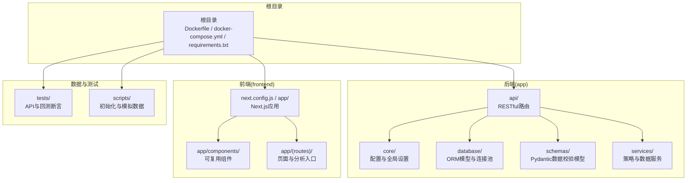
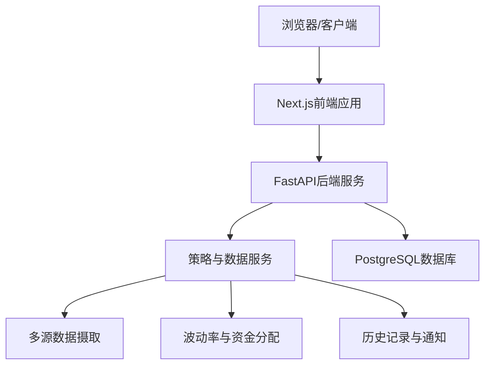
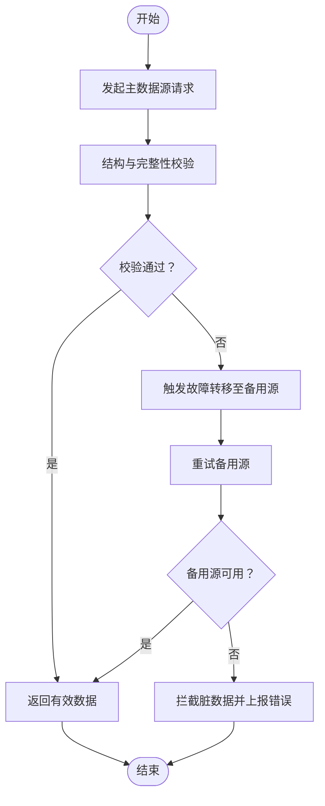
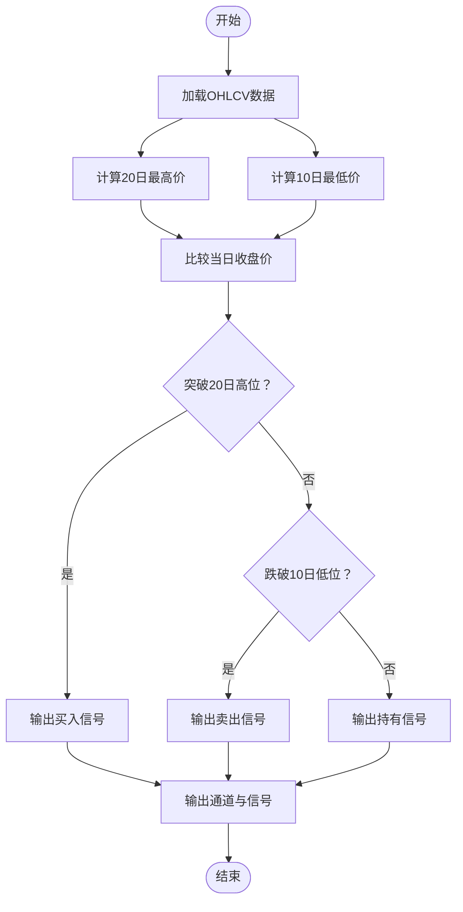
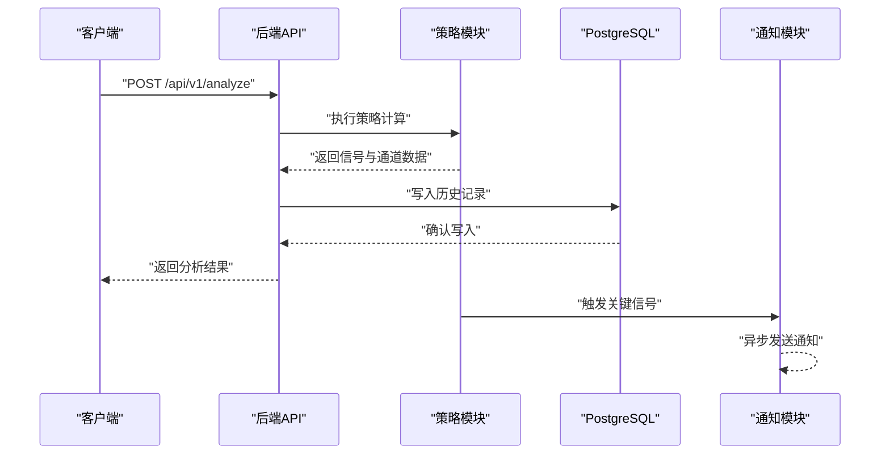
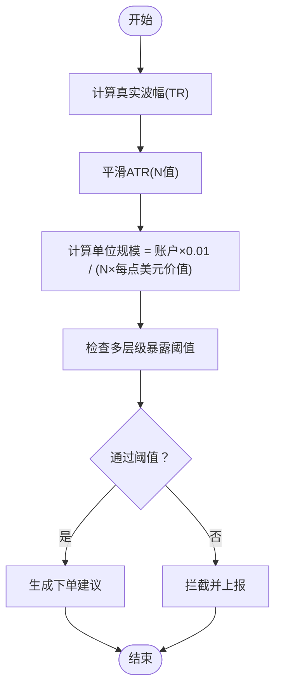

# 项目概述

<cite>
**本文档引用的文件**
- [现代海龟协议：基于Python与微服务架构的自动化量化交易系统产品需求文档(PRD).md](file://现代海龟协议：基于Python与微服务架构的自动化量化交易系统产品需求文档(PRD).md)
</cite>

## 目录
1. [引言](#引言)
2. [项目结构](#项目结构)
3. [核心组件](#核心组件)
4. [架构总览](#架构总览)
5. [详细组件分析](#详细组件分析)
6. [依赖分析](#依赖分析)
7. [性能考量](#性能考量)
8. [故障排查指南](#故障排查指南)
9. [结论](#结论)
10. [附录](#附录)

## 引言
本项目以“现代海龟协议”命名，旨在将经典的趋势跟踪交易法则与现代技术栈深度融合，构建一套基于Python与微服务架构的自动化量化交易系统。项目以“纪律胜于预测”的理念为核心，强调系统性风险管理与动态头寸规模控制，通过波动率驱动的资金分配与严格的风控阈值，实现跨资产类别的风险平价与稳健收益曲线。系统不仅提供实时信号与可视化分析，还预留与专业回测框架的集成能力，为未来向全自动化交易引擎演进奠定基础。

项目定位与价值主张：
- 在量化交易领域，提供一套可落地、可扩展、可审计的全栈解决方案，兼顾学术研究与实战应用。
- 以经典海龟法则为理论基石，结合Python异步后端、Next.js前端与PostgreSQL持久化，形成低延迟、高内聚、低耦合的工程实现。
- 通过波动率与ATR为核心的动态资金管理，消除主观判断对头寸规模的影响，确保系统在不同市场环境下保持稳定的风险边界。

发展历程与愿景：
- 发展历程：从经典海龟法则的参数化规则出发，逐步演进为以事件驱动、数据驱动、风控驱动的现代量化系统。
- 技术愿景：构建可与专业回测框架松耦合集成、具备容器化与安全加固能力的生产级平台，支撑从策略研发到实盘执行的全生命周期。
- 未来规划：持续完善多资产、多市场的风控暴露阈值体系，探索与外部交易所接口的对接与合规改造，逐步实现端到端自动化交易执行。

## 项目结构
项目采用前后端分离与领域驱动设计，根目录包含环境配置、依赖清单与部署编排文件；后端位于app/目录，前端位于frontend/目录；测试与脚本分别置于tests/与scripts/目录，便于独立维护与扩展。

**章节来源**
- [现代海龟协议：基于Python与微服务架构的自动化量化交易系统产品需求文档(PRD).md:27-34](file://现代海龟协议：基于Python与微服务架构的自动化量化交易系统产品需求文档(PRD).md#L27-L34)

## 核心组件
- 容灾型市场数据摄取模块：负责多源数据仲裁与自动故障转移，确保策略计算所需的历史OHLCV数据连续、完整、可用。
- 策略运算与信号生成模块：基于滚动窗口与突破规则，输出确定性交易信号（买入、卖出、持有），并生成通道支撑/阻力位辅助可视化。
- 历史追踪与通知模块：将分析结果持久化至PostgreSQL，支持历史查询与回溯；仅在关键信号触发时进行异步通知，降低噪声。
- 波动率驱动的风险建模与资金分配：以ATR为核心计算N值，结合账户净资产与每点美元价值，动态确定单位头寸规模，严格执行1%风险上限与多层级暴露阈值。

**章节来源**
- [现代海龟协议：基于Python与微服务架构的自动化量化交易系统产品需求文档(PRD).md:39-61](file://现代海龟协议：基于Python与微服务架构的自动化量化交易系统产品需求文档(PRD).md#L39-L61)
- [现代海龟协议：基于Python与微服务架构的自动化量化交易系统产品需求文档(PRD).md:67-102](file://现代海龟协议：基于Python与微服务架构的自动化量化交易系统产品需求文档(PRD).md#L67-L102)

## 架构总览
系统采用微服务架构，后端以FastAPI为核心，结合异步I/O与Pydantic数据校验，提供RESTful接口；前端基于Next.js与React，使用Tailwind CSS与Recharts实现响应式可视化；数据库采用PostgreSQL，配合SQLAlchemy ORM实现结构化历史记录的持久化与查询。

**图表来源**
- [现代海龟协议：基于Python与微服务架构的自动化量化交易系统产品需求文档(PRD).md:15-26](file://现代海龟协议：基于Python与微服务架构的自动化量化交易系统产品需求文档(PRD).md#L15-L26)
- [现代海龟协议：基于Python与微服务架构的自动化量化交易系统产品需求文档(PRD).md:107-112](file://现代海龟协议：基于Python与微服务架构的自动化量化交易系统产品需求文档(PRD).md#L107-L112)

**章节来源**
- [现代海龟协议：基于Python与微服务架构的自动化量化交易系统产品需求文档(PRD).md:11-26](file://现代海龟协议：基于Python与微服务架构的自动化量化交易系统产品需求文档(PRD).md#L11-L26)
- [现代海龟协议：基于Python与微服务架构的自动化量化交易系统产品需求文档(PRD).md:107-112](file://现代海龟协议：基于Python与微服务架构的自动化量化交易系统产品需求文档(PRD).md#L107-L112)

## 详细组件分析

### 容灾型市场数据摄取模块
- 职责：在主数据源（如雅虎财经）出现超时、限流或脏数据时，自动切换至备用数据源（如Alpha Vantage），并在极端情况下拦截脏数据，保障策略计算的稳定性。
- 关键流程：请求发起 → 主源校验 → 异常检测 → 故障转移 → 终端保护。
- 设计要点：严格的异常捕获与受控降级，确保数据完整性与连续性。

**章节来源**
- [现代海龟协议：基于Python与微服务架构的自动化量化交易系统产品需求文档(PRD).md:39-44](file://现代海龟协议：基于Python与微服务架构的自动化量化交易系统产品需求文档(PRD).md#L39-L44)

### 策略运算与信号生成模块
- 职责：基于滚动窗口计算20日最高价与10日最低价，生成突破买入、跌破卖出与持有信号，并输出通道支撑/阻力位。
- 关键流程：读取OHLCV → 计算滚动窗口 → 条件分支判别 → 输出信号与通道数据。
- 设计要点：明确的信号定义与过滤震荡市噪音，避免频繁交易摩擦。

**章节来源**
- [现代海龟协议：基于Python与微服务架构的自动化量化交易系统产品需求文档(PRD).md:45-56](file://现代海龟协议：基于Python与微服务架构的自动化量化交易系统产品需求文档(PRD).md#L45-L56)

### 历史追踪与通知模块
- 职责：将分析结果持久化至PostgreSQL，支持分页查询与回溯；仅在关键信号触发时进行异步通知，降低噪声。
- 关键流程：策略执行完成 → 写入历史记录 → 触发通知（如适用）。
- 设计要点：结构化日志与审计追溯，人机协同闭环。

**章节来源**
- [现代海龟协议：基于Python与微服务架构的自动化量化交易系统产品需求文档(PRD).md:57-61](file://现代海龟协议：基于Python与微服务架构的自动化量化交易系统产品需求文档(PRD).md#L57-L61)
- [现代海龟协议：基于Python与微服务架构的自动化量化交易系统产品需求文档(PRD).md:107-112](file://现代海龟协议：基于Python与微服务架构的自动化量化交易系统产品需求文档(PRD).md#L107-L112)

### 波动率驱动的风险建模与资金分配
- 职责：计算真实波幅（TR）与ATR（N值），结合账户净资产与每点美元价值，动态确定单位头寸规模；严格执行1%风险上限与多层级暴露阈值。
- 关键流程：计算TR → 平滑ATR → 计算单位规模 → 暴露阈值检查 → 生成下单建议。
- 设计要点：跨资产风险平价、系统性风险控制与宏观暴露约束。

**章节来源**
- [现代海龟协议：基于Python与微服务架构的自动化量化交易系统产品需求文档(PRD).md:67-102](file://现代海龟协议：基于Python与微服务架构的自动化量化交易系统产品需求文档(PRD).md#L67-L102)

## 依赖分析
- 后端技术栈：Python 3.11+、FastAPI、Pydantic、NumPy、Pandas、SciPy/Statsmodels、Numba、Joblib、Polars（可选）、SQLAlchemy、PostgreSQL。
- 前端技术栈：Next.js 16、React 18、TypeScript 5.0、Tailwind CSS 3.0、Recharts 3.4。
- 部署与安全：Docker/Docker Compose、环境变量与密钥管理、可选安全中间件（如AuthTuna）。

```mermaid
graph TB
Backend["后端依赖"] --> Py["Python 3.11+"]
Backend --> FastAPI["FastAPI"]
Backend --> Pydantic["Pydantic"]
Backend --> NumPy["NumPy"]
Backend --> Pandas["Pandas"]
Backend --> SciPy["SciPy/Statsmodels"]
Backend --> Numba["Numba"]
Backend --> Joblib["Joblib"]
Backend --> Polars["Polars(可选)"]
Backend --> SQLAlchemy["SQLAlchemy"]
Frontend["前端依赖"] --> Next["Next.js 16"]
Frontend --> React["React 18"]
Frontend --> TS["TypeScript 5.0"]
Frontend --> Tailwind["Tailwind CSS 3.0"]
Frontend --> Recharts["Recharts 3.4"]
Ops["部署与安全"] --> Docker["Docker/Docker Compose"]
Ops --> Env["环境变量与密钥管理"]
Ops --> Security["可选安全中间件"]
```

**章节来源**
- [现代海龟协议：基于Python与微服务架构的自动化量化交易系统产品需求文档(PRD).md:15-26](file://现代海龟协议：基于Python与微服务架构的自动化量化交易系统产品需求文档(PRD).md#L15-L26)
- [现代海龟协议：基于Python与微服务架构的自动化量化交易系统产品需求文档(PRD).md:119-126](file://现代海龟协议：基于Python与微服务架构的自动化量化交易系统产品需求文档(PRD).md#L119-L126)

## 性能考量
- 异步I/O与事件循环：后端采用FastAPI异步非阻塞机制，提升高并发场景下的吞吐量与响应速度。
- 科学计算优化：NumPy/Pandas提供高性能矩阵与时间序列处理；Numba即时编译加速长周期回测；Joblib并行计算提升多资产分析效率。
- 可扩展性：容器化与微服务架构便于水平扩展与资源隔离；数据库连接池与索引优化支持历史数据查询。
- 可观测性：结构化日志与历史记录便于性能回归与问题定位。

[本节为通用性能讨论，无需列出章节来源]

## 故障排查指南
- 数据异常：若出现主数据源超时或返回429，请检查网络与限流策略；确认备用数据源可用性；必要时拦截脏数据并记录错误日志。
- 信号噪声：若频繁出现“持有”信号，检查参数窗口是否过小或市场处于震荡区间；适当调整窗口或增加过滤条件。
- 风控拦截：若下单被拦截，请检查当前暴露阈值与相关性矩阵；确认是否存在单市场或宏观方向过度集中。
- 通知异常：若通知未送达，请检查SMTP/Webhook配置与异步队列状态；确保仅在关键信号触发时发送通知。

**章节来源**
- [现代海龟协议：基于Python与微服务架构的自动化量化交易系统产品需求文档(PRD).md:39-44](file://现代海龟协议：基于Python与微服务架构的自动化量化交易系统产品需求文档(PRD).md#L39-L44)
- [现代海龟协议：基于Python与微服务架构的自动化量化交易系统产品需求文档(PRD).md:57-61](file://现代海龟协议：基于Python与微服务架构的自动化量化交易系统产品需求文档(PRD).md#L57-L61)
- [现代海龟协议：基于Python与微服务架构的自动化量化交易系统产品需求文档(PRD).md:92-102](file://现代海龟协议：基于Python与微服务架构的自动化量化交易系统产品需求文档(PRD).md#L92-L102)

## 结论
“现代海龟协议”以经典趋势跟踪法则为理论基石，借助Python异步后端、Next.js前端与PostgreSQL数据库，构建了具备系统性风险管理与动态资金分配能力的全栈量化平台。通过多源数据容灾、确定性信号生成、历史记录与通知闭环，以及严格的风控阈值体系，系统在不同市场环境下均能保持稳健的风险边界。未来，平台将持续增强与专业回测框架的集成能力与安全加固，逐步迈向全自动化交易执行引擎，为量化研究与实战应用提供坚实支撑。

[本节为总结性内容，无需列出章节来源]

## 附录
- 使用场景与应用案例：
  - 实时趋势监控：通过前端仪表盘查看多资产的突破信号与通道视图，辅助交易员快速决策。
  - 历史回溯分析：利用历史记录与可视化图表复盘策略在不同周期的表现，进行参数优化与风控校准。
  - 组合风控管理：在多资产、多市场环境下，通过暴露阈值与相关性矩阵控制系统性风险，避免过度集中。
  - 回测与参数优化：将策略模块作为插件接入专业回测框架，进行大规模历史压力测试与参数寻优。

[本节为概念性内容，无需列出章节来源]